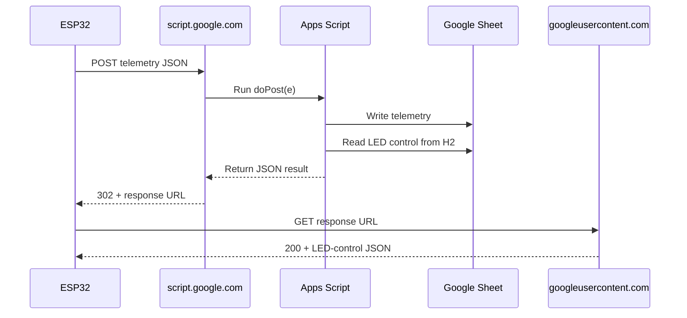

# Connecting an ESP32-S3 Securely to Google Sheets

Connecting an ESP32-S3 securely to Google Sheets uses a Google Apps Script Web App as an HTTPS API bridge. The ESP32-S3 transmits telemetry data via HTTPS `POST` requests and receives control commands in the server response payload.

## Capabilities and Limitations

| Feature Category | Capabilities | Limitations |
|---|---|---|
| **Data Throughput** | Logs structured JSON data directly into spreadsheet rows. | Not suitable for high-frequency sampling. Keep intervals at least 5 seconds. |
| **Security** | Supports TLS 1.2/1.3 encrypted HTTPS requests via the ESP32-S3 `WiFiClientSecure`. | Web App endpoints deployed with `Anyone` access rely on URL obscurity unless custom headers are added. |
| **Bi-directional Flow** | Sends telemetry such as temperature and RSSI and receives commands such as `led-control` in a single HTTP response. | Latency ranges between 500 ms and 2,000 ms per request due to Google Apps Script execution time. |
| **Quotas and Cost** | Provides free storage and processing using standard Google Drive accounts. | Subject to Google Apps Script daily quotas, typically 20,000 to 50,000 executions per day. |

## Step-by-Step Implementation Guide

### 1. Set Up Google Sheet and Apps Script

**Estimated time:** 5 minutes

Create a new Google Sheet and add the following headers in Row 1:

```text
Timestamp | Status | Temperature | RSSI | Uptime | LED State | Button | LED Control Target
```

Set the value of cell `H2` to `0` or `1`. This acts as the remote dashboard control for `led-control`.

Open **Extensions > Apps Script** and replace the default script with the following code:

```javascript
function doPost(e) {
  try {
    var sheet = SpreadsheetApp.getActiveSpreadsheet().getActiveSheet();
    var data = JSON.parse(e.postData.contents);

    // Append telemetry row
    sheet.appendRow([
      new Date(),
      data.status,
      data.temperature,
      data.rssi,
      data.uptime,
      data["led-state"],
      data.button
    ]);

    // Read desired control state from cell H2
    var ledControlValue = sheet.getRange("H2").getValue();

    // Respond back to ESP32-S3 with control command
    var response = {
      "status": "success",
      "led-control": ledControlValue
    };

    return ContentService
      .createTextOutput(JSON.stringify(response))
      .setMimeType(ContentService.MimeType.JSON);

  } catch (err) {
    return ContentService
      .createTextOutput(
        JSON.stringify({
          "status": "error",
          "message": err.toString()
        })
      )
      .setMimeType(ContentService.MimeType.JSON);
  }
}
```

### 2. Deploy Apps Script as a Web App

**Prerequisite:** Required for API access.

1. In Apps Script, click **Deploy > New deployment**.
2. Select **Web app** as the deployment type.
3. Set **Execute as** to **Me**.
4. Set **Who has access** to **Anyone**.
5. Click **Deploy**.
6. Authorize the required permissions.
7. Copy the generated Web App URL. It starts with:

   ```text
   https://script.google.com/macros/s/...
   ```

> **Note:** Google Apps Script issues a `302 Found` redirect when handling `POST` requests. The ESP32 HTTP client must explicitly enable redirect-following to receive the JSON response.

### 3. Configure ESP32-S3 Firmware

**Environment:** Arduino IDE or ESP-IDF C++

Flash the following code to your ESP32-S3. Ensure that the `ArduinoJson` library is installed.

```cpp
#include <WiFi.h>
#include <WiFiClientSecure.h>
#include <HTTPClient.h>
#include <ArduinoJson.h>

const char* WIFI_SSID = "YOUR_WIFI_SSID";
const char* WIFI_PASS = "YOUR_WIFI_PASSWORD";

// Replace with your Google Apps Script Deployment URL
const char* GOOGLE_SCRIPT_URL =
  "[https://script.google.com/macros/s/YOUR_DEPLOYMENT_ID/exec](https://script.google.com/macros/s/YOUR_DEPLOYMENT_ID/exec)";

// Topics / Field Keys
const char* TOPIC_STATUS = "status";
const char* TOPIC_TEMP = "temperature";
const char* TOPIC_RSSI = "rssi";
const char* TOPIC_UPTIME = "uptime";
const char* TOPIC_LED_SET = "led-control";
const char* TOPIC_LED_STATE = "led-state";
const char* TOPIC_BUTTON = "button";

const int LED_PIN = 2;
const int BUTTON_PIN = 0;

// Google Root CA Certificate (GTS Root R1)
// for strict TLS verification
const char* GOOGLE_ROOT_CA =R"(
  -----BEGIN CERTIFICATE-----
  MH3XITBAMBgNVHR8EMTAvMC2gK6AhihhodHRwOi8vY3JsLnVzZXJ0cnVzdC5jb20v
  VVNFUlRydXN0UlNBQ2VydGlmaWNhdGlvbkF1dGhvcml0eS5jcmwwDQYJKoZIhvcN
  AQEMBQADggIBAGLjko5GdyYV1KKJhJDA9x6HYXh3m4f7X6u9M/J511b8SgO6vK/8
  -----END CERTIFICATE-----
  )";


void sendTelemetryAndFetchCommands() {
  if (WiFi.status() != WL_CONNECTED) {
    Serial.println("WiFi disconnected");
    return;
  }

  StaticJsonDocument<256> doc;
  doc["type"] = "telemetry";
  doc[TOPIC_STATUS] = "ONLINE";
  doc[TOPIC_TEMP] = random(100, 500) / 10.0f;
  doc[TOPIC_RSSI] = WiFi.RSSI();
  doc[TOPIC_UPTIME] = millis() / 1000UL;
  doc[TOPIC_LED_STATE] = digitalRead(LED_PIN);
  doc[TOPIC_BUTTON] = (digitalRead(BUTTON_PIN) == LOW) ? 1 : 0;

  String requestBody;
  serializeJson(doc, requestBody);
  Serial.println("Send Payload: " + requestBody);

  WiFiClientSecure postClient;
#ifdef SECURE_CA_CERT
  postClient.setCACert(GOOGLE_ROOT_CA);
#else
  postClient.setInsecure();
#endif

  HTTPClient postHttp;
  postHttp.setFollowRedirects(HTTPC_DISABLE_FOLLOW_REDIRECTS);
  postHttp.setReuse(false);
  postHttp.setConnectTimeout(15000);
  postHttp.setTimeout(20000);

  if (!postHttp.begin(postClient, GOOGLE_SCRIPT_URL)) {
    Serial.println("[TELEMETRY] Cannot start POST");
    return;
  }

  postHttp.addHeader("Content-Type", "application/json");
  int postCode = postHttp.POST(requestBody);
  Serial.printf("[TELEMETRY] POST response: %d\n", postCode);

  String responseBody;
  int finalCode = postCode;

  if (postCode == 302) {
    String redirectUrl = postHttp.getLocation();
    postHttp.end();

    if (!redirectUrl.startsWith("https://script.googleusercontent.com/")) {
      Serial.println("[TELEMETRY] Missing or unexpected redirect URL");
      return;
    }

    WiFiClientSecure getClient;
#ifdef SECURE_CA_CERT
    getClient.setCACert(GOOGLE_ROOT_CA);
#else
    getClient.setInsecure();
#endif

    HTTPClient getHttp;

    getHttp.setReuse(false);
    getHttp.setConnectTimeout(15000);
    getHttp.setTimeout(20000);

    if (!getHttp.begin(getClient, redirectUrl)) {
      Serial.println("[TELEMETRY] Cannot start response GET");
      return;
    }

    finalCode = getHttp.GET();
    if (finalCode == 200) {
      responseBody = getHttp.getString();
    }
    getHttp.end();

  } else {
    if (postCode == 200) {
      responseBody = postHttp.getString();
    }
    postHttp.end();
  }

  Serial.printf("[TELEMETRY] Final response: %d\n", finalCode);
  if (finalCode != 200) {
    Serial.println("[TELEMETRY] Failed to fetch command");
    return;
  }

  Serial.println("Server Response: " + responseBody);

  StaticJsonDocument<192> responseDoc;
  DeserializationError err = deserializeJson(responseDoc, responseBody);

  if (err) {
    Serial.printf("[COMMAND] Invalid JSON: %s\n", err.c_str());
    return;
  }

  if (responseDoc["status"] != "success") {
    Serial.println("[COMMAND] Apps Script reported an error");
    return;
  }

  if (!responseDoc["led-control"].is<int>()) {
    Serial.println("[COMMAND] led-control must be a number, 0 or 1");
    return;
  }

  int targetLedState = responseDoc["led-control"].as<int>();
  if (targetLedState != 0 && targetLedState != 1) {
    Serial.println("[COMMAND] led-control must be 0 or 1");
    return;
  }

  digitalWrite(LED_PIN, targetLedState ? HIGH : LOW);
  Serial.printf("[COMMAND] LED state updated to: %d\n", targetLedState);
}

void setup() {
  Serial.begin(115200);

  pinMode(LED_PIN, OUTPUT);
  pinMode(BUTTON_PIN, INPUT_PULLUP);

  WiFi.begin(WIFI_SSID, WIFI_PASS);

  Serial.print("Connecting to WiFi");

  while (WiFi.status() != WL_CONNECTED) {
    delay(500);
    Serial.print(".");
  }

  Serial.println("\nConnected to WiFi");
}

void loop() {
  sendTelemetryAndFetchCommands();

  // Poll and upload every 10 seconds
  delay(10000);
}
```


# Obtaining the GTS Root R1 Certificate

You can obtain the GTS Root R1 certificate directly from Google's official PKI repository, export it using OpenSSL or a web browser, or copy the preformatted C++ snippet below.

> **Important:** The certificate shown below is truncated. Download the complete certificate from Google's official PKI repository before using it in production.

## Preformatted C++ Code

Copy and paste the following structure into your Arduino or ESP32 project:

```cpp
// Google Root CA Certificate (GTS Root R1)
const char* GOOGLE_ROOT_CA =R"(
-----BEGIN CERTIFICATE-----
MIIFVzCCAz+gAwIBAgINAgPlk28xsBNJiGuiFzANBgkqhkiG9w0BAQwFADBHMQsw
CQYDVQQGEwJVUzEiMCAGA1UEChMZR29vZ2xlIFRydXN0IFNlcnZpY2VzIExMQzEU
MBIGA1UEAxMLR1RTIFJvb3QgUjEwHhcNMTYwNjIyMDAwMDAwWhcNMzYwNjIyMDAw
MDAwWjBHMQswCQYDVQQGEwJVUzEiMCAGA1UEChMZR29vZ2xlIFRydXN0IFNlcnZp
Y2VzIExMQzEUMBIGA1UEAxMLR1RTIFJvb3QgUjEwggIiMA0GCSqGSIb3DQEBAQUA
A4ICDwAwggIKAoICAQC2EQKLHuOhd5s73L+UPreVp0A8of2C+X0yBoJx9vaMf/vo
27xqLpeXo4xL+Sv2sfnOhB2x+cWX3u+58qPpvBKJXqeqUqv4IyfLpLGcY9vXmX7w
Cl7raKb0xlpHDU0QM+NOsROjyBhsS+z8CZDfnWQpJSMHobTSPS5g4M/SCYe7zUjw
TcLCeoiKu7rPWRnWr4+wB7CeMfGCwcDfLqZtbBkOtdh+JhpFAz2weaSUKK0Pfybl
qAj+lug8aJRT7oM6iCsVlgmy4HqMLnXWnOunVmSPlk9orj2XwoSPwLxAwAtcvfaH
szVsrBhQf4TgTM2S0yDpM7xSma8ytSmzJSq0SPly4cpk9+aCEI3oncKKiPo4Zor8
Y/kB+Xj9e1x3+naH+uzfsQ55lVe0vSbv1gHR6xYKu44LtcXFilWr06zqkUspzBmk
MiVOKvFlRNACzqrOSbTqn3yDsEB750Orp2yjj32JgfpMpf/VjsPOS+C12LOORc92
wO1AK/1TD7Cn1TsNsYqiA94xrcx36m97PtbfkSIS5r762DL8EGMUUXLeXdYWk70p
aDPvOmbsB4om3xPXV2V4J95eSRQAogB/mqghtqmxlbCluQ0WEdrHbEg8QOB+DVrN
VjzRlwW5y0vtOUucxD/SVRNuJLDWcfr0wbrM7Rv1/oFB2ACYPTrIrnqYNxgFlQID
AQABo0IwQDAOBgNVHQ8BAf8EBAMCAYYwDwYDVR0TAQH/BAUwAwEB/zAdBgNVHQ4E
FgQU5K8rJnEaK0gnhS9SZizv8IkTcT4wDQYJKoZIhvcNAQEMBQADggIBAJ+qQibb
C5u+/x6Wki4+omVKapi6Ist9wTrYggoGxval3sBOh2Z5ofmmWJyq+bXmYOfg6LEe
QkEzCzc9zolwFcq1JKjPa7XSQCGYzyI0zzvFIoTgxQ6KfF2I5DUkzps+GlQebtuy
h6f88/qBVRRiClmpIgUxPoLW7ttXNLwzldMXG+gnoot7TiYaelpkttGsN/H9oPM4
7HLwEXWdyzRSjeZ2axfG34arJ45JK3VmgRAhpuo+9K4l/3wV3s6MJT/KYnAK9y8J
ZgfIPxz88NtFMN9iiMG1D53Dn0reWVlHxYciNuaCp+0KueIHoI17eko8cdLiA6Ef
MgfdG+RCzgwARWGAtQsgWSl4vflVy2PFPEz0tv/bal8xa5meLMFrUKTX5hgUvYU/
Z6tGn6D/Qqc6f1zLXbBwHSs09dR2CQzreExZBfMzQsNhFRAbd03OIozUhfJFfbdT
6u9AWpQKXCBfTkBdYiJ23//OYb2MI3jSNwLgjt7RETeJ9r/tSQdirpLsQBqvFAnZ
0E6yove+7u7Y/9waLd64NnHi/Hm3lCXRSHNboTXns5lndcEZOitHTtNCjv0xyBZm
2tIMPNuzjsmhDYAPexZ3FL//2wmUspO8IFgV6dtxQ/PeEMMA3KgqlbbC1j+Qa3bb
bP6MvPJwNQzcmRk13NfIRmPVNnGuV/u3gm3c
-----END CERTIFICATE-----
)";
```

## Method 1: Download from Google Trust Services

1. Open the [Google Trust Services PKI repository](https://pki.goog/repository/).
2. Scroll down to **Root CAs**.
3. Find **GTS Root R1**.
4. Click **PEM** to download the `r1.pem` certificate file.

## Method 2: Extract the Certificate with OpenSSL

Run the following command in a terminal to retrieve and inspect the certificate chain from Google's servers:

```bash
openssl s_client \
  -showcerts \
  -connect script.google.com:443 \
  </dev/null
```

Inspect the output for the certificate blocks:

```text
-----BEGIN CERTIFICATE-----
...
-----END CERTIFICATE-----
```

> **Note:** The root certificate is not always sent by the server. For production use, download GTS Root R1 directly from Google's official PKI repository rather than assuming it is present in the server response.

## Method 3: Export the Certificate Using a Web Browser

1. Open [Google Apps Script](https://script.google.com) in Chrome or Microsoft Edge.
2. Click the padlock or connection-details icon in the address bar.
3. Select **Connection is secure**.
4. Click **Certificate is valid**.
5. Open the **Details** or **Certification Path** tab.
6. Select the top-level parent certificate, such as **GTS Root R1**.
7. Choose **Export**.
8. Select **Base-64 encoded ASCII**, which produces a PEM-formatted certificate.

## Format a PEM File for C++

If you have a raw `.pem` file, place each certificate line inside a C++ string and add `\n` at the end of each line.

### Raw PEM

```text
-----BEGIN CERTIFICATE-----
```

### C++ String     

The complete certificate should follow this structure:
```cpp
const char* GOOGLE_ROOT_CA =R"(
-----BEGIN CERTIFICATE-----
CERTIFICATE_LINE_1
CERTIFICATE_LINE_2
:
CERTIFICATE_LINE_n
-----END CERTIFICATE-----
)";

```


## Use the Certificate with `WiFiClientSecure`

Pass the certificate to `client.setCACert()`:

```cpp
#include <WiFiClientSecure.h>

WiFiClientSecure client;

client.setCACert(GOOGLE_ROOT_CA);
```

## Verification

After passing the certificate to `client.setCACert(GOOGLE_ROOT_CA)`, `WiFiClientSecure` should validate the server certificate chain without producing an error such as:

```text
ESP_ERR_MBEDTLS_SSL_HANDSHAKE_FAILED
```

---

# Verifying TLS Connections to Google Services on the ESP32-S3

To verify TLS connections to Google services on the ESP32-S3, you must synchronize the board's internal system clock via NTP and supply root certificates to `WiFiClientSecure`.

Without synchronized time, TLS verification will fail because the microcontroller cannot validate certificate expiration dates.

## NTP Sync Requirement

TLS clock validation requires valid system time. If your ESP32-S3 attempts HTTPS verification before NTP synchronization completes, the TLS handshake will fail with a certificate validation error.

## 1. Synchronize the ESP32-S3 Clock via NTP

**Prerequisite:** Complete this step before opening an HTTPS connection.

Fetch network time using `configTime()`:

```cpp
#include <WiFi.h>

void syncNTP() {
  // Synchronize time with public NTP servers
  configTime(0, 0, "pool.ntp.org", "time.nist.gov");

  Serial.print("Waiting for NTP time sync");

  time_t now = time(nullptr);

  // Wait until system time is updated past the Unix epoch
  // Year 2016 or later
  while (now < 1466553600) {
    delay(500);
    Serial.print(".");
    now = time(nullptr);
  }

  Serial.println("\nTime successfully synchronized!");
}
```

### Verification

The Serial Monitor should print:

```text
Time successfully synchronized!
```

The value returned by `time(nullptr)` should be an epoch value matching the current UTC time.

## 2. Use the ESP32 Built-in Certificate Bundle

**Method A — Recommended**

The ESP32 Arduino Core includes a precompiled bundle of trusted root certificates, including Google Trust Services certificates.

This method handles certificate rotation automatically without requiring hardcoded PEM certificate strings.

```cpp
#include <WiFiClientSecure.h>
#include <HTTPClient.h>
#include <esp_crt_bundle.h>

// Includes the root certificate bundle
void makeSecureRequest() {
  WiFiClientSecure client;

  // Attach the ESP-IDF root CA bundle
  client.setCACertBundle(rootca_crt_bundle_start);

  HTTPClient http;

  http.setFollowRedirects(
    HTTPC_STRICT_FOLLOW_REDIRECTS
  );

  if (
    http.begin(
      client,
      "[https://script.google.com/macros/s/YOUR_SCRIPT_ID/exec](https://script.google.com/macros/s/YOUR_SCRIPT_ID/exec)"
    )
  ) {
    int httpCode = http.GET();

    Serial.printf(
      "HTTP Response code: %d\n",
      httpCode
    );

    http.end();
  }
}
```

### Verification

The request should return an HTTP status code such as:

- `200 OK`
- `302 Found`

It should not return a negative connection error code such as:

```text
-1 (HTTPC_ERROR_CONNECTION_REFUSED)
```

## 3. Pin Google's Root CA Certificate

**Method B — Alternative**

If you prefer to explicitly restrict trust to Google services, pass Google's GTS Root R1 certificate in PEM format directly to `client.setCACert()`.

```cpp
#include <WiFiClientSecure.h>
#include <HTTPClient.h>

// Google GTS Root R1 Certificate
const char* GOOGLE_GTS_ROOT_R1 =
  "-----BEGIN CERTIFICATE-----\n"
  "MIIFvTCCA7WgAwIBAgINAgO9WmyU2A1wAKXA8TANBgkqhkiG9w0BAQsFADBGMQsw\n"
  "CQYDVQQGEwJVUzEPMA0GA1UEChMGR29vZ2xlMRUwEwYDVQQLEwxHVFMgUm9vdCBS\n"
  "MQ0wCwYDVQQDEwRHVFMxMB4XDTE2MDYyMjAwMDAwMFoXDTM2MDYyMjAwMDAwMFow\n"
  "RjELMAkGA1UEBhMCVVMxDzANBgNVBAoTBkdvb2dsZTEVMBMGA1UECxMMR1RTIFJv\n"
  "b3QgUjExDTALBgNVBAMTBkdUUzEwggEiMA0GCSqGSIb3DQEBAQUAA4IBDwAwggEK\n"
  "AoIBAQC5EQ2miW5wT3cE8tU9DqUjJ+F+k7Z0qjH3l3y9m0x7e8kKz8Z1aYp... (truncated)\n"
  "-----END CERTIFICATE-----\n";

void makePinnedSecureRequest() {
  WiFiClientSecure client;

  // Explicitly set the trusted root certificate
  client.setCACert(GOOGLE_GTS_ROOT_R1);

  HTTPClient http;

  http.setFollowRedirects(
    HTTPC_STRICT_FOLLOW_REDIRECTS
  );

  if (
    http.begin(
      client,
      "[https://script.google.com/macros/s/YOUR_SCRIPT_ID/exec](https://script.google.com/macros/s/YOUR_SCRIPT_ID/exec)"
    )
  ) {
    int httpCode = http.GET();

    Serial.printf(
      "HTTP Response code: %d\n",
      httpCode
    );

    http.end();
  }
}
```

### Verification

After a failed connection attempt, print the result of `client.lastError(buf, len)`.

An output of `0` indicates that no TLS handshake errors occurred.

```cpp
char errorBuffer;

client.lastError(
  errorBuffer,
  sizeof(errorBuffer)
);

Serial.println(errorBuffer);
```

> **Important:** The certificate shown above is truncated and cannot be used for actual TLS verification. Replace it with the complete, valid Google GTS Root R1 PEM certificate.

---

# ESP32-S3 WiFiClientSecure Memory Usage

`WiFiClientSecure` on the ESP32-S3 consumes approximately 45–50 KB of internal RAM per connection by default because mbedTLS allocates standard 16 KB read and 16 KB write buffers.

## Memory Optimization Strategies

### 1. Reduce TLS Buffer Sizes

If your JSON request and response payloads are small, reduce the mbedTLS incoming and outgoing buffer sizes from 16 KB to 2–4 KB before initiating the connection.

```cpp
WiFiClientSecure client;

// Set RX buffer to 2,048 bytes and TX buffer to 512 bytes
client.setBufferSizes(2048, 512);

client.setInsecure();  // Or use client.setCACert(...)
```

#### Verification

Print `ESP.getFreeHeap()` immediately before and after `client.connect()`.

The RAM reduction during the connection should decrease from approximately 45 KB to approximately 8–12 KB.

### 2. Move mbedTLS Memory Allocations to PSRAM

If your ESP32-S3 module includes external PSRAM, such as an `N8R8` or `N16R8` module, configure mbedTLS to allocate its SSL contexts and buffers from PSRAM instead of scarce internal SRAM.

If using PlatformIO or ESP-IDF, add the following settings to your `sdkconfig` or `platformio.ini` file:

```ini
; platformio.ini build flags for ESP32-S3 with PSRAM
build_flags =
    -DCONFIG_MBEDTLS_EXTERNAL_MEM_ALLOC=1
    -DBOARD_HAS_PSRAM
```

#### Verification

Check `ESP.getFreeHeap()` during an active HTTPS transmission.

Internal SRAM usage should remain virtually unchanged.

### 3. Enable Dynamic Buffer Allocation

Dynamic buffer allocation frees mbedTLS buffers when they are no longer actively transferring data instead of holding them for the entire lifecycle of the client.

Add the following settings to the ESP-IDF `sdkconfig`:

```ini
CONFIG_MBEDTLS_DYNAMIC_BUFFER=y
CONFIG_MBEDTLS_DYNAMIC_FREE_CONFIG_DATA=y
CONFIG_MBEDTLS_DYNAMIC_FREE_CA_CERT=y
```

#### Verification

Monitor heap usage during a long-lived connection.

RAM usage should decrease between active HTTP transfers even while the socket remains open.

### 4. Reuse Connections with HTTP Keep-Alive

Reestablishing a complete TLS handshake during every loop iteration continuously allocates and frees memory, which can cause heap fragmentation.

Enable connection reuse to keep the SSL context active:

```cpp
HTTPClient http;

// Enable HTTP Keep-Alive connection reuse
http.setReuse(true);
```

#### Verification

Subsequent HTTP requests should execute significantly faster, potentially under 100 ms compared with 1–2 seconds for a new TLS connection.

`ESP.getMinFreeHeap()` should also stabilize without steadily decreasing because of fragmentation.

### 5. Explicitly Flush and Stop Clients

If you do not reuse connections, ensure that `WiFiClientSecure` and `HTTPClient` explicitly release their allocated memory buffers before going out of scope.

```cpp
http.end();     // Closes the HTTP connection and frees internal stream buffers
client.stop();  // Closes the socket and frees mbedTLS SSL context memory
```

#### Verification

Call `ESP.getFreeHeap()` after `client.stop()`.

The available free heap should return to its pre-connection baseline.

---


# ESP32-S3 Google Apps Script Redirect Flow

Your function performs one logical operation—upload telemetry and receive LED control—but Google Apps Script implements it as two HTTP requests:




Google uses a temporary `script.googleusercontent.com` URL for content returned by `ContentService`, so the ESP32 must follow that redirect to obtain the JSON response.

See the [Google Apps Script Content Service documentation](https://developers.google.com/apps-script/guides/content).

## 1. The Two Client Classes

```cpp
WiFiClientSecure postClient;
HTTPClient postHttp;
```

They operate at different layers:

| Object | Responsibility |
|---|---|
| `WiFiClientSecure` | TCP connection, TLS encryption, and certificate verification. |
| `HTTPClient` | HTTP methods, headers, URLs, redirects, and response codes. |

`HTTPClient` uses the secure connection supplied by `WiFiClientSecure`.

### Certificate Validation Enabled

```cpp
postClient.setCACert(GOOGLE_ROOT_CA);
```

The ESP32 checks that the server certificate is trusted.

### Certificate Validation Disabled

```cpp
postClient.setInsecure();
```

The traffic remains encrypted, but the ESP32 does not verify that it is communicating with Google. This is less secure.

## 2. Redirect Settings

```cpp
postHttp.setFollowRedirects(
    HTTPC_DISABLE_FOLLOW_REDIRECTS
);
```

There are three redirect options:

| Option | Meaning |
|---|---|
| `HTTPC_DISABLE_FOLLOW_REDIRECTS` | Returns the first redirect code, such as `302`, without following it. |
| `HTTPC_STRICT_FOLLOW_REDIRECTS` | Follows redirects according to the library's normal HTTP rules. |
| `HTTPC_FORCE_FOLLOW_REDIRECTS` | Permits redirects for methods such as `POST`, even where confirmation would normally be required. |

The Arduino-ESP32 documentation describes these modes in the [HTTPClient header](https://github.com/espressif/arduino-esp32/blob/master/libraries/HTTPClient/src/HTTPClient.h).

### `HTTPC_DISABLE_FOLLOW_REDIRECTS`

```cpp
postHttp.setFollowRedirects(
    HTTPC_DISABLE_FOLLOW_REDIRECTS
);
```

For this project, this is the most controllable option.

When Google returns:

```text
HTTP 302 Found
Location: [https://script.googleusercontent.com/](https://script.googleusercontent.com/)...
```

`postHttp.POST()` returns `302`. The program then extracts the redirect URL and performs the `GET` request explicitly.

### `HTTPC_STRICT_FOLLOW_REDIRECTS`

```cpp
postHttp.setFollowRedirects(
    HTTPC_STRICT_FOLLOW_REDIRECTS
);
```

This allows `HTTPClient` to handle supported redirects automatically.

In the current Arduino-ESP32 implementation:

- `302` and `303` are followed as a new `GET`.
- The original `POST` body is discarded.
- `301` and `307` are automatically followed under strict mode only for `GET` or `HEAD`.

The detailed behavior is available in Espressif's [HTTPClient.cpp](https://github.com/espressif/arduino-esp32/blob/master/libraries/HTTPClient/src/HTTPClient.cpp).

### `HTTPC_FORCE_FOLLOW_REDIRECTS`

```cpp
postHttp.setFollowRedirects(
    HTTPC_FORCE_FOLLOW_REDIRECTS
);
```

This permits redirects for `POST`, `PUT`, and other methods.

For some redirect codes, the original method, body, and headers may be sent again. This can be dangerous for telemetry because the `POST` request could execute twice and create duplicate spreadsheet entries.

For this Google Apps Script implementation, manually handling the expected `302` response is easier to debug:

```cpp
HTTPC_DISABLE_FOLLOW_REDIRECTS
```

## 3. Connection Options

```cpp
postHttp.setReuse(false);
postHttp.setConnectTimeout(15000);
postHttp.setTimeout(20000);
```

### `setReuse(false)`

```cpp
postHttp.setReuse(false);
```

Disables HTTP keep-alive connection reuse.

After the `POST` finishes, the connection will not be retained for another request. This is useful because the second request goes to a different hostname:

```text
POST: script.google.com
GET:  script.googleusercontent.com
```

### `setConnectTimeout(15000)`

```cpp
postHttp.setConnectTimeout(15000);
```

Allows up to 15,000 ms for:

- DNS lookup.
- TCP connection.
- TLS connection establishment.

If the connection cannot be established, the request normally returns a negative client error.

### `setTimeout(20000)`

```cpp
postHttp.setTimeout(20000);
```

Allows up to 20,000 ms while waiting for or reading the HTTP response.

The previous result:

```text
-11
```

means:

```text
HTTPC_ERROR_READ_TIMEOUT
```

The complete negative error definitions are available in Espressif's [HTTPClient.h](https://github.com/espressif/arduino-esp32/blob/master/libraries/HTTPClient/src/HTTPClient.h).

## 4. Start the POST Transaction

```cpp
if (!postHttp.begin(postClient, GOOGLE_SCRIPT_URL)) {
  Serial.println("[TELEMETRY] Cannot start POST");
  return;
}
```

`begin()` associates the following items:

- `postHttp`.
- `postClient`.
- `GOOGLE_SCRIPT_URL`.

It validates and prepares the URL configuration. It does not upload the JSON yet.

A valid deployed Apps Script URL normally looks like this:

```text
[https://script.google.com/macros/s/DEPLOYMENT_ID/exec](https://script.google.com/macros/s/DEPLOYMENT_ID/exec)
```

Use `/exec`, not the Apps Script editor URL.

## 5. Set the Content Type

```cpp
postHttp.addHeader(
    "Content-Type",
    "application/json"
);
```

This tells Apps Script that the `POST` body contains JSON.

It corresponds to the following Apps Script statement:

```javascript
var data = JSON.parse(e.postData.contents);
```

The body sent by the ESP32 may look like this:

```json
{
  "type": "telemetry",
  "status": "ONLINE",
  "temperature": 17.4,
  "rssi": -70,
  "uptime": 757,
  "led-state": 0,
  "button": 1
}
```

## 6. Send the POST Request

```cpp
int postCode = postHttp.POST(requestBody);
```

This command:

1. Connects to `script.google.com`.
2. Establishes TLS.
3. Sends the HTTP headers.
4. Sends the JSON body.
5. Waits for Google's response headers.
6. Returns either an HTTP status code or a negative ESP32 error.

### Positive `postCode` Values

A positive value is an HTTP response from the server.

| Code | HTTP Meaning | Meaning in This Project |
|---:|---|---|
| `200` | OK | Direct JSON response received; uncommon for Apps Script `ContentService`. |
| `201` | Created | Server created a resource; not expected here. |
| `202` | Accepted | Request accepted, but processing may not be complete. |
| `204` | No Content | Successful request, but there is no JSON response body. |
| `301` | Moved Permanently | URL was permanently redirected. |
| `302` | Found / Temporary Redirect | Normal Apps Script response; retrieve the URL from `Location`. |
| `303` | See Other | Retrieve the result using `GET`. |
| `307` | Temporary Redirect | Redirect that normally preserves the method and body. |
| `308` | Permanent Redirect | Permanent redirect that preserves the method and body. |
| `400` | Bad Request | Malformed request or malformed redirected request. |
| `401` | Unauthorized | Authentication is required. |
| `403` | Forbidden | Web App permissions or deployment access problem. |
| `404` | Not Found | Incorrect or obsolete deployment URL. |
| `405` | Method Not Allowed | Endpoint does not accept `POST`. |
| `408` | Request Timeout | Google timed out while processing the request. |
| `413` | Payload Too Large | Request body exceeds server limits. |
| `429` | Too Many Requests | Apps Script or Google quota limit, or rate limiting. |
| `500` | Internal Server Error | Apps Script or Google server failure. |
| `502` | Bad Gateway | Google gateway received an invalid upstream response. |
| `503` | Service Unavailable | Temporary Google service problem. |
| `504` | Gateway Timeout | Google's upstream processing took too long. |

For this function, the expected initial `POST` result is:

```text
302
```

### Negative `postCode` Values

A negative number is generated by the ESP32 library. It is not an HTTP response from Google.

| Code | Arduino Error | Meaning |
|---:|---|---|
| `-1` | Connection refused | Could not establish the connection. |
| `-2` | Send header failed | HTTP headers could not be transmitted. |
| `-3` | Send payload failed | JSON body could not be transmitted. |
| `-4` | Not connected | Client was not connected. |
| `-5` | Connection lost | Connection dropped during the request. |
| `-6` | No stream | Required stream was unavailable. |
| `-7` | No HTTP server | No valid HTTP response was detected. |
| `-8` | Too little RAM | Insufficient memory. |
| `-9` | Encoding error | Unsupported or invalid response encoding. |
| `-10` | Stream write error | Failed while writing received data. |
| `-11` | Read timeout | Server response did not arrive within `setTimeout()`. |

Print the error text as follows:

```cpp
if (postCode < 0) {
  Serial.printf(
      "[TELEMETRY] POST failed: %s\n",
      HTTPClient::errorToString(postCode).c_str()
  );
}
```

Do not interpret every positive code as success. Generally:

```cpp
if (postCode >= 200 && postCode < 300) {
  // HTTP success
}
```

A `302` response is not final success yet. It means that another request is required.

## 7. Obtain the Redirect URL

```cpp
String redirectUrl = postHttp.getLocation();
```

Google's response contains a header similar to this:

```http
Location: [https://script.googleusercontent.com/macros/echo](https://script.googleusercontent.com/macros/echo)?...
```

`getLocation()` retrieves that value.

The URL is temporary and represents the output created by this Apps Script code:

```javascript
return ContentService
  .createTextOutput(JSON.stringify(response))
  .setMimeType(ContentService.MimeType.JSON);
```

Copy the URL before calling:

```cpp
postHttp.end();
```

`end()` disconnects and clears the internal HTTP state, including response information.

## 8. Validate the Redirect Destination

```cpp
if (!redirectUrl.startsWith(
      "[https://script.googleusercontent.com/](https://script.googleusercontent.com/)"
  )) {
  Serial.println(
    "[TELEMETRY] Missing or unexpected redirect URL"
  );
  return;
}
```

This check ensures that:

- The `Location` header was received.
- Google returned the expected hostname.
- The ESP32 does not follow an unexpected or potentially malicious URL.

## 9. Use a Separate GET Client

```cpp
WiFiClientSecure getClient;
HTTPClient getHttp;
```

A separate client is not an HTTP requirement, but it is a clean and reliable design because the second request connects to a different server hostname.

| POST Connection | GET Connection |
|---|---|
| `script.google.com` | `script.googleusercontent.com` |
| Sends JSON | Sends no JSON |
| Uses `POST` | Uses `GET` |
| Receives `302` | Receives `200` and JSON |
| Uses a `Content-Type` header | Does not need the `POST` content header |

Using a separate client provides:

- A fresh TLS connection for the new hostname.
- Correct hostname verification and TLS SNI.
- No leftover `POST` headers or `POST` body.
- No reuse of a stale connection.
- Clear separation between uploading telemetry and downloading the response.

The second hostname must also validate successfully against `GOOGLE_ROOT_CA`.

## 10. Configure the Second TLS Connection

```cpp
WiFiClientSecure getClient;

#ifdef SECURE_CA_CERT
  getClient.setCACert(GOOGLE_ROOT_CA);
#else
  getClient.setInsecure();
#endif
```

This configures TLS for `script.googleusercontent.com`.

It is a new secure transport object because the previous transport was connected to `script.google.com`.

## 11. Configure the GET Request

```cpp
HTTPClient getHttp;

getHttp.setReuse(false);
getHttp.setConnectTimeout(15000);
getHttp.setTimeout(20000);
```

These settings have the same meanings as for the `POST` client:

- Do not reuse the connection.
- Allow 15 seconds to connect.
- Allow 20 seconds to receive the response.

## 12. Prepare the Redirected URL

```cpp
if (!getHttp.begin(getClient, redirectUrl)) {
  Serial.println(
    "[TELEMETRY] Cannot start response GET"
  );
  return;
}
```

This attaches the temporary response URL to the second secure client.

Again, `begin()` only configures the request. The actual network request happens when `GET()` is called.

## 13. Fetch the Apps Script Response

```cpp
finalCode = getHttp.GET();
```

This sends a request similar to:

```http
GET /temporary-response-path HTTP/1.1
Host: script.googleusercontent.com
```

It does not run the telemetry `POST` again. It retrieves the output already generated by `doPost(e)`.

Expected result:

```cpp
finalCode = 200;
```

## 14. Read the Response Body

```cpp
if (finalCode == 200) {
  responseBody = getHttp.getString();
}
```

The response should look like this:

```json
{
  "status": "success",
  "led-control": 1
}
```

The value came from:

```javascript
var ledControlValue =
  sheet.getRange("H2").getValue();
```

Therefore:

| Dashboard cell `H2` | ESP32 receives |
|---:|---|
| `0` | `"led-control": 0` |
| `1` | `"led-control": 1` |

Call `getString()` before:

```cpp
getHttp.end();
```

`end()` closes the connection and clears the HTTP state.

## 15. Direct `200` Response Branch

```cpp
} else {
  if (postCode == 200) {
    responseBody = postHttp.getString();
  }

  postHttp.end();
}
```

This handles the possibility that the original `POST` returns the JSON directly without a redirect.

The two possible successful paths are:

```text
Path A: POST 302 → GET 200 → Read JSON
Path B: POST 200 → Read JSON directly
```

For Google Apps Script `ContentService`, Path A is normally expected.

### Improved Response Handling

Report all other `POST` responses explicitly:

```cpp
} else if (postCode == 200) {
  responseBody = postHttp.getString();
  postHttp.end();

} else {
  Serial.printf(
    "[TELEMETRY] Unexpected POST response: %d\n",
    postCode
  );

  if (postCode < 0) {
    Serial.println(
      HTTPClient::errorToString(postCode).c_str()
    );
  } else {
    Serial.println(postHttp.getString());
  }

  postHttp.end();
  return;
}
```

## Important Status-Code Distinction

```text
postCode > 0  = HTTP response received from a server
postCode < 0  = ESP32, network, or HTTP client error
```

For this specific application, the normal successful sequence is:

```text
POST response: 302
Final GET response: 200
Response: {"status":"success","led-control":1}
```


# Why `doGet(e)` Is Not Required: Path A

**Correct—Path A does not need a `doGet(e)` function.**

The redirected `GET` request does not return to your Apps Script web-app URL. Therefore, it does not invoke `doGet(e)`.

## Request Sequence

The sequence is:

### 1. ESP32 Sends a POST Request

The ESP32 sends a `POST` request to:

```text
[https://script.google.com/macros/s/.../exec](https://script.google.com/macros/s/.../exec)
```

### 2. Google Runs `doPost(e)`

Google Apps Script runs:

```javascript
doPost(e)
```

The `doPost(e)` function:

1. Writes the telemetry data.
2. Reads the value from `Dashboard!H2`.
3. Creates the JSON response.

```javascript
return ContentService
  .createTextOutput(JSON.stringify(response))
  .setMimeType(ContentService.MimeType.JSON);
```

### 3. Google Generates a Temporary Response URL

Google stores the generated JSON behind a temporary one-time URL:

```text
[https://script.googleusercontent.com/](https://script.googleusercontent.com/)...
```

The first server returns:

```http
HTTP 302
Location: [https://script.googleusercontent.com/](https://script.googleusercontent.com/)...
```

### 4. ESP32 Follows the Redirect

The ESP32 sends a `GET` request directly to the temporary URL.

The `script.googleusercontent.com` server returns the JSON that was already generated by `doPost(e)`:

```http
HTTP 200
```

```json
{
  "status": "success",
  "led-control": 1
}
```

## Request Responsibilities

```text
POST /exec          → Invokes doPost(e)
GET redirect URL    → Retrieves doPost(e)'s generated output
```

Therefore, the redirected `GET` request does not execute `doGet(e)`.

## When `doGet(e)` Is Needed

A `doGet(e)` function is only needed when the ESP32 sends a new `GET` request to the original Apps Script web-app URL:

```http
GET [https://script.google.com/macros/s/.../exec](https://script.google.com/macros/s/.../exec)
```

Example:

```javascript
function doGet(e) {
  var sheet = SpreadsheetApp
    .getActiveSpreadsheet()
    .getSheetByName("Dashboard");

  var ledControlValue =
    sheet.getRange("H2").getValue();

  return ContentService
    .createTextOutput(
      JSON.stringify({
        "status": "success",
        "led-control": ledControlValue
      })
    )
    .setMimeType(ContentService.MimeType.JSON);
}
```

## Separate `doGet(e)` Design

Adding `doGet(e)` would create a separate request design:

```text
POST /exec → Upload telemetry
GET /exec  → Fetch the current LED control
```

## Current Design

Your present design combines both operations:

```text
POST /exec       → Upload telemetry and generate the LED-control response
GET temporary URL → Retrieve the generated response
```

Therefore, the existing `doPost(e)` function is sufficient. A `doGet(e)` function is not required for the redirected response flow.


# Path B: Direct JSON Response

In Path B, the server returns the final JSON directly in the original `POST` response. There is no redirect and no second `GET` request.

```text
ESP32 POST → Server processes data → HTTP 200 + JSON body
```

## Path B Flow

### 1. ESP32 Sends the Telemetry

```cpp
int postCode = postHttp.POST(requestBody);
```

The HTTP request is approximately:

```http
POST /api HTTP/1.1
Host: example.com
Content-Type: application/json

{
  "type": "telemetry",
  "status": "ONLINE",
  "temperature": 32.5,
  "rssi": -70,
  "uptime": 777,
  "led-state": 0,
  "button": 1
}
```

### 2. Server Processes the POST Request

The server:

1. Receives the JSON.
2. Stores the telemetry.
3. Reads the required LED-control value.
4. Builds the response JSON.
5. Returns the JSON directly with HTTP status `200`.

The response would look like this:

```http
HTTP/1.1 200 OK
Content-Type: application/json

{"status":"success","led-control":1}
```

There is no:

```http
Location: [https://](https://)...
```

because no redirect is required.

### 3. `POST()` Returns `200`

```cpp
postCode = 200;
```

The code does not enter the `302` section:

```cpp
if (postCode == 302) {
  // Not executed
}
```

Instead, it enters:

```cpp
else {
  if (postCode == 200) {
    responseBody = postHttp.getString();
  }

  postHttp.end();
}
```

### 4. Read JSON from the Original POST Response

```cpp
responseBody = postHttp.getString();
```

`getString()` reads the response body from the existing `POST` connection:

```json
{
  "status": "success",
  "led-control": 1
}
```

This must happen before:

```cpp
postHttp.end();
```

because `end()` closes and clears the `POST` connection.

### 5. Parse the Response

After the `POST` connection is closed, the JSON remains stored in:

```cpp
responseBody
```

It can then be parsed:

```cpp
StaticJsonDocument<192> responseDoc;

DeserializationError err =
    deserializeJson(responseDoc, responseBody);
```

### 6. Extract the LED Command

```cpp
int targetLedState =
    responseDoc["led-control"].as<int>();
```

For this response:

```json
{
  "status": "success",
  "led-control": 1
}
```

The result is:

```cpp
targetLedState = 1;
```

### 7. Update the LED

```cpp
digitalWrite(
    LED_PIN,
    targetLedState ? HIGH : LOW
);
```

Therefore:

```text
led-control = 0 → LED LOW/OFF
led-control = 1 → LED HIGH/ON
```

## Path A Versus Path B

| Operation | Path A | Path B |
|---|---:|---:|
| ESP32 sends `POST` | Yes | Yes |
| Server processes telemetry | Yes | Yes |
| Initial response | `302` | `200` |
| `Location` header | Yes | No |
| Second TLS connection | Yes | No |
| ESP32 sends `GET` | Yes | No |
| JSON comes from | Redirected `GET` | Original `POST` |
| `doGet(e)` required | No | No |

## Important Information for Google Apps Script

Your `doPost(e)` function returns its result using:

```javascript
ContentService.createTextOutput(...)
```

Google normally serves `ContentService` output through a temporary `script.googleusercontent.com` URL.

Therefore, the normal Google Apps Script flow is expected to be:

```text
Path A: POST 302 → GET 200 → Read JSON
```

Path B is included as a fallback and is common with:

- Conventional REST APIs.
- Custom web servers.
- PHP endpoints.
- Node.js endpoints.
- Python endpoints.
- ESP32 server endpoints.
- Proxies that follow Google's redirect for the ESP32.

For the current Google Apps Script deployment, receiving `POST 200` directly would be unusual, but the code can handle it safely.

## Simplified Path B Code

```cpp
int postCode = postHttp.POST(requestBody);

if (postCode == 200) {
  String responseBody = postHttp.getString();

  postHttp.end();

  StaticJsonDocument<192> responseDoc;

  DeserializationError err =
      deserializeJson(responseDoc, responseBody);

  if (!err) {
    int ledControl =
        responseDoc["led-control"] | 0;

    digitalWrite(
        LED_PIN,
        ledControl ? HIGH : LOW
    );
  }
} else {
  postHttp.end();
}
```
