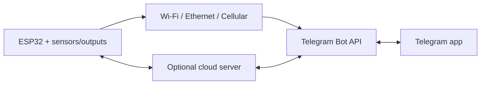
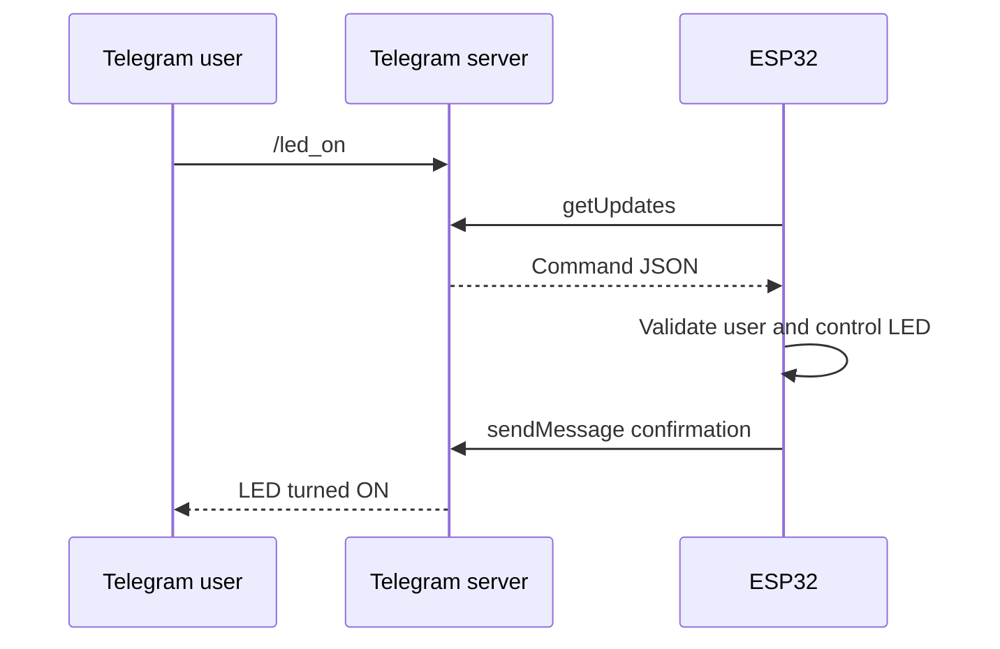
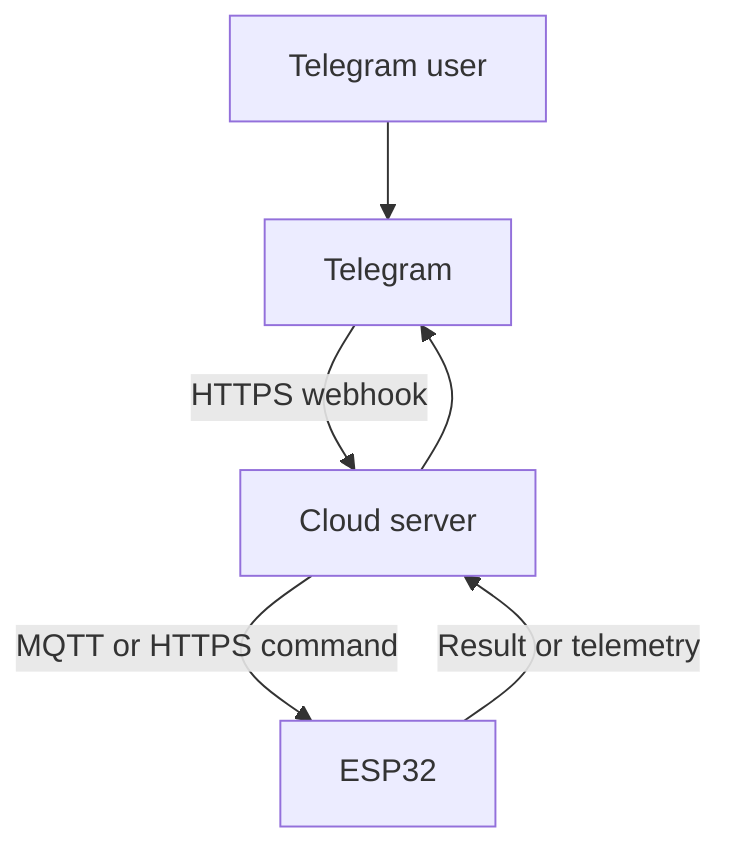
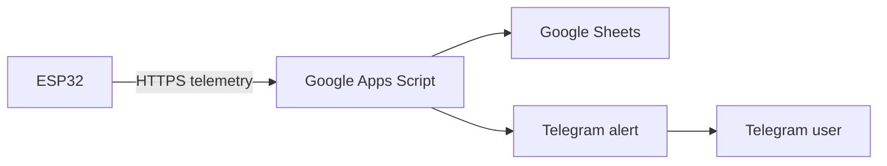

# ESP32 Communication with Telegram

An ESP32 can communicate with Telegram through a Telegram Bot. The ESP32 does not communicate directly with the Telegram phone app using Bluetooth or Wi-Fi Direct. Messages normally pass through Telegram's cloud servers using the HTTPS-based Bot API.

See the [Telegram Bot API documentation](https://core.telegram.org/bots/api).



## 1. Basic Communication Structure

A Telegram bot is created using `@BotFather`, which provides a secret bot token.

The ESP32 then sends HTTPS requests such as:

```text
[https://api.telegram.org/bot](https://api.telegram.org/bot)<BOT_TOKEN>/sendMessage
```

Typical information includes:

| Field | Meaning |
|---|---|
| `BOT_TOKEN` | Identifies and authenticates the bot. |
| `chat_id` | Identifies the permitted user, group, or channel. |
| `text` | Message content. |
| `update_id` | Identifies each received Telegram event. |

Telegram accepts HTTPS `GET` or `POST` requests. Parameters may be provided as URL query parameters, form data, JSON, or multipart form data for file uploads.

Responses are JSON objects containing fields such as:

- `ok`
- `result`
- `description`
- `error_code`

See the [Telegram Bot API request format](https://core.telegram.org/bots/api#making-requests).

## 2. ESP32-to-Telegram Communication Options

### Option A — One-Way Notification

The ESP32 sends information to Telegram but does not read commands.


Example applications:

- High-temperature warning.
- Water-leak alarm.
- Door-open notification.
- Motion detection.
- Machine fault alert.
- Power-failure notification.
- Wi-Fi reconnection or reboot report.
- Periodic sensor report.

Typical API methods include:

- `sendMessage`
- `sendPhoto`
- `sendDocument`
- `sendLocation`

This is the easiest and most reliable starting point because the ESP32 only makes outgoing connections.

### Option B — Two-Way Control Using Polling

The ESP32 sends notifications and periodically asks Telegram whether new messages or commands have arrived.



Telegram provides the `getUpdates` method for this purpose. It supports short polling and long polling.

Each processed message should be acknowledged logically by advancing the offset beyond its `update_id`. Otherwise, the ESP32 may process the same update again.

`getUpdates` cannot be used while a webhook is active.

See the [Telegram getUpdates documentation](https://core.telegram.org/bots/api#getupdates).

Suitable commands include:

```text
/start
/status
/temperature
/led_on
/led_off
/restart
```

#### Advantages

- No public server is required.
- Works with an ESP32 behind a home router.
- Simple to implement in the Arduino IDE.
- Suitable for small personal IoT projects.

#### Limitations

- The ESP32 must repeatedly contact Telegram.
- Frequent polling increases network traffic and power consumption.
- Long polling can block other firmware activity if implemented poorly.
- Commands are not guaranteed to arrive instantly.
- Update IDs must be managed carefully to prevent duplicate actions.

For ESP32-S3 projects, this is generally the best first two-way architecture.

### Option C — Inline-Button Control

Instead of typing commands, the bot presents buttons:

```text
Living Room Light

[ ON ] [ OFF ]
[ STATUS ] [ AUTO ]
```

The ESP32 receives a `callback_query` when the user presses a button.

Applications include:

- Lighting control.
- Fan-speed selection.
- Irrigation duration.
- Alarm arming.
- Motor direction.
- Operating-mode selection.
- Alarm acknowledgement.

This approach teaches:

- JSON construction.
- Inline keyboard formatting.
- Callback handling.
- State-machine design.
- User-interface feedback.

The ESP32 should update or acknowledge the Telegram message after processing the button so the user knows whether the command succeeded.

### Option D — Webhook Through a Cloud Server

Telegram pushes every new command to a public HTTPS server. The server then communicates with the ESP32.



Possible server platforms include:

- Google Apps Script.
- Node-RED.
- Python Flask or FastAPI.
- Node.js.
- Firebase.
- AWS Lambda.
- Cloudflare Workers.
- Home Assistant.
- Raspberry Pi with a public endpoint.

Telegram sends webhook updates as HTTPS `POST` requests.

A webhook can include a secret token in the `X-Telegram-Bot-Api-Secret-Token` header so the server can verify that the request belongs to the configured webhook.

See the [Telegram setWebhook documentation](https://core.telegram.org/bots/api#setwebhook).

A webhook directly to an ESP32 is usually impractical because:

- The ESP32 is normally behind router NAT.
- It does not have a public HTTPS address.
- Certificate and server management are difficult.
- Internet providers may block incoming connections.
- Exposing a microcontroller directly to the Internet increases risk.

Use webhooks when managing multiple devices or when commands must be routed through a proper backend.

### Option E — MQTT-to-Telegram Gateway

The ESP32 uses MQTT while a server converts between MQTT topics and Telegram messages.


Example MQTT topics:

```text
home/bathroom/temperature
home/bathroom/leak
home/bathroom/fan/set
home/bathroom/fan/state
```

#### Advantages

- Telegram code is removed from the ESP32.
- Multiple ESP32 devices can be supported.
- Telemetry and commands are separated cleanly.
- Easier integration with dashboards, databases, and automation.
- MQTT retained messages can store the latest desired state.

This is an educational architecture for advanced IoT classes because it introduces:

- Message brokers.
- Topic design.
- Publish/subscribe communication.
- Cloud integration.

### Option F — Google Sheets or Apps Script Bridge

Since you are already working with ESP32 and Google Sheets, you can extend the same architecture:



Examples:

- Log temperature in Google Sheets.
- Send a Telegram warning when temperature exceeds a limit.
- Record who acknowledged an alarm.
- Retrieve the last command from a sheet.
- Generate a daily operating summary.

This teaches:

- HTTP `POST`.
- JSON.
- Cloud scripting.
- Data logging.
- Notification rules.

However, Apps Script redirects and execution limits must be handled carefully.

## 3. Internet Connection Choices

Telegram communication requires Internet access, but the ESP32 can reach the Internet through different hardware.

| Connection | Hardware | Suitable Application |
|---|---|---|
| Wi-Fi | Built into most ESP32 boards. | Home automation and classroom projects. |
| Ethernet | W5500, LAN8720, or Ethernet ESP32 board. | Industrial or fixed equipment. |
| Cellular | SIM7600, A7670, SIM7000, or similar modem. | Remote monitoring without Wi-Fi. |
| Wi-Fi gateway | ESP32 connects through another router or device. | Portable installations. |
| LoRa-to-gateway | LoRa sensor communicates with an Internet-connected gateway. | Long-range field sensing. |

The Telegram protocol remains HTTPS regardless of whether the underlying Internet connection is Wi-Fi, Ethernet, or cellular.

## 4. Arduino Implementation Choices

### Direct HTTPS Requests

Use:

```cpp
#include <WiFiClientSecure.h>
#include <HTTPClient.h>
#include <ArduinoJson.h>
```

#### Advantages

- Students learn the actual Bot API.
- Full control over request formatting and error handling.
- No dependency on a Telegram-specific library.

#### Disadvantages

- More code is required.
- URL encoding, JSON parsing, and file uploads require care.
- Polling and update-offset management must be implemented manually.

This approach is best for advanced learning.

### Universal Arduino Telegram Bot

The library supports:

- Receiving and sending messages.
- Reply keyboards.
- Inline keyboards.
- Photos.
- Locations.
- Long polling.

It uses an SSL client and ArduinoJson.

See the [Universal Arduino Telegram Bot repository](https://github.com/witnessmenow/Universal-Arduino-Bot).

Good for:

- Introductory projects.
- LED control.
- Sensor monitoring.
- ESP32-CAM.
- Quick prototypes.

### AsyncTelegram2

[AsyncTelegram2](https://github.com/cotestatnt/AsyncTelegram2) is intended for applications where Telegram communication should not block the rest of the firmware.

This is useful when the ESP32 must continue servicing displays, sensors, motors, or time-critical tasks while checking Telegram.

Good for:

- Multitasking systems.
- FreeRTOS-based projects.
- Responsive displays.
- Multiple sensors.
- Projects where blocking HTTPS calls create delays.

### CTBot

[CTBot](https://github.com/shurillu/CTBot) provides a relatively simple interface for ESP8266 and ESP32. It supports commands and keyboard-based interaction.

### Recommended Teaching Sequence

For a new advanced ESP32-S3 lesson, teach the following sequence:

1. Raw `HTTPClient` for understanding the protocol.
2. A Telegram library for rapid implementation.
3. An asynchronous or cloud architecture for the final project.

## 5. Recommended Learning Projects

| Level | Project | Communication Learned | Main Engineering Concepts |
|---:|---|---|---|
| 1 | Push-button Telegram notifier | ESP32 → Telegram | GPIO input, debounce, HTTPS, `sendMessage`. |
| 2 | Temperature and humidity monitor | ESP32 → Telegram | Sensor interface, formatting, and thresholds. |
| 3 | Remote LED and relay controller | Telegram → ESP32 | `getUpdates`, JSON parsing, and command validation. |
| 4 | Inline-button home controller | Two-way interactive | Callback queries, state machines, and UI feedback. |
| 5 | ESP32-CAM security alert | Photo upload | Motion sensing, JPEG buffers, and multipart transfer. |
| 6 | Water-leak monitoring system | Event and acknowledgement | Alarm latching, escalation, and recovery. |
| 7 | Google Sheets plus Telegram | ESP32 → cloud → Telegram | REST API, data logging, and rule processing. |
| 8 | MQTT multi-device control centre | Telegram ↔ server ↔ ESP32 | MQTT, device identity, and scalable architecture. |
| 9 | Cellular remote alarm | ESP32 + modem → Telegram | AT commands, cellular reliability, and reconnection. |
| 10 | Dependable IoT capstone | Full two-way system | TLS, NVS, watchdog, retries, OTA, and security. |

## Best Introductory Project

A good first project is an ESP32 temperature monitor with LED control.

### Functions

- `/start` displays available commands.
- `/status` returns temperature, RSSI, uptime, and LED state.
- `/led_on` and `/led_off` control an LED.
- A high-temperature condition automatically sends an alert.
- Only an authorised `chat_id` can issue commands.
- An inline keyboard provides `ON`, `OFF`, and `STATUS` buttons.

This single project covers most essential Telegram communication concepts without requiring excessive hardware.

## Best Advanced Project

### Smart Equipment Monitoring and Maintenance Assistant

Possible functions include:

- Periodically measure temperature, current, and vibration.
- Report abnormal conditions to a maintenance Telegram group.
- Allow an authorised person to acknowledge an alarm.
- Log data to Google Sheets or an MQTT database.
- Send a photo from an ESP32-CAM.
- Report firmware version, reset reason, and uptime.
- Permit safe configuration changes through Telegram.
- Store settings and processed command IDs in NVS.
- Use a watchdog and reconnection state machine.

## 6. Security and Reliability Practices

- Never publish the bot token in GitHub repositories or screenshots.
- Restrict commands using an allowlist of authorised `chat_id` values.
- Use TLS certificate validation; avoid `client.setInsecure()` in a finished system.
- Synchronise the ESP32 system time before validating TLS certificates.
- Do not accept arbitrary text as GPIO numbers, durations, or configuration values.
- Store or correctly advance the last `update_id` to prevent repeated commands.
- Confirm the actual output state after a command instead of merely replying `"success"`.
- Add timeouts, retry limits, and Wi-Fi reconnection handling.
- Avoid using Telegram as a safety-critical emergency-stop system.
- Require additional confirmation for dangerous commands such as reboot, door unlock, motor operation, or OTA update.
- Keep Telegram processing separate from time-critical control loops.

Telegram retains uncollected bot updates for no longer than 24 hours. Polling and webhook reception are mutually exclusive.

See the [Telegram update delivery documentation](https://core.telegram.org/bots/api#getting-updates).

## Recommended Advanced ESP32-S3 Lesson

For an advanced ESP32-S3 class, combine Projects 3, 4, and 6 into one lesson:

```text
Secure two-way Telegram control
+ Sensor alarms
+ Inline buttons
+ Command authorisation
```
