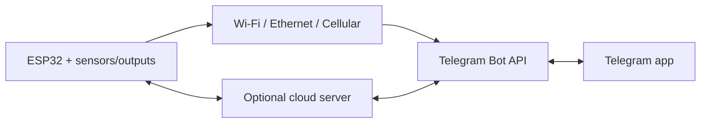
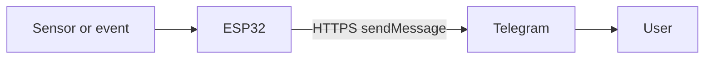
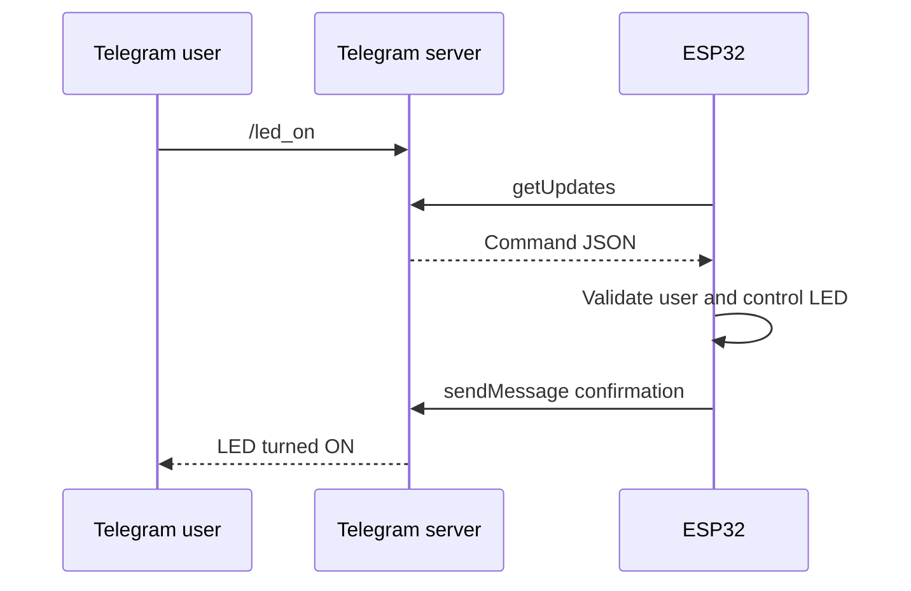
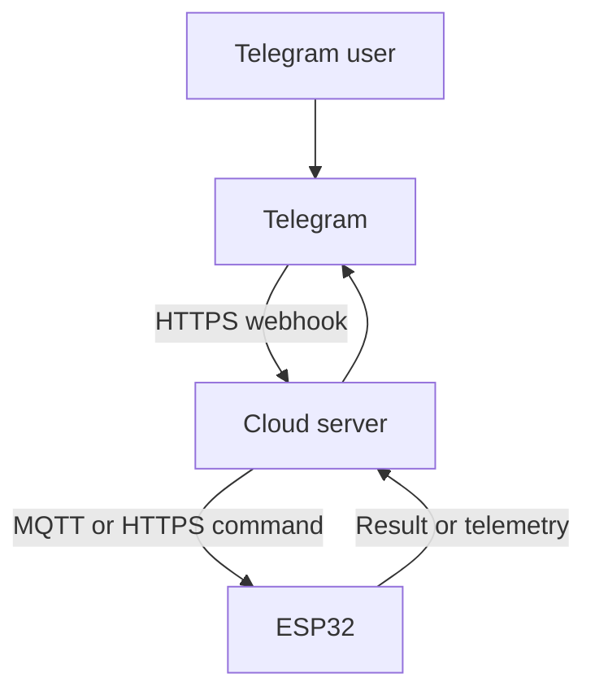
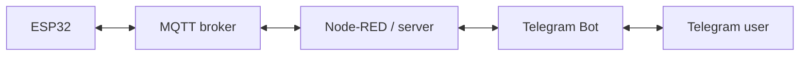
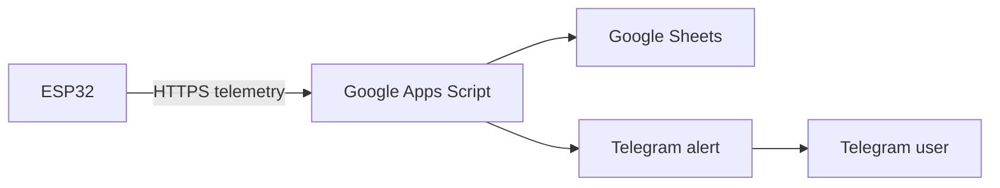
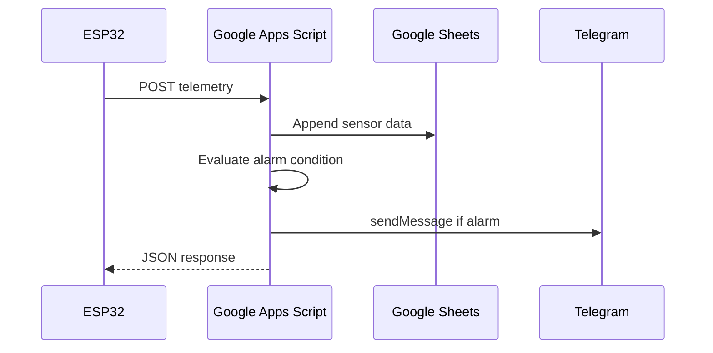
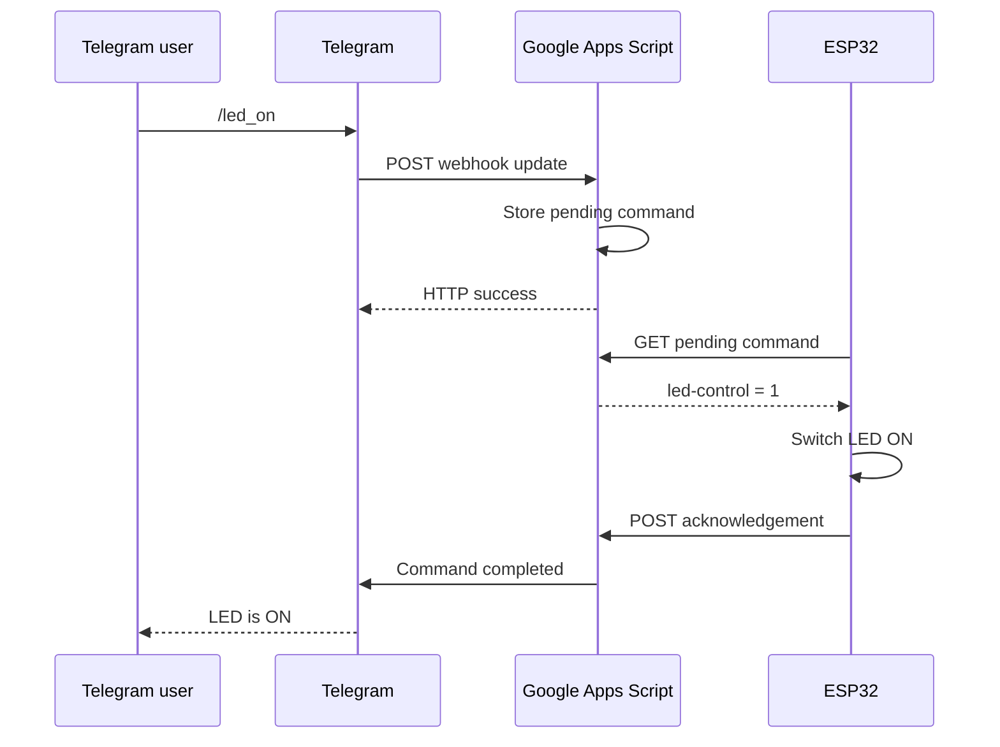
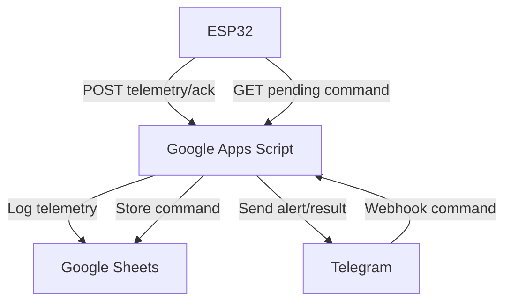
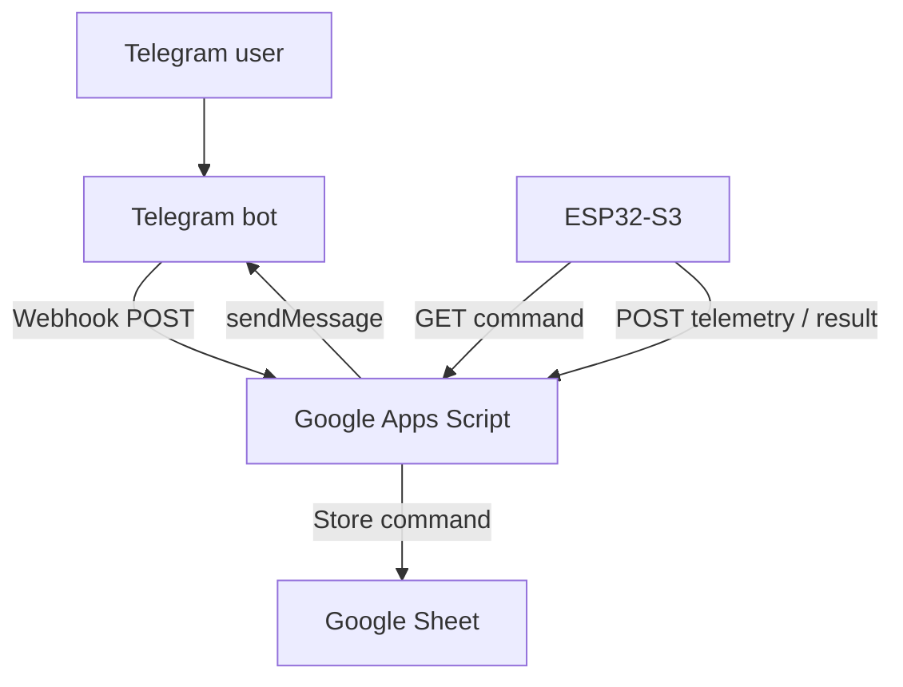

# ESP32 Communication with Telegram

An ESP32 can communicate with Telegram through a Telegram Bot. The ESP32 does not communicate directly with the Telegram phone app using Bluetooth or Wi-Fi Direct. Messages normally pass through Telegram's cloud servers using the HTTPS-based Bot API.

See the [Telegram Bot API documentation](https://core.telegram.org/bots/api).



## 1. Basic Communication Structure

A Telegram bot is created using `@BotFather`, which provides a secret bot token.

The ESP32 then sends HTTPS requests such as:

```text
[https://api.telegram.org/bot](https://api.telegram.org/bot)<BOT_TOKEN>/sendMessage
```

Typical information includes:

| Field | Meaning |
|---|---|
| `BOT_TOKEN` | Identifies and authenticates the bot. |
| `chat_id` | Identifies the permitted user, group, or channel. |
| `text` | Message content. |
| `update_id` | Identifies each received Telegram event. |

Telegram accepts HTTPS `GET` or `POST` requests. Parameters may be provided as URL query parameters, form data, JSON, or multipart form data for file uploads.

Responses are JSON objects containing fields such as:

- `ok`
- `result`
- `description`
- `error_code`

See the [Telegram Bot API request format](https://core.telegram.org/bots/api#making-requests).

## 2. ESP32-to-Telegram Communication Options

### Option A — One-Way Notification

The ESP32 sends information to Telegram but does not read commands.



Example applications:

- High-temperature warning.
- Water-leak alarm.
- Door-open notification.
- Motion detection.
- Machine fault alert.
- Power-failure notification.
- Wi-Fi reconnection or reboot report.
- Periodic sensor report.

Typical API methods include:

- `sendMessage`
- `sendPhoto`
- `sendDocument`
- `sendLocation`

This is the easiest and most reliable starting point because the ESP32 only makes outgoing connections.

### Option B — Two-Way Control Using Polling

The ESP32 sends notifications and periodically asks Telegram whether new messages or commands have arrived.



Telegram provides the `getUpdates` method for this purpose. It supports short polling and long polling.

Each processed message should be acknowledged logically by advancing the offset beyond its `update_id`. Otherwise, the ESP32 may process the same update again.

`getUpdates` cannot be used while a webhook is active.

See the [Telegram getUpdates documentation](https://core.telegram.org/bots/api#getupdates).

Suitable commands include:

```text
/start
/status
/temperature
/led_on
/led_off
/restart
```

#### Advantages

- No public server is required.
- Works with an ESP32 behind a home router.
- Simple to implement in the Arduino IDE.
- Suitable for small personal IoT projects.

#### Limitations

- The ESP32 must repeatedly contact Telegram.
- Frequent polling increases network traffic and power consumption.
- Long polling can block other firmware activity if implemented poorly.
- Commands are not guaranteed to arrive instantly.
- Update IDs must be managed carefully to prevent duplicate actions.

For ESP32-S3 projects, this is generally the best first two-way architecture.

### Option C — Inline-Button Control

Instead of typing commands, the bot presents buttons:

```text
Living Room Light

[ ON ] [ OFF ]
[ STATUS ] [ AUTO ]
```

The ESP32 receives a `callback_query` when the user presses a button.

Applications include:

- Lighting control.
- Fan-speed selection.
- Irrigation duration.
- Alarm arming.
- Motor direction.
- Operating-mode selection.
- Alarm acknowledgement.

This approach teaches:

- JSON construction.
- Inline keyboard formatting.
- Callback handling.
- State-machine design.
- User-interface feedback.

The ESP32 should update or acknowledge the Telegram message after processing the button so the user knows whether the command succeeded.

### Option D — Webhook Through a Cloud Server

Telegram pushes every new command to a public HTTPS server. The server then communicates with the ESP32.



Possible server platforms include:

- Google Apps Script.
- Node-RED.
- Python Flask or FastAPI.
- Node.js.
- Firebase.
- AWS Lambda.
- Cloudflare Workers.
- Home Assistant.
- Raspberry Pi with a public endpoint.

Telegram sends webhook updates as HTTPS `POST` requests.

A webhook can include a secret token in the `X-Telegram-Bot-Api-Secret-Token` header so the server can verify that the request belongs to the configured webhook.

See the [Telegram setWebhook documentation](https://core.telegram.org/bots/api#setwebhook).

A webhook directly to an ESP32 is usually impractical because:

- The ESP32 is normally behind router NAT.
- It does not have a public HTTPS address.
- Certificate and server management are difficult.
- Internet providers may block incoming connections.
- Exposing a microcontroller directly to the Internet increases risk.

Use webhooks when managing multiple devices or when commands must be routed through a proper backend.

### Option E — MQTT-to-Telegram Gateway

The ESP32 uses MQTT while a server converts between MQTT topics and Telegram messages.



Example MQTT topics:

```text
home/bathroom/temperature
home/bathroom/leak
home/bathroom/fan/set
home/bathroom/fan/state
```

#### Advantages

- Telegram code is removed from the ESP32.
- Multiple ESP32 devices can be supported.
- Telemetry and commands are separated cleanly.
- Easier integration with dashboards, databases, and automation.
- MQTT retained messages can store the latest desired state.

This is an educational architecture for advanced IoT classes because it introduces:

- Message brokers.
- Topic design.
- Publish/subscribe communication.
- Cloud integration.

### Option F — Google Sheets or Apps Script Bridge

Since you are already working with ESP32 and Google Sheets, you can extend the same architecture:



Examples:

- Log temperature in Google Sheets.
- Send a Telegram warning when temperature exceeds a limit.
- Record who acknowledged an alarm.
- Retrieve the last command from a sheet.
- Generate a daily operating summary.

This teaches:

- HTTP `POST`.
- JSON.
- Cloud scripting.
- Data logging.
- Notification rules.

However, Apps Script redirects and execution limits must be handled carefully.

## 3. Internet Connection Choices

Telegram communication requires Internet access, but the ESP32 can reach the Internet through different hardware.

| Connection | Hardware | Suitable Application |
|---|---|---|
| Wi-Fi | Built into most ESP32 boards. | Home automation and classroom projects. |
| Ethernet | W5500, LAN8720, or Ethernet ESP32 board. | Industrial or fixed equipment. |
| Cellular | SIM7600, A7670, SIM7000, or similar modem. | Remote monitoring without Wi-Fi. |
| Wi-Fi gateway | ESP32 connects through another router or device. | Portable installations. |
| LoRa-to-gateway | LoRa sensor communicates with an Internet-connected gateway. | Long-range field sensing. |

The Telegram protocol remains HTTPS regardless of whether the underlying Internet connection is Wi-Fi, Ethernet, or cellular.

## 4. Arduino Implementation Choices

### Direct HTTPS Requests

Use:

```cpp
#include <WiFiClientSecure.h>
#include <HTTPClient.h>
#include <ArduinoJson.h>
```

#### Advantages

- Students learn the actual Bot API.
- Full control over request formatting and error handling.
- No dependency on a Telegram-specific library.

#### Disadvantages

- More code is required.
- URL encoding, JSON parsing, and file uploads require care.
- Polling and update-offset management must be implemented manually.

This approach is best for advanced learning.

### Universal Arduino Telegram Bot

The library supports:

- Receiving and sending messages.
- Reply keyboards.
- Inline keyboards.
- Photos.
- Locations.
- Long polling.

It uses an SSL client and ArduinoJson.

See the [Universal Arduino Telegram Bot repository](https://github.com/witnessmenow/Universal-Arduino-Bot).

Good for:

- Introductory projects.
- LED control.
- Sensor monitoring.
- ESP32-CAM.
- Quick prototypes.

### AsyncTelegram2

[AsyncTelegram2](https://github.com/cotestatnt/AsyncTelegram2) is intended for applications where Telegram communication should not block the rest of the firmware.

This is useful when the ESP32 must continue servicing displays, sensors, motors, or time-critical tasks while checking Telegram.

Good for:

- Multitasking systems.
- FreeRTOS-based projects.
- Responsive displays.
- Multiple sensors.
- Projects where blocking HTTPS calls create delays.

### CTBot

[CTBot](https://github.com/shurillu/CTBot) provides a relatively simple interface for ESP8266 and ESP32. It supports commands and keyboard-based interaction.

### Recommended Teaching Sequence

For a new advanced ESP32-S3 lesson, teach the following sequence:

1. Raw `HTTPClient` for understanding the protocol.
2. A Telegram library for rapid implementation.
3. An asynchronous or cloud architecture for the final project.

## 5. Recommended Learning Projects

| Level | Project | Communication Learned | Main Engineering Concepts |
|---:|---|---|---|
| 1 | Push-button Telegram notifier | ESP32 → Telegram | GPIO input, debounce, HTTPS, `sendMessage`. |
| 2 | Temperature and humidity monitor | ESP32 → Telegram | Sensor interface, formatting, and thresholds. |
| 3 | Remote LED and relay controller | Telegram → ESP32 | `getUpdates`, JSON parsing, and command validation. |
| 4 | Inline-button home controller | Two-way interactive | Callback queries, state machines, and UI feedback. |
| 5 | ESP32-CAM security alert | Photo upload | Motion sensing, JPEG buffers, and multipart transfer. |
| 6 | Water-leak monitoring system | Event and acknowledgement | Alarm latching, escalation, and recovery. |
| 7 | Google Sheets plus Telegram | ESP32 → cloud → Telegram | REST API, data logging, and rule processing. |
| 8 | MQTT multi-device control centre | Telegram ↔ server ↔ ESP32 | MQTT, device identity, and scalable architecture. |
| 9 | Cellular remote alarm | ESP32 + modem → Telegram | AT commands, cellular reliability, and reconnection. |
| 10 | Dependable IoT capstone | Full two-way system | TLS, NVS, watchdog, retries, OTA, and security. |


**Learning Roadmap and Practical Projects**     

| Project Level | Application Idea | Hardware Required | Key Communication Concepts Learned |
|---|---|---|---|
| **Beginner** | Remote Relay Controller | ESP32, relay module, and LED. | Basic polling, parsing text command strings such as `/turn_on` and `/status`, and filtering by an allowlisted chat ID. |
| **Intermediate** | Environmental Alarm System | ESP32 with a DHT22 or BME280 sensor. | Threshold-triggered conditions, formatting HTML or Markdown messages, and sending automated alerts. |
| **Intermediate** | Interactive Control Dashboard | ESP32 and status LEDs. | Building inline keyboards and interactive tap buttons inside a Telegram chat. |
| **Advanced** | ESP32-CAM Motion Security | ESP32-CAM and PIR motion sensor. | HTTP `multipart/form-data` binary image transfer for sending JPEG photos when motion is detected. |
| **Hybrid** | MQTT-to-Telegram Gateway | ESP32 and Raspberry Pi running n8n or Node-RED. | Decoupled telemetry over MQTT, webhook handling, and multi-node automation. |


## Best Introductory Project

A good first project is an ESP32 temperature monitor with LED control.

### Functions

- `/start` displays available commands.
- `/status` returns temperature, RSSI, uptime, and LED state.
- `/led_on` and `/led_off` control an LED.
- A high-temperature condition automatically sends an alert.
- Only an authorised `chat_id` can issue commands.
- An inline keyboard provides `ON`, `OFF`, and `STATUS` buttons.

This single project covers most essential Telegram communication concepts without requiring excessive hardware.

## Best Advanced Project

### Smart Equipment Monitoring and Maintenance Assistant

Possible functions include:

- Periodically measure temperature, current, and vibration.
- Report abnormal conditions to a maintenance Telegram group.
- Allow an authorised person to acknowledge an alarm.
- Log data to Google Sheets or an MQTT database.
- Send a photo from an ESP32-CAM.
- Report firmware version, reset reason, and uptime.
- Permit safe configuration changes through Telegram.
- Store settings and processed command IDs in NVS.
- Use a watchdog and reconnection state machine.

## 6. Security and Reliability Practices

- Never publish the bot token in GitHub repositories or screenshots.
- Restrict commands using an allowlist of authorised `chat_id` values.
- Use TLS certificate validation; avoid `client.setInsecure()` in a finished system.
- Synchronise the ESP32 system time before validating TLS certificates.
- Do not accept arbitrary text as GPIO numbers, durations, or configuration values.
- Store or correctly advance the last `update_id` to prevent repeated commands.
- Confirm the actual output state after a command instead of merely replying `"success"`.
- Add timeouts, retry limits, and Wi-Fi reconnection handling.
- Avoid using Telegram as a safety-critical emergency-stop system.
- Require additional confirmation for dangerous commands such as reboot, door unlock, motor operation, or OTA update.
- Keep Telegram processing separate from time-critical control loops.

Telegram retains uncollected bot updates for no longer than 24 hours. Polling and webhook reception are mutually exclusive.

See the [Telegram update delivery documentation](https://core.telegram.org/bots/api#getting-updates).

## Recommended Advanced ESP32-S3 Lesson

For an advanced ESP32-S3 class, combine Projects 3, 4, and 6 into one lesson:

```text
Secure two-way Telegram control
+ Sensor alarms
+ Inline buttons
+ Command authorisation
```
---

# Google Apps Script: Option F vs. Option D

The two options use the same Google Apps Script platform, but Apps Script plays a different role:

- **Option F:** The ESP32 initiates communication by sending telemetry to Google Apps Script. Apps Script logs it and optionally sends a Telegram alert.
- **Option D:** Telegram initiates communication by sending a webhook to Google Apps Script. Apps Script stores the command, and the ESP32 later retrieves it.

The important point is that Google Apps Script normally cannot directly push a command into an ESP32 behind a router. The ESP32 must still poll Google Apps Script, MQTT, Firebase, or another command service.

## 1. Communication-Flow Difference

### Option F — ESP32 Telemetry Bridge



The ESP32 is the initiator.

Typical ESP32 payload:

```json
{
  "source": "esp32",
  "type": "telemetry",
  "deviceId": "ESP32_01",
  "temperature": 45.5,
  "rssi": -73,
  "uptime": 100,
  "led-state": 0
}
```

### Option D — Telegram Webhook Command Bridge



Telegram is the first initiator, but the ESP32 still initiates its own connection to collect the command.

## 2. Main Code Differences

| Function | Option F: Telemetry Bridge | Option D: Webhook Bridge |
|---|---:|---:|
| ESP32 sends telemetry | Yes | Optional |
| ESP32 contacts Telegram directly | No | No |
| ESP32 polls Google Apps Script for commands | Optional | Usually required |
| Google Apps Script receives ESP32 JSON | Yes | Optional |
| Google Apps Script receives Telegram JSON | No | Yes |
| Google Apps Script parses `update_id` and message | No | Yes |
| Google Apps Script checks Telegram `chat_id` | Only for alert destination | Required for command authorisation |
| Google Apps Script stores pending commands | Usually not | Yes |
| Google Apps Script sends Telegram messages | Alarm notification | Command response and acknowledgement |
| Telegram webhook configured | No | Yes |
| Bot token stored in ESP32 | No | No |
| Bot token stored in Google Apps Script | Yes | Yes |

## 3. Option F Code Structure

### ESP32 Code

The existing ESP32 design is already close to Option F:

```cpp
void sendTelemetry() {
  JsonDocument doc;

  doc["source"] = "esp32";
  doc["type"] = "telemetry";
  doc["deviceId"] = "ESP32_01";
  doc["status"] = "ONLINE";
  doc["temperature"] = temperature;
  doc["rssi"] = WiFi.RSSI();
  doc["uptime"] = millis() / 1000;
  doc["led-state"] = digitalRead(LED_PIN);

  String payload;
  serializeJson(doc, payload);

  WiFiClientSecure client;
  client.setCACert(GOOGLE_ROOT_CA);

  HTTPClient http;

  http.setFollowRedirects(
      HTTPC_FORCE_FOLLOW_REDIRECTS
  );

  http.begin(client, GAS_URL);
  http.addHeader(
      "Content-Type",
      "application/json"
  );

  int httpCode = http.POST(payload);
  String response = http.getString();

  Serial.printf(
      "HTTP response: %d\n",
      httpCode
  );

  Serial.println(response);

  http.end();
}
```

The ESP32:

1. Reads sensors.
2. Constructs telemetry JSON.
3. Sends it to Google Apps Script using `POST`.
4. Parses the Google Apps Script response.
5. Optionally applies a command returned with that response.

Example response:

```json
{
  "status": "success",
  "led-control": 1
}
```

### Google Apps Script Code

```javascript
const SHEET_ID = "YOUR_SHEET_ID";

function doPost(e) {
  try {
    const data = JSON.parse(e.postData.contents);

    if (data.source !== "esp32") {
      return jsonResponse({
        status: "error",
        message: "Unknown source"
      });
    }

    const sheet =
      SpreadsheetApp
        .openById(SHEET_ID)
        .getSheetByName("Telemetry");

    sheet.appendRow([
      new Date(),
      data.deviceId,
      data.status,
      data.temperature,
      data.rssi,
      data.uptime,
      data["led-state"]
    ]);

    if (Number(data.temperature) >= 45) {
      sendTelegram(
        "High-temperature warning\n" +
        "Device: " + data.deviceId + "\n" +
        "Temperature: " + data.temperature + " °C"
      );
    }

    return jsonResponse({
      status: "success",
      "led-control": readLedControlFromSheet()
    });

  } catch (error) {
    return jsonResponse({
      status: "error",
      message: error.message
    });
  }
}
```

Telegram is only used as an output notification channel:

```javascript
function sendTelegram(message) {
  const properties =
    PropertiesService.getScriptProperties();

  const token =
    properties.getProperty("BOT_TOKEN");

  const chatId =
    properties.getProperty("CHAT_ID");

  const url =
    "[https://api.telegram.org/bot](https://api.telegram.org/bot)" +
    token +
    "/sendMessage";

  const payload = {
    chat_id: chatId,
    text: message
  };

  UrlFetchApp.fetch(url, {
    method: "post",
    contentType: "application/json",
    payload: JSON.stringify(payload),
    muteHttpExceptions: true
  });
}
```

## 4. Option D Code Structure

Option D requires Google Apps Script to understand the Telegram webhook JSON and convert Telegram commands into commands that the ESP32 can retrieve.

### Telegram Webhook JSON

When the user sends `/led_on`, Google Apps Script receives something similar to:

```json
{
  "update_id": 123456789,
  "message": {
    "message_id": 20,
    "from": {
      "id": 11223344
    },
    "chat": {
      "id": 11223344,
      "type": "private"
    },
    "text": "/led_on"
  }
}
```

### Google Apps Script Webhook Handler

```javascript
const AUTHORISED_CHAT_ID = "11223344";

function doPost(e) {
  try {
    const data =
      JSON.parse(e.postData.contents || "{}");

    // Telegram webhook message
    if (data.update_id !== undefined) {
      return handleTelegramUpdate(data, e);
    }

    // ESP32 telemetry or acknowledgement
    if (data.source === "esp32") {
      return handleEsp32Request(data);
    }

    return jsonResponse({
      status: "error",
      message: "Unknown request"
    });

  } catch (error) {
    return jsonResponse({
      status: "error",
      message: error.message
    });
  }
}
```

Google Apps Script runs `doPost(e)` when it receives an HTTP `POST`. The request body is available through `e.postData.contents`.

See the [Google Apps Script web-app documentation](https://developers.google.com/apps-script/guides/web).

### Parse Telegram Commands

```javascript
function handleTelegramUpdate(update, e) {
  const message = update.message;

  if (!message || !message.text) {
    return jsonResponse({
      ok: true
    });
  }

  const chatId = String(message.chat.id);
  const command =
    message.text.trim().toLowerCase();

  if (chatId !== AUTHORISED_CHAT_ID) {
    sendTelegramTo(
      chatId,
      "Unauthorised user."
    );

    return jsonResponse({
      ok: true
    });
  }

  switch (command) {
    case "/led_on":
      queueCommand(
        "ESP32_01",
        "SET_LED",
        1
      );

      sendTelegramTo(
        chatId,
        "LED ON command queued. " +
        "Waiting for ESP32."
      );
      break;

    case "/led_off":
      queueCommand(
        "ESP32_01",
        "SET_LED",
        0
      );

      sendTelegramTo(
        chatId,
        "LED OFF command queued. " +
        "Waiting for ESP32."
      );
      break;

    case "/status":
      sendStoredStatus(
        chatId,
        "ESP32_01"
      );
      break;

    default:
      sendTelegramTo(
        chatId,
        "Available commands:\n" +
        "/led_on\n" +
        "/led_off\n" +
        "/status"
      );
  }

  return jsonResponse({
    ok: true
  });
}
```

### Store the Command

For a simple single-device demonstration, Script Properties can be used:

```javascript
function queueCommand(
  deviceId,
  command,
  value
) {
  const commandObject = {
    commandId: Utilities.getUuid(),
    deviceId: deviceId,
    command: command,
    value: value,
    state: "PENDING",
    timestamp: new Date().toISOString()
  };

  PropertiesService
    .getScriptProperties()
    .setProperty(
      "COMMAND_" + deviceId,
      JSON.stringify(commandObject)
    );
}
```

For multiple ESP32 devices, a Google Sheet command queue is better:

| Command ID | Device ID | Command | Value | State | Created | Completed |
|---|---|---|---:|---|---|---|
| `abc-123` | `ESP32_01` | `SET_LED` | `1` | `PENDING` | `14:20:10` | |
| `abc-124` | `ESP32_02` | `SET_FAN` | `0` | `DONE` | `14:21:15` | `14:21:18` |

## 5. ESP32 Command Polling for Option D

The ESP32 does not call Telegram's `getUpdates`. Instead, it asks Google Apps Script for a pending command:

```text
GET GAS_URL?action=getCommand&deviceId=ESP32_01
```

### ESP32 Polling Code

```cpp
void checkPendingCommand() {
  String url =
      String(GAS_URL) +
      "?action=getCommand" +
      "&deviceId=ESP32_01";

  WiFiClientSecure client;
  client.setCACert(GOOGLE_ROOT_CA);

  HTTPClient http;

  http.setFollowRedirects(
      HTTPC_STRICT_FOLLOW_REDIRECTS
  );

  http.begin(client, url);

  int httpCode = http.GET();

  if (httpCode == HTTP_CODE_OK) {
    String response = http.getString();

    JsonDocument doc;

    DeserializationError error =
        deserializeJson(doc, response);

    if (!error && doc["status"] == "command") {
      String command =
          doc["command"];

      int value =
          doc["value"];

      String commandId =
          doc["commandId"];

      if (command == "SET_LED" &&
          (value == 0 || value == 1)) {

        digitalWrite(
            LED_PIN,
            value ? HIGH : LOW
        );

        sendCommandAcknowledgement(
            commandId,
            true,
            value
        );
      }
    }
  }

  http.end();
}
```

### Google Apps Script `doGet()`

```javascript
function doGet(e) {
  const action =
    e.parameter.action || "";

  if (action === "getCommand") {
    return getPendingCommand(
      e.parameter.deviceId
    );
  }

  return jsonResponse({
    status: "error",
    message: "Unknown action"
  });
}
```

```javascript
function getPendingCommand(deviceId) {
  const value =
    PropertiesService
      .getScriptProperties()
      .getProperty(
        "COMMAND_" + deviceId
      );

  if (!value) {
    return jsonResponse({
      status: "no-command"
    });
  }

  const command =
    JSON.parse(value);

  if (command.state !== "PENDING") {
    return jsonResponse({
      status: "no-command"
    });
  }

  return jsonResponse({
    status: "command",
    commandId: command.commandId,
    command: command.command,
    value: command.value
  });
}
```

## 6. ESP32 Acknowledgement

It is better not to tell the Telegram user `"LED is ON"` immediately after Google Apps Script receives `/led_on`.

At that point, Google Apps Script has only queued the command.

The sequence should be:

1. Telegram user sends `/led_on`.
2. Google Apps Script replies: `"Command queued."`
3. ESP32 retrieves and executes the command.
4. ESP32 sends an acknowledgement.
5. Google Apps Script sends: `"ESP32 confirmed: LED is ON."`

### ESP32 Acknowledgement Payload

```json
{
  "source": "esp32",
  "type": "command-ack",
  "deviceId": "ESP32_01",
  "commandId": "abc-123",
  "success": true,
  "led-state": 1
}
```

### Google Apps Script Request Handler

```javascript
function handleEsp32Request(data) {
  if (data.type === "telemetry") {
    return processTelemetry(data);
  }

  if (data.type === "command-ack") {
    return processCommandAcknowledgement(data);
  }

  return jsonResponse({
    status: "error",
    message: "Unknown ESP32 message type"
  });
}
```

```javascript
function processCommandAcknowledgement(data) {
  PropertiesService
    .getScriptProperties()
    .deleteProperty(
      "COMMAND_" + data.deviceId
    );

  const result = data.success
    ? "Command completed successfully."
    : "ESP32 failed to execute the command.";

  sendTelegram(
    result +
    "\nDevice: " + data.deviceId +
    "\nLED state: " + data["led-state"]
  );

  return jsonResponse({
    status: "acknowledgement-recorded"
  });
}
```

## 7. Combined Google Apps Script Design

You do not necessarily need two separate Google Apps Script deployments.

One deployment can support both options by examining the incoming JSON:

```javascript
function doPost(e) {
  const data =
    JSON.parse(e.postData.contents || "{}");

  if (data.update_id !== undefined) {
    return handleTelegramUpdate(
      data,
      e
    );
  }

  if (data.source === "esp32") {
    return handleEsp32Request(data);
  }

  return jsonResponse({
    status: "error",
    message: "Unrecognised request"
  });
}
```

The complete combined flow becomes:



This is the most logical extension of an existing Google Sheets project.

## 8. Webhook Setup Requirement

For Option D, register the Google Apps Script deployment URL with Telegram:

```text
[https://api.telegram.org/bot](https://api.telegram.org/bot)<BOT_TOKEN>/setWebhook?url=<GAS_WEB_APP_URL>
```

After registration:

- Telegram sends updates to Google Apps Script.
- The ESP32 must stop using Telegram's `getUpdates`.
- Google Apps Script becomes the only Telegram update receiver.

Telegram does not permit `getUpdates` and webhook delivery to operate simultaneously.

See the [Telegram webhook documentation](https://core.telegram.org/bots/api#setwebhook).

Check the webhook state with:

```text
[https://api.telegram.org/bot](https://api.telegram.org/bot)<BOT_TOKEN>/getWebhookInfo
```

## 9. Relevance of the Current 302 Redirect Issue

For both designs, an ESP32 calling a Google Apps Script web app can encounter a redirect from:

```text
script.google.com
```

to:

```text
script.googleusercontent.com
```

Google documents that `ContentService` output is served from a different URL for security reasons.

See the [Google Content Service documentation](https://developers.google.com/apps-script/reference/content/content-service).

The difference is:

| Design | Redirect Handling Applies To |
|---|---|
| Option F | ESP32 telemetry `POST` response. |
| Option D | ESP32 command `GET` and acknowledgement `POST`. |

The Telegram-to-Google Apps Script webhook does not use the ESP32 redirect-handling code.

For the ESP32 implementation, automatic redirect handling is preferable for `GET` requests:

```cpp
http.setFollowRedirects(
    HTTPC_STRICT_FOLLOW_REDIRECTS
);
```

For the Google Apps Script `POST` request:

```cpp
http.setFollowRedirects(
    HTTPC_FORCE_FOLLOW_REDIRECTS
);
```

This avoids depending on `http.getLocation()`, which showed inconsistent behavior in the observed implementation.

## Recommendation

Keep the existing Option F structure and add the Option D functions:

1. Continue posting telemetry from the ESP32 to Google Apps Script.
2. Add Telegram webhook processing to `doPost()`.
3. Add a command queue in Google Sheets or Script Properties.
4. Let the ESP32 call `doGet()` every 3–5 seconds.
5. Add an ESP32 command acknowledgement.
6. Let Google Apps Script send the final execution result to Telegram.

Therefore, Option D does not replace the existing Google Sheets communication. It adds a Telegram-to-Google Apps Script command path on top of it.

---


# Combined ESP32-S3 and Telegram Setup

Below is the recommended setup sequence for the combined architecture:



## 1. Create the Telegram Bot

### Step 1 — Open BotFather

In Telegram, open the official verified BotFather:

[Open @BotFather](https://t.me/BotFather)

Check that:

- The username is exactly `@BotFather`.
- The account is verified.
- You are not using a similarly named unofficial account.

### Step 2 — Create a Bot

Send:

```text
/newbot
```

BotFather asks for two names.

First, enter a display name, for example:

```text
ESP32 Learning Lab
```

Then enter a unique username ending in `bot`, for example:

```text
OoiKK_ESP32_bot
```

If accepted, BotFather returns something similar to:

```text
Done! Congratulations on your new bot.

Use this token to access the HTTP API:

1234567890:AAExampleSecretToken123456789
```

The official Telegram procedure is `/newbot`, followed by the bot name and username.

See the [Telegram Bot tutorial](https://core.telegram.org/bots/tutorial#obtain-your-bot-token).

## 2. Identify the Telegram Values

These values are easily confused:

| Item | Example | Purpose | Secret? |
|---|---|---|---|
| Bot display name | `ESP32 Learning Lab` | Human-readable name. | No |
| Bot username | `OoiKK_ESP32_bot` | Telegram address. | No |
| Bot ID | `1234567890` | Numeric bot identity. | No |
| Bot token | `1234567890:AAExample...` | Authenticates API requests. | Yes |
| User or chat ID | `987654321` | Identifies who receives messages. | Usually no, but protect it. |
| GAS URL | `https://script.google.com/.../exec` | Your cloud endpoint. | No |
| Webhook URL | GAS URL plus secret path | Receives Telegram updates. | Treat as sensitive. |

The numeric value before the colon in the bot token is normally the bot ID:

```text
Bot token:
1234567890:AAExampleSecretToken
└────────┘
   Bot ID
```

However, the recommended way to confirm the bot ID is with `getMe`.

## 3. Save the Bot Token Securely

Do not put the real bot token in:

- Public GitHub code.
- Teaching slides.
- Screenshots.
- Google Sheet cells.
- Serial Monitor output.
- URLs shared with other people.

For this Google Apps Script-based design, store the bot token in Apps Script Properties, not in the ESP32 firmware.

If the token is exposed, open BotFather and use:

```text
/revoke
```

or:

```text
/token
```

to replace it.

## 4. Open and Activate the Bot

Your bot's Telegram URL is:

```text
[https://t.me/](https://t.me/)<BOT_USERNAME>
```

Example:

[Open the ESP32 bot](https://t.me/OoiKK_ESP32_bot)

Open the link and press:

```text
START
```

Alternatively, send:

```text
/start
```

This step is important because a bot generally cannot initiate a private conversation until the user has contacted it first.

See the [Telegram bot tutorial](https://core.telegram.org/bots/tutorial#sending-messages).

## 5. Verify the Token and Obtain the Bot ID

Construct this URL:

```text
[https://api.telegram.org/bot](https://api.telegram.org/bot)<BOT_TOKEN>/getMe
```

Example format:

```text
[https://api.telegram.org/bot1234567890:AAExampleSecretToken/getMe](https://api.telegram.org/bot1234567890:AAExampleSecretToken/getMe)
```

For initial testing, paste it into a browser. Telegram should return:

```json
{
  "ok": true,
  "result": {
    "id": 1234567890,
    "is_bot": true,
    "first_name": "ESP32 Learning Lab",
    "username": "OoiKK_ESP32_bot"
  }
}
```

The important values are:

```text
Bot ID       = result.id
Bot username = result.username
```

The `getMe` method tests the bot token and returns the bot's basic information.

See the [Telegram getMe API documentation](https://core.telegram.org/bots/api#getme).

> **Security note:** Because the token appears in browser history, use this browser test only during initial setup. For the finished system, let Google Apps Script make the API requests.

## 6. Obtain the Private Chat ID

Your `chat_id` is required when Google Apps Script sends a Telegram message to you.

### Step 1 — Send a New Message to the Bot

Open your bot and send:

```text
Hello ESP32
```

or:

```text
/start
```

### Step 2 — Call `getUpdates`

Before setting a webhook, open:

```text
[https://api.telegram.org/bot](https://api.telegram.org/bot)<BOT_TOKEN>/getUpdates
```

A typical result is:

```json
{
  "ok": true,
  "result": [
    {
      "update_id": 825614000,
      "message": {
        "message_id": 1,
        "from": {
          "id": 987654321,
          "is_bot": false,
          "first_name": "Ding Dong"
        },
        "chat": {
          "id": 987654321,
          "first_name": "Ding Dong",
          "type": "private"
        },
        "date": 1789880000,
        "text": "Hello ESP32"
      }
    }
  ]
}
```

Your private chat ID is:

```text
result.message.chat.id
```

Therefore:

```text
CHAT_ID = 987654321
```

For a private conversation, these values are often the same:

```text
message.from.id
message.chat.id
```

Use `message.chat.id` because Telegram's `sendMessage` method expects a chat ID.

### If the Result Is Empty

If you receive:

```json
{
  "ok": true,
  "result": []
}
```

Then:

1. Return to Telegram.
2. Send another new message to the bot.
3. Reload the `getUpdates` URL.
4. Confirm that you have not already enabled a webhook.

Telegram's `getUpdates` method cannot operate while a webhook is active.

See the [Telegram getUpdates documentation](https://core.telegram.org/bots/api#getupdates).

## 7. Test Sending a Telegram Message

Use this URL:

```text
[https://api.telegram.org/bot](https://api.telegram.org/bot)<BOT_TOKEN>/sendMessage?chat_id=<CHAT_ID>&text=ESP32%20test%20successful
```

Example format:

```text
[https://api.telegram.org/bot1234567890:AAExampleSecretToken/sendMessage?chat_id=987654321&text=ESP32%20test%20successful](https://api.telegram.org/bot1234567890:AAExampleSecretToken/sendMessage?chat_id=987654321&text=ESP32%20test%20successful)
```

You should receive:

```json
{
  "ok": true,
  "result": {
    "message_id": 2,
    "chat": {
      "id": 987654321,
      "type": "private"
    },
    "text": "ESP32 test successful"
  }
}
```

A message should also appear in your Telegram conversation with the bot.

## 8. Configure Bot Commands

Open BotFather and send:

```text
/mybots
```

Then select:

```text
Your bot
→ Edit Bot
→ Edit Commands
```

Alternatively, send:

```text
/setcommands
```

Select your bot and submit:

```text
start - Show available commands
status - Show ESP32 status
led_on - Turn the LED on
led_off - Turn the LED off
temperature - Read the temperature
restart - Restart the ESP32
help - Show help information
```

Do not include `/` in the command definitions submitted to BotFather.

Users will later see:

```text
/start
/status
/led_on
/led_off
/temperature
/restart
/help
```

For safety, do not implement `/restart` until the basic communication is stable.

## 9. Create the Google Apps Script Project

### Step 1 — Create the Script

Open [Google Apps Script](https://script.google.com/).

Select:

```text
New project
```

Name the project:

```text
ESP32 Telegram Bridge
```

### Step 2 — Store Configuration Securely

Open:

```text
Project Settings
→ Script Properties
→ Add script property
```

Add these properties:

| Property | Value |
|---|---|
| `BOT_TOKEN` | Your complete Telegram bot token. |
| `AUTHORIZED_CHAT_ID` | Your private chat ID. |
| `DEVICE_ID` | `ESP32_01`. |
| `DEVICE_KEY` | A long random device password. |
| `WEBHOOK_PATH_SECRET` | A different long random string. |

Example structure:

```text
BOT_TOKEN = 1234567890:AAExampleSecretToken
AUTHORIZED_CHAT_ID = 987654321
DEVICE_ID = ESP32_01
DEVICE_KEY = a-long-random-esp32-device-key
WEBHOOK_PATH_SECRET = another-long-random-webhook-secret
```

Do not use the same value for `DEVICE_KEY` and `WEBHOOK_PATH_SECRET`.

## 10. Add a Basic Apps Script Program

```javascript
function jsonResponse(data) {
  return ContentService
    .createTextOutput(
      JSON.stringify(data)
    )
    .setMimeType(
      ContentService.MimeType.JSON
    );
}

function doGet(e) {
  const action =
    e.parameter.action || "";

  if (action === "getCommand") {
    return getPendingCommand(e);
  }

  return jsonResponse({
    status: "success",
    service: "ESP32 Telegram Bridge"
  });
}

function doPost(e) {
  try {
    const data =
      JSON.parse(
        e.postData.contents || "{}"
      );

    // Telegram webhook update
    if (data.update_id !== undefined) {
      return handleTelegramUpdate(
        data,
        e
      );
    }

    // ESP32 telemetry or acknowledgement
    if (data.source === "esp32") {
      return handleEsp32Request(data);
    }

    return jsonResponse({
      status: "error",
      message: "Unknown request source"
    });

  } catch (error) {
    console.error(error);

    return jsonResponse({
      status: "error",
      message: error.message
    });
  }
}
```

Google Apps Script web applications must contain `doGet(e)` or `doPost(e)`. `POST` data is available through `e.postData.contents`.

See the [Google Apps Script web-app documentation](https://developers.google.com/apps-script/guides/web).

## 11. Deploy Apps Script as a Web Application

In Apps Script:

1. Select **Deploy**.
2. Select **New deployment**.
3. Click **Select type**.
4. Choose **Web app**.
5. Enter a description, such as:

   ```text
   ESP32 Telegram Bridge v1
   ```

6. For **Execute as**, select:

   ```text
   Me
   ```

7. For **Who has access**, select the option that permits public access, normally:

   ```text
   Anyone
   ```

8. Click **Deploy**.
9. Authorise the requested Google permissions.
10. Copy the web application URL.

The URL looks like:

```text
[https://script.google.com/macros/s/DEPLOYMENT_ID/exec](https://script.google.com/macros/s/DEPLOYMENT_ID/exec)
```

Use the URL ending in:

```text
/exec
```

Do not use the testing URL ending in:

```text
/dev
```

The `/dev` URL is only available to script editors and is unsuitable for Telegram webhooks.

See the [Google Apps Script deployment guide](https://developers.google.com/apps-script/guides/web#deploy_a_script_as_a_web_app).

## 12. Test the Apps Script Web Application

Open your `/exec` URL:

```text
[https://script.google.com/macros/s/DEPLOYMENT_ID/exec](https://script.google.com/macros/s/DEPLOYMENT_ID/exec)
```

The expected result is:

```json
{
  "status": "success",
  "service": "ESP32 Telegram Bridge"
}
```

Google may redirect the browser to a `script.googleusercontent.com` address when serving `ContentService` output. That is normal behaviour.

Your original permanent application URL remains the `/exec` URL.

## 13. Construct the Telegram Webhook URL

You can use the basic Apps Script URL directly:

```text
[https://script.google.com/macros/s/DEPLOYMENT_ID/exec](https://script.google.com/macros/s/DEPLOYMENT_ID/exec)
```

However, adding a private path is recommended:

```text
[https://script.google.com/macros/s/DEPLOYMENT_ID/exec/telegram/](https://script.google.com/macros/s/DEPLOYMENT_ID/exec/telegram/)<WEBHOOK_PATH_SECRET>
```

Example structure:

```text
[https://script.google.com/macros/s/ABC123XYZ/exec/telegram/my-long-random-secret](https://script.google.com/macros/s/ABC123XYZ/exec/telegram/my-long-random-secret)
```

Apps Script provides everything after `/exec/` through:

```javascript
e.pathInfo
```

Therefore, Apps Script can validate that Telegram is calling the expected private path.

Add this near the beginning of the Telegram handler:

```javascript
function handleTelegramUpdate(update, e) {
  const properties =
    PropertiesService.getScriptProperties();

  const expectedPath =
    "telegram/" +
    properties.getProperty(
      "WEBHOOK_PATH_SECRET"
    );

  if (e.pathInfo !== expectedPath) {
    return jsonResponse({
      ok: false,
      error: "Invalid webhook path"
    });
  }

  const message =
    update.message;

  if (!message || !message.text) {
    return jsonResponse({
      ok: true
    });
  }

  const authorisedChatId =
    properties.getProperty(
      "AUTHORIZED_CHAT_ID"
    );

  const chatId =
    String(message.chat.id);

  if (chatId !== authorisedChatId) {
    return jsonResponse({
      ok: true
    });
  }

  // Process commands here.

  return jsonResponse({
    ok: true
  });
}
```

## 14. Register the Apps Script URL as the Telegram Webhook

The Telegram API endpoint is:

```text
[https://api.telegram.org/bot](https://api.telegram.org/bot)<BOT_TOKEN>/setWebhook
```

The webhook URL is passed as the `url` parameter.

### Recommended Apps Script Registration Function

Add this temporary function to Apps Script:

```javascript
function registerTelegramWebhook() {
  const properties =
    PropertiesService.getScriptProperties();

  const token =
    properties.getProperty(
      "BOT_TOKEN"
    );

  const pathSecret =
    properties.getProperty(
      "WEBHOOK_PATH_SECRET"
    );

  const gasExecUrl =
    "[https://script.google.com/macros/s/](https://script.google.com/macros/s/)" +
    "DEPLOYMENT_ID/exec";

  const webhookUrl =
    gasExecUrl +
    "/telegram/" +
    pathSecret;

  const telegramUrl =
    "[https://api.telegram.org/bot](https://api.telegram.org/bot)" +
    token +
    "/setWebhook";

  const response =
    UrlFetchApp.fetch(
      telegramUrl,
      {
        method: "post",
        payload: {
          url: webhookUrl,
          allowed_updates: JSON.stringify([
            "message",
            "callback_query"
          ]),
          drop_pending_updates: "true"
        },
        muteHttpExceptions: true
      }
    );

  console.log(
    response.getContentText()
  );
}
```

Replace only:

```text
DEPLOYMENT_ID
```

Then:

1. Select `registerTelegramWebhook` from the function list.
2. Click **Run**.
3. Authorise it if requested.
4. Open the execution log.

Expected response:

```json
{
  "ok": true,
  "result": true,
  "description": "Webhook was set"
}
```

`drop_pending_updates: true` removes older messages waiting in Telegram. Remove that parameter if you want to retain pending messages.

## 15. Verify the Webhook

Use:

```text
[https://api.telegram.org/bot](https://api.telegram.org/bot)<BOT_TOKEN>/getWebhookInfo
```

Expected result:

```json
{
  "ok": true,
  "result": {
    "url": "[https://script.google.com/macros/s/DEPLOYMENT_ID/exec/telegram/SECRET](https://script.google.com/macros/s/DEPLOYMENT_ID/exec/telegram/SECRET)",
    "has_custom_certificate": false,
    "pending_update_count": 0,
    "max_connections": 40
  }
}
```

Check these fields:

| Field | Expected Value |
|---|---|
| `url` | Your Google Apps Script webhook URL. |
| `pending_update_count` | Normally `0`. |
| `last_error_message` | Should be absent. |
| `last_error_date` | Should be absent. |

If `last_error_message` appears, Telegram cannot obtain a successful response from Google Apps Script.

## 16. Send a Webhook Test

After the webhook is configured:

1. Open your Telegram bot.
2. Send:

   ```text
   /status
   ```

3. In Apps Script, open **Executions**.

You should see a `doPost` execution.

During initial testing, temporarily add:

```javascript
console.log(
  JSON.stringify(update)
);
```

inside `handleTelegramUpdate()`.

The logged JSON should contain:

```json
{
  "update_id": 825614001,
  "message": {
    "chat": {
      "id": 987654321
    },
    "text": "/status"
  }
}
```

Remove or reduce detailed logging after testing because it can expose user information.

## 17. Send Telegram Messages from Apps Script

```javascript
function sendTelegramTo(chatId, text) {
  const token =
    PropertiesService
      .getScriptProperties()
      .getProperty("BOT_TOKEN");

  const url =
    "[https://api.telegram.org/bot](https://api.telegram.org/bot)" +
    token +
    "/sendMessage";

  const response =
    UrlFetchApp.fetch(
      url,
      {
        method: "post",
        contentType: "application/json",
        payload: JSON.stringify({
          chat_id: String(chatId),
          text: text
        }),
        muteHttpExceptions: true
      }
    );

  const result =
    JSON.parse(
      response.getContentText()
    );

  if (!result.ok) {
    throw new Error(
      "Telegram sendMessage failed: " +
      response.getContentText()
    );
  }

  return result;
}
```

### Convenience Function for the Authorised User

```javascript
function sendTelegram(text) {
  const chatId =
    PropertiesService
      .getScriptProperties()
      .getProperty(
        "AUTHORIZED_CHAT_ID"
      );

  return sendTelegramTo(
    chatId,
    text
  );
}
```

### Test Function

```javascript
function testTelegramMessage() {
  sendTelegram(
    "Telegram and Google Apps Script " +
    "connection successful."
  );
}
```

Run `testTelegramMessage()` manually. The message should arrive in Telegram.

## 18. URLs Needed for the Complete Project

| Purpose | URL Format |
|---|---|
| Open your bot | `https://t.me/<BOT_USERNAME>` |
| Telegram API base | `https://api.telegram.org/bot<BOT_TOKEN>/` |
| Verify token or get bot ID | `https://api.telegram.org/bot<BOT_TOKEN>/getMe` |
| Get messages before webhook | `https://api.telegram.org/bot<BOT_TOKEN>/getUpdates` |
| Send a message | `https://api.telegram.org/bot<BOT_TOKEN>/sendMessage` |
| Register webhook | `https://api.telegram.org/bot<BOT_TOKEN>/setWebhook` |
| Check webhook | `https://api.telegram.org/bot<BOT_TOKEN>/getWebhookInfo` |
| Remove webhook | `https://api.telegram.org/bot<BOT_TOKEN>/deleteWebhook` |
| GAS base URL | `https://script.google.com/macros/s/<DEPLOYMENT_ID>/exec` |
| Telegram-to-GAS webhook | `<GAS_URL>/telegram/<SECRET>` |
| ESP32 command request | `<GAS_URL>?action=getCommand&deviceId=ESP32_01&key=<DEVICE_KEY>` |

## 19. Switch Between Webhook and `getUpdates`

After the webhook is registered, this will no longer work:

```text
[https://api.telegram.org/bot](https://api.telegram.org/bot)<BOT_TOKEN>/getUpdates
```

To temporarily return to `getUpdates`, remove the webhook:

```text
[https://api.telegram.org/bot](https://api.telegram.org/bot)<BOT_TOKEN>/deleteWebhook
```

To also discard queued messages:

```text
[https://api.telegram.org/bot](https://api.telegram.org/bot)<BOT_TOKEN>/deleteWebhook?drop_pending_updates=true
```

Then:

1. Send a new Telegram message.
2. Call `getUpdates`.
3. Complete testing.
4. Register the Google Apps Script webhook again.

## Final Values You Need

Record these values privately:

```text
BOT_USERNAME =
BOT_ID =
BOT_TOKEN =
AUTHORIZED_CHAT_ID =
GAS_EXEC_URL =
WEBHOOK_PATH_SECRET =
TELEGRAM_WEBHOOK_URL =
DEVICE_ID = ESP32_01
DEVICE_KEY =
```

For the current ESP32 Google Sheets project:

- Google Apps Script needs `BOT_TOKEN` and `AUTHORIZED_CHAT_ID`.
- The ESP32 needs only the Google Apps Script `/exec` URL, its `DEVICE_ID`, and its separate `DEVICE_KEY`.

This keeps the Telegram bot token out of the ESP32 firmware.
