# ESP32 Communication with Telegram

An ESP32 can communicate with Telegram through a Telegram Bot. The ESP32 does not communicate directly with the Telegram phone app using Bluetooth or Wi-Fi Direct. Messages normally pass through Telegram's cloud servers using the HTTPS-based Bot API.

See the [Telegram Bot API documentation](https://core.telegram.org/bots/api).

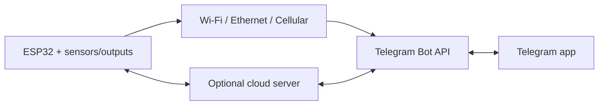

## 1. Basic Communication Structure

A Telegram bot is created using `@BotFather`, which provides a secret bot token.

The ESP32 then sends HTTPS requests such as:

```text
[https://api.telegram.org/bot](https://api.telegram.org/bot)<BOT_TOKEN>/sendMessage
```

Typical information includes:

| Field | Meaning |
|---|---|
| `BOT_TOKEN` | Identifies and authenticates the bot. |
| `chat_id` | Identifies the permitted user, group, or channel. |
| `text` | Message content. |
| `update_id` | Identifies each received Telegram event. |

Telegram accepts HTTPS `GET` or `POST` requests. Parameters may be provided as URL query parameters, form data, JSON, or multipart form data for file uploads.

Responses are JSON objects containing fields such as:

- `ok`
- `result`
- `description`
- `error_code`

See the [Telegram Bot API request format](https://core.telegram.org/bots/api#making-requests).

## 2. ESP32-to-Telegram Communication Options

### Option A — One-Way Notification

The ESP32 sends information to Telegram but does not read commands.


Example applications:

- High-temperature warning.
- Water-leak alarm.
- Door-open notification.
- Motion detection.
- Machine fault alert.
- Power-failure notification.
- Wi-Fi reconnection or reboot report.
- Periodic sensor report.

Typical API methods include:

- `sendMessage`
- `sendPhoto`
- `sendDocument`
- `sendLocation`

This is the easiest and most reliable starting point because the ESP32 only makes outgoing connections.

### Option B — Two-Way Control Using Polling

The ESP32 sends notifications and periodically asks Telegram whether new messages or commands have arrived.

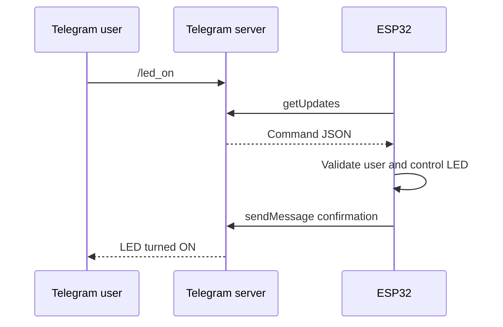

Telegram provides the `getUpdates` method for this purpose. It supports short polling and long polling.

Each processed message should be acknowledged logically by advancing the offset beyond its `update_id`. Otherwise, the ESP32 may process the same update again.

`getUpdates` cannot be used while a webhook is active.

See the [Telegram getUpdates documentation](https://core.telegram.org/bots/api#getupdates).

Suitable commands include:

```text
/start
/status
/temperature
/led_on
/led_off
/restart
```

#### Advantages

- No public server is required.
- Works with an ESP32 behind a home router.
- Simple to implement in the Arduino IDE.
- Suitable for small personal IoT projects.

#### Limitations

- The ESP32 must repeatedly contact Telegram.
- Frequent polling increases network traffic and power consumption.
- Long polling can block other firmware activity if implemented poorly.
- Commands are not guaranteed to arrive instantly.
- Update IDs must be managed carefully to prevent duplicate actions.

For ESP32-S3 projects, this is generally the best first two-way architecture.

### Option C — Inline-Button Control

Instead of typing commands, the bot presents buttons:

```text
Living Room Light

[ ON ] [ OFF ]
[ STATUS ] [ AUTO ]
```

The ESP32 receives a `callback_query` when the user presses a button.

Applications include:

- Lighting control.
- Fan-speed selection.
- Irrigation duration.
- Alarm arming.
- Motor direction.
- Operating-mode selection.
- Alarm acknowledgement.

This approach teaches:

- JSON construction.
- Inline keyboard formatting.
- Callback handling.
- State-machine design.
- User-interface feedback.

The ESP32 should update or acknowledge the Telegram message after processing the button so the user knows whether the command succeeded.

### Option D — Webhook Through a Cloud Server

Telegram pushes every new command to a public HTTPS server. The server then communicates with the ESP32.

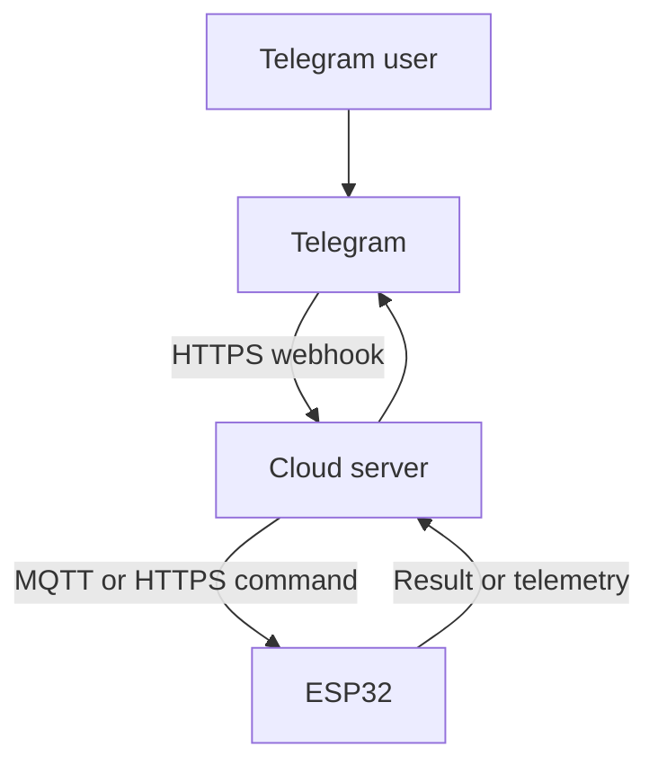

Possible server platforms include:

- Google Apps Script.
- Node-RED.
- Python Flask or FastAPI.
- Node.js.
- Firebase.
- AWS Lambda.
- Cloudflare Workers.
- Home Assistant.
- Raspberry Pi with a public endpoint.

Telegram sends webhook updates as HTTPS `POST` requests.

A webhook can include a secret token in the `X-Telegram-Bot-Api-Secret-Token` header so the server can verify that the request belongs to the configured webhook.

See the [Telegram setWebhook documentation](https://core.telegram.org/bots/api#setwebhook).

A webhook directly to an ESP32 is usually impractical because:

- The ESP32 is normally behind router NAT.
- It does not have a public HTTPS address.
- Certificate and server management are difficult.
- Internet providers may block incoming connections.
- Exposing a microcontroller directly to the Internet increases risk.

Use webhooks when managing multiple devices or when commands must be routed through a proper backend.

### Option E — MQTT-to-Telegram Gateway

The ESP32 uses MQTT while a server converts between MQTT topics and Telegram messages.


Example MQTT topics:

```text
home/bathroom/temperature
home/bathroom/leak
home/bathroom/fan/set
home/bathroom/fan/state
```

#### Advantages

- Telegram code is removed from the ESP32.
- Multiple ESP32 devices can be supported.
- Telemetry and commands are separated cleanly.
- Easier integration with dashboards, databases, and automation.
- MQTT retained messages can store the latest desired state.

This is an educational architecture for advanced IoT classes because it introduces:

- Message brokers.
- Topic design.
- Publish/subscribe communication.
- Cloud integration.

### Option F — Google Sheets or Apps Script Bridge

Since you are already working with ESP32 and Google Sheets, you can extend the same architecture:

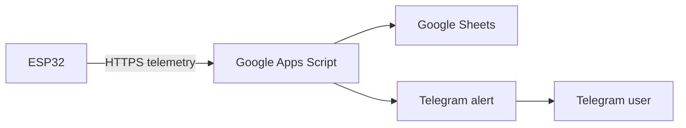

Examples:

- Log temperature in Google Sheets.
- Send a Telegram warning when temperature exceeds a limit.
- Record who acknowledged an alarm.
- Retrieve the last command from a sheet.
- Generate a daily operating summary.

This teaches:

- HTTP `POST`.
- JSON.
- Cloud scripting.
- Data logging.
- Notification rules.

However, Apps Script redirects and execution limits must be handled carefully.

## 3. Internet Connection Choices

Telegram communication requires Internet access, but the ESP32 can reach the Internet through different hardware.

| Connection | Hardware | Suitable Application |
|---|---|---|
| Wi-Fi | Built into most ESP32 boards. | Home automation and classroom projects. |
| Ethernet | W5500, LAN8720, or Ethernet ESP32 board. | Industrial or fixed equipment. |
| Cellular | SIM7600, A7670, SIM7000, or similar modem. | Remote monitoring without Wi-Fi. |
| Wi-Fi gateway | ESP32 connects through another router or device. | Portable installations. |
| LoRa-to-gateway | LoRa sensor communicates with an Internet-connected gateway. | Long-range field sensing. |

The Telegram protocol remains HTTPS regardless of whether the underlying Internet connection is Wi-Fi, Ethernet, or cellular.

## 4. Arduino Implementation Choices

### Direct HTTPS Requests

Use:

```cpp
#include <WiFiClientSecure.h>
#include <HTTPClient.h>
#include <ArduinoJson.h>
```

#### Advantages

- Students learn the actual Bot API.
- Full control over request formatting and error handling.
- No dependency on a Telegram-specific library.

#### Disadvantages

- More code is required.
- URL encoding, JSON parsing, and file uploads require care.
- Polling and update-offset management must be implemented manually.

This approach is best for advanced learning.

### Universal Arduino Telegram Bot

The library supports:

- Receiving and sending messages.
- Reply keyboards.
- Inline keyboards.
- Photos.
- Locations.
- Long polling.

It uses an SSL client and ArduinoJson.

See the [Universal Arduino Telegram Bot repository](https://github.com/witnessmenow/Universal-Arduino-Bot).

Good for:

- Introductory projects.
- LED control.
- Sensor monitoring.
- ESP32-CAM.
- Quick prototypes.

### AsyncTelegram2

[AsyncTelegram2](https://github.com/cotestatnt/AsyncTelegram2) is intended for applications where Telegram communication should not block the rest of the firmware.

This is useful when the ESP32 must continue servicing displays, sensors, motors, or time-critical tasks while checking Telegram.

Good for:

- Multitasking systems.
- FreeRTOS-based projects.
- Responsive displays.
- Multiple sensors.
- Projects where blocking HTTPS calls create delays.

### CTBot

[CTBot](https://github.com/shurillu/CTBot) provides a relatively simple interface for ESP8266 and ESP32. It supports commands and keyboard-based interaction.

### Recommended Teaching Sequence

For a new advanced ESP32-S3 lesson, teach the following sequence:

1. Raw `HTTPClient` for understanding the protocol.
2. A Telegram library for rapid implementation.
3. An asynchronous or cloud architecture for the final project.

## 5. Recommended Learning Projects

| Level | Project | Communication Learned | Main Engineering Concepts |
|---:|---|---|---|
| 1 | Push-button Telegram notifier | ESP32 → Telegram | GPIO input, debounce, HTTPS, `sendMessage`. |
| 2 | Temperature and humidity monitor | ESP32 → Telegram | Sensor interface, formatting, and thresholds. |
| 3 | Remote LED and relay controller | Telegram → ESP32 | `getUpdates`, JSON parsing, and command validation. |
| 4 | Inline-button home controller | Two-way interactive | Callback queries, state machines, and UI feedback. |
| 5 | ESP32-CAM security alert | Photo upload | Motion sensing, JPEG buffers, and multipart transfer. |
| 6 | Water-leak monitoring system | Event and acknowledgement | Alarm latching, escalation, and recovery. |
| 7 | Google Sheets plus Telegram | ESP32 → cloud → Telegram | REST API, data logging, and rule processing. |
| 8 | MQTT multi-device control centre | Telegram ↔ server ↔ ESP32 | MQTT, device identity, and scalable architecture. |
| 9 | Cellular remote alarm | ESP32 + modem → Telegram | AT commands, cellular reliability, and reconnection. |
| 10 | Dependable IoT capstone | Full two-way system | TLS, NVS, watchdog, retries, OTA, and security. |


**Learning Roadmap and Practical Projects**     

| Project Level | Application Idea | Hardware Required | Key Communication Concepts Learned |
|---|---|---|---|
| **Beginner** | Remote Relay Controller | ESP32, relay module, and LED. | Basic polling, parsing text command strings such as `/turn_on` and `/status`, and filtering by an allowlisted chat ID. |
| **Intermediate** | Environmental Alarm System | ESP32 with a DHT22 or BME280 sensor. | Threshold-triggered conditions, formatting HTML or Markdown messages, and sending automated alerts. |
| **Intermediate** | Interactive Control Dashboard | ESP32 and status LEDs. | Building inline keyboards and interactive tap buttons inside a Telegram chat. |
| **Advanced** | ESP32-CAM Motion Security | ESP32-CAM and PIR motion sensor. | HTTP `multipart/form-data` binary image transfer for sending JPEG photos when motion is detected. |
| **Hybrid** | MQTT-to-Telegram Gateway | ESP32 and Raspberry Pi running n8n or Node-RED. | Decoupled telemetry over MQTT, webhook handling, and multi-node automation. |


## Best Introductory Project

A good first project is an ESP32 temperature monitor with LED control.

### Functions

- `/start` displays available commands.
- `/status` returns temperature, RSSI, uptime, and LED state.
- `/led_on` and `/led_off` control an LED.
- A high-temperature condition automatically sends an alert.
- Only an authorised `chat_id` can issue commands.
- An inline keyboard provides `ON`, `OFF`, and `STATUS` buttons.

This single project covers most essential Telegram communication concepts without requiring excessive hardware.

## Best Advanced Project

### Smart Equipment Monitoring and Maintenance Assistant

Possible functions include:

- Periodically measure temperature, current, and vibration.
- Report abnormal conditions to a maintenance Telegram group.
- Allow an authorised person to acknowledge an alarm.
- Log data to Google Sheets or an MQTT database.
- Send a photo from an ESP32-CAM.
- Report firmware version, reset reason, and uptime.
- Permit safe configuration changes through Telegram.
- Store settings and processed command IDs in NVS.
- Use a watchdog and reconnection state machine.

## 6. Security and Reliability Practices

- Never publish the bot token in GitHub repositories or screenshots.
- Restrict commands using an allowlist of authorised `chat_id` values.
- Use TLS certificate validation; avoid `client.setInsecure()` in a finished system.
- Synchronise the ESP32 system time before validating TLS certificates.
- Do not accept arbitrary text as GPIO numbers, durations, or configuration values.
- Store or correctly advance the last `update_id` to prevent repeated commands.
- Confirm the actual output state after a command instead of merely replying `"success"`.
- Add timeouts, retry limits, and Wi-Fi reconnection handling.
- Avoid using Telegram as a safety-critical emergency-stop system.
- Require additional confirmation for dangerous commands such as reboot, door unlock, motor operation, or OTA update.
- Keep Telegram processing separate from time-critical control loops.

Telegram retains uncollected bot updates for no longer than 24 hours. Polling and webhook reception are mutually exclusive.

See the [Telegram update delivery documentation](https://core.telegram.org/bots/api#getting-updates).

## Recommended Advanced ESP32-S3 Lesson

For an advanced ESP32-S3 class, combine Projects 3, 4, and 6 into one lesson:

```text
Secure two-way Telegram control
+ Sensor alarms
+ Inline buttons
+ Command authorisation
```
---

# Google Apps Script: Option F vs. Option D

The two options use the same Google Apps Script platform, but Apps Script plays a different role:

- **Option F:** The ESP32 initiates communication by sending telemetry to Google Apps Script. Apps Script logs it and optionally sends a Telegram alert.
- **Option D:** Telegram initiates communication by sending a webhook to Google Apps Script. Apps Script stores the command, and the ESP32 later retrieves it.

The important point is that Google Apps Script normally cannot directly push a command into an ESP32 behind a router. The ESP32 must still poll Google Apps Script, MQTT, Firebase, or another command service.

## 1. Communication-Flow Difference

### Option F — ESP32 Telemetry Bridge

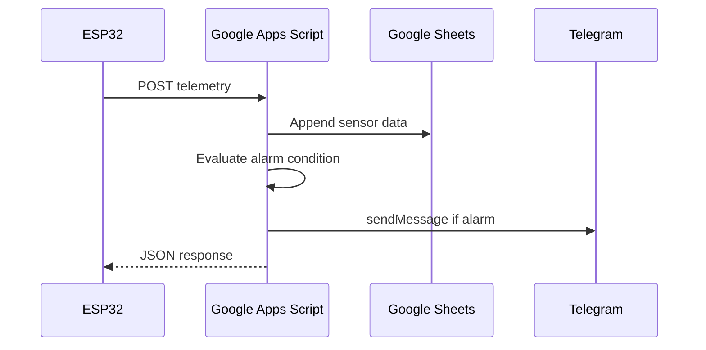

The ESP32 is the initiator.

Typical ESP32 payload:

```json
{
  "source": "esp32",
  "type": "telemetry",
  "deviceId": "ESP32_01",
  "temperature": 45.5,
  "rssi": -73,
  "uptime": 100,
  "led-state": 0
}
```

### Option D — Telegram Webhook Command Bridge

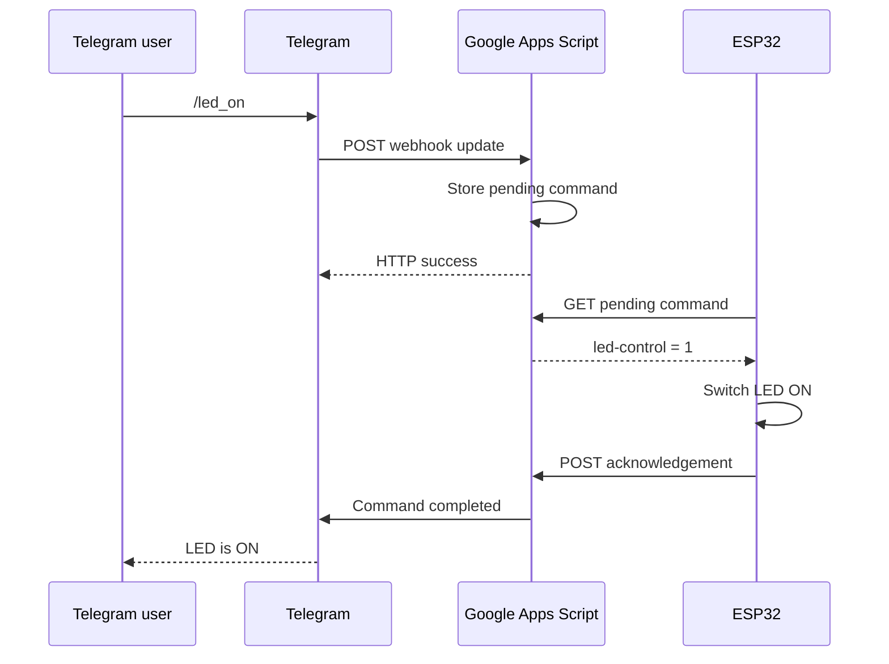

Telegram is the first initiator, but the ESP32 still initiates its own connection to collect the command.

## 2. Main Code Differences

| Function | Option F: Telemetry Bridge | Option D: Webhook Bridge |
|---|---:|---:|
| ESP32 sends telemetry | Yes | Optional |
| ESP32 contacts Telegram directly | No | No |
| ESP32 polls Google Apps Script for commands | Optional | Usually required |
| Google Apps Script receives ESP32 JSON | Yes | Optional |
| Google Apps Script receives Telegram JSON | No | Yes |
| Google Apps Script parses `update_id` and message | No | Yes |
| Google Apps Script checks Telegram `chat_id` | Only for alert destination | Required for command authorisation |
| Google Apps Script stores pending commands | Usually not | Yes |
| Google Apps Script sends Telegram messages | Alarm notification | Command response and acknowledgement |
| Telegram webhook configured | No | Yes |
| Bot token stored in ESP32 | No | No |
| Bot token stored in Google Apps Script | Yes | Yes |

## 3. Option F Code Structure

### ESP32 Code

The existing ESP32 design is already close to Option F:

```cpp
void sendTelemetry() {
  JsonDocument doc;

  doc["source"] = "esp32";
  doc["type"] = "telemetry";
  doc["deviceId"] = "ESP32_01";
  doc["status"] = "ONLINE";
  doc["temperature"] = temperature;
  doc["rssi"] = WiFi.RSSI();
  doc["uptime"] = millis() / 1000;
  doc["led-state"] = digitalRead(LED_PIN);

  String payload;
  serializeJson(doc, payload);

  WiFiClientSecure client;
  client.setCACert(GOOGLE_ROOT_CA);

  HTTPClient http;

  http.setFollowRedirects(
      HTTPC_FORCE_FOLLOW_REDIRECTS
  );

  http.begin(client, GAS_URL);
  http.addHeader(
      "Content-Type",
      "application/json"
  );

  int httpCode = http.POST(payload);
  String response = http.getString();

  Serial.printf(
      "HTTP response: %d\n",
      httpCode
  );

  Serial.println(response);

  http.end();
}
```

The ESP32:

1. Reads sensors.
2. Constructs telemetry JSON.
3. Sends it to Google Apps Script using `POST`.
4. Parses the Google Apps Script response.
5. Optionally applies a command returned with that response.

Example response:

```json
{
  "status": "success",
  "led-control": 1
}
```

### Google Apps Script Code

```javascript
const SHEET_ID = "YOUR_SHEET_ID";

function doPost(e) {
  try {
    const data = JSON.parse(e.postData.contents);

    if (data.source !== "esp32") {
      return jsonResponse({
        status: "error",
        message: "Unknown source"
      });
    }

    const sheet =
      SpreadsheetApp
        .openById(SHEET_ID)
        .getSheetByName("Telemetry");

    sheet.appendRow([
      new Date(),
      data.deviceId,
      data.status,
      data.temperature,
      data.rssi,
      data.uptime,
      data["led-state"]
    ]);

    if (Number(data.temperature) >= 45) {
      sendTelegram(
        "High-temperature warning\n" +
        "Device: " + data.deviceId + "\n" +
        "Temperature: " + data.temperature + " °C"
      );
    }

    return jsonResponse({
      status: "success",
      "led-control": readLedControlFromSheet()
    });

  } catch (error) {
    return jsonResponse({
      status: "error",
      message: error.message
    });
  }
}
```

Telegram is only used as an output notification channel:

```javascript
function sendTelegram(message) {
  const properties =
    PropertiesService.getScriptProperties();

  const token =
    properties.getProperty("BOT_TOKEN");

  const chatId =
    properties.getProperty("CHAT_ID");

  const url =
    "https://api.telegram.org/bot" +
    token +
    "/sendMessage";

  const payload = {
    chat_id: chatId,
    text: message
  };

  UrlFetchApp.fetch(url, {
    method: "post",
    contentType: "application/json",
    payload: JSON.stringify(payload),
    muteHttpExceptions: true
  });
}
```

## 4. Option D Code Structure

Option D requires Google Apps Script to understand the Telegram webhook JSON and convert Telegram commands into commands that the ESP32 can retrieve.

### Telegram Webhook JSON

When the user sends `/led_on`, Google Apps Script receives something similar to:

```json
{
  "update_id": 123456789,
  "message": {
    "message_id": 20,
    "from": {
      "id": 11223344
    },
    "chat": {
      "id": 11223344,
      "type": "private"
    },
    "text": "/led_on"
  }
}
```

### Google Apps Script Webhook Handler

```javascript
const AUTHORISED_CHAT_ID = "11223344";

function doPost(e) {
  try {
    const data =
      JSON.parse(e.postData.contents || "{}");

    // Telegram webhook message
    if (data.update_id !== undefined) {
      return handleTelegramUpdate(data, e);
    }

    // ESP32 telemetry or acknowledgement
    if (data.source === "esp32") {
      return handleEsp32Request(data);
    }

    return jsonResponse({
      status: "error",
      message: "Unknown request"
    });

  } catch (error) {
    return jsonResponse({
      status: "error",
      message: error.message
    });
  }
}
```

Google Apps Script runs `doPost(e)` when it receives an HTTP `POST`. The request body is available through `e.postData.contents`.

See the [Google Apps Script web-app documentation](https://developers.google.com/apps-script/guides/web).

### Parse Telegram Commands

```javascript
function handleTelegramUpdate(update, e) {
  const message = update.message;

  if (!message || !message.text) {
    return jsonResponse({
      ok: true
    });
  }

  const chatId = String(message.chat.id);
  const command =
    message.text.trim().toLowerCase();

  if (chatId !== AUTHORISED_CHAT_ID) {
    sendTelegramTo(
      chatId,
      "Unauthorised user."
    );

    return jsonResponse({
      ok: true
    });
  }

  switch (command) {
    case "/led_on":
      queueCommand(
        "ESP32_01",
        "SET_LED",
        1
      );

      sendTelegramTo(
        chatId,
        "LED ON command queued. " +
        "Waiting for ESP32."
      );
      break;

    case "/led_off":
      queueCommand(
        "ESP32_01",
        "SET_LED",
        0
      );

      sendTelegramTo(
        chatId,
        "LED OFF command queued. " +
        "Waiting for ESP32."
      );
      break;

    case "/status":
      sendStoredStatus(
        chatId,
        "ESP32_01"
      );
      break;

    default:
      sendTelegramTo(
        chatId,
        "Available commands:\n" +
        "/led_on\n" +
        "/led_off\n" +
        "/status"
      );
  }

  return jsonResponse({
    ok: true
  });
}
```

### Store the Command

For a simple single-device demonstration, Script Properties can be used:

```javascript
function queueCommand(
  deviceId,
  command,
  value
) {
  const commandObject = {
    commandId: Utilities.getUuid(),
    deviceId: deviceId,
    command: command,
    value: value,
    state: "PENDING",
    timestamp: new Date().toISOString()
  };

  PropertiesService
    .getScriptProperties()
    .setProperty(
      "COMMAND_" + deviceId,
      JSON.stringify(commandObject)
    );
}
```

For multiple ESP32 devices, a Google Sheet command queue is better:

| Command ID | Device ID | Command | Value | State | Created | Completed |
|---|---|---|---:|---|---|---|
| `abc-123` | `ESP32_01` | `SET_LED` | `1` | `PENDING` | `14:20:10` | |
| `abc-124` | `ESP32_02` | `SET_FAN` | `0` | `DONE` | `14:21:15` | `14:21:18` |

## 5. ESP32 Command Polling for Option D

The ESP32 does not call Telegram's `getUpdates`. Instead, it asks Google Apps Script for a pending command:

```text
GET GAS_URL?action=getCommand&deviceId=ESP32_01
```

### ESP32 Polling Code

```cpp
void checkPendingCommand() {
  String url =
      String(GAS_URL) +
      "?action=getCommand" +
      "&deviceId=ESP32_01";

  WiFiClientSecure client;
  client.setCACert(GOOGLE_ROOT_CA);

  HTTPClient http;

  http.setFollowRedirects(
      HTTPC_STRICT_FOLLOW_REDIRECTS
  );

  http.begin(client, url);

  int httpCode = http.GET();

  if (httpCode == HTTP_CODE_OK) {
    String response = http.getString();

    JsonDocument doc;

    DeserializationError error =
        deserializeJson(doc, response);

    if (!error && doc["status"] == "command") {
      String command =
          doc["command"];

      int value =
          doc["value"];

      String commandId =
          doc["commandId"];

      if (command == "SET_LED" &&
          (value == 0 || value == 1)) {

        digitalWrite(
            LED_PIN,
            value ? HIGH : LOW
        );

        sendCommandAcknowledgement(
            commandId,
            true,
            value
        );
      }
    }
  }

  http.end();
}
```

### Google Apps Script `doGet()`

```javascript
function doGet(e) {
  const action =
    e.parameter.action || "";

  if (action === "getCommand") {
    return getPendingCommand(
      e.parameter.deviceId
    );
  }

  return jsonResponse({
    status: "error",
    message: "Unknown action"
  });
}
```

```javascript
function getPendingCommand(deviceId) {
  const value =
    PropertiesService
      .getScriptProperties()
      .getProperty(
        "COMMAND_" + deviceId
      );

  if (!value) {
    return jsonResponse({
      status: "no-command"
    });
  }

  const command =
    JSON.parse(value);

  if (command.state !== "PENDING") {
    return jsonResponse({
      status: "no-command"
    });
  }

  return jsonResponse({
    status: "command",
    commandId: command.commandId,
    command: command.command,
    value: command.value
  });
}
```

## 6. ESP32 Acknowledgement

It is better not to tell the Telegram user `"LED is ON"` immediately after Google Apps Script receives `/led_on`.

At that point, Google Apps Script has only queued the command.

The sequence should be:

1. Telegram user sends `/led_on`.
2. Google Apps Script replies: `"Command queued."`
3. ESP32 retrieves and executes the command.
4. ESP32 sends an acknowledgement.
5. Google Apps Script sends: `"ESP32 confirmed: LED is ON."`

### ESP32 Acknowledgement Payload

```json
{
  "source": "esp32",
  "type": "command-ack",
  "deviceId": "ESP32_01",
  "commandId": "abc-123",
  "success": true,
  "led-state": 1
}
```

### Google Apps Script Request Handler

```javascript
function handleEsp32Request(data) {
  if (data.type === "telemetry") {
    return processTelemetry(data);
  }

  if (data.type === "command-ack") {
    return processCommandAcknowledgement(data);
  }

  return jsonResponse({
    status: "error",
    message: "Unknown ESP32 message type"
  });
}
```

```javascript
function processCommandAcknowledgement(data) {
  PropertiesService
    .getScriptProperties()
    .deleteProperty(
      "COMMAND_" + data.deviceId
    );

  const result = data.success
    ? "Command completed successfully."
    : "ESP32 failed to execute the command.";

  sendTelegram(
    result +
    "\nDevice: " + data.deviceId +
    "\nLED state: " + data["led-state"]
  );

  return jsonResponse({
    status: "acknowledgement-recorded"
  });
}
```

## 7. Combined Google Apps Script Design

You do not necessarily need two separate Google Apps Script deployments.

One deployment can support both options by examining the incoming JSON:

```javascript
function doPost(e) {
  const data =
    JSON.parse(e.postData.contents || "{}");

  if (data.update_id !== undefined) {
    return handleTelegramUpdate(
      data,
      e
    );
  }

  if (data.source === "esp32") {
    return handleEsp32Request(data);
  }

  return jsonResponse({
    status: "error",
    message: "Unrecognised request"
  });
}
```

The complete combined flow becomes:

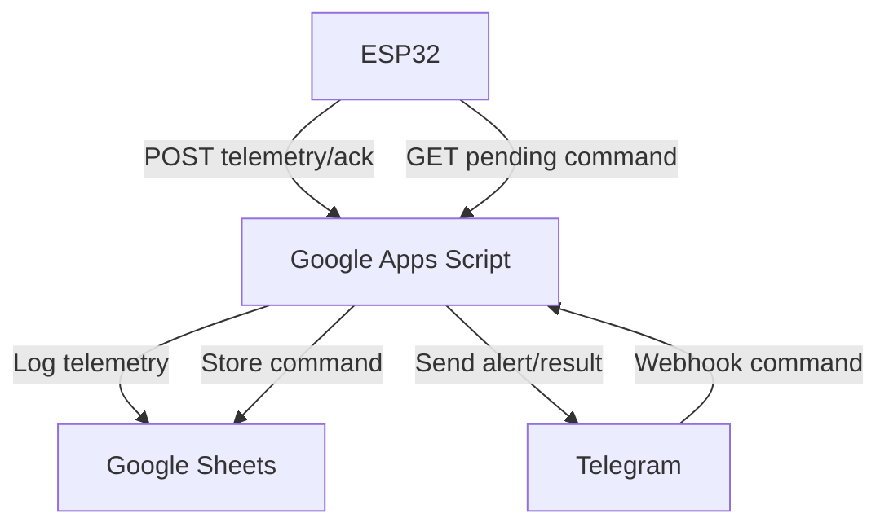

This is the most logical extension of an existing Google Sheets project.

## 8. Webhook Setup Requirement

For Option D, register the Google Apps Script deployment URL with Telegram:

```text
[https://api.telegram.org/bot](https://api.telegram.org/bot)<BOT_TOKEN>/setWebhook?url=<GAS_WEB_APP_URL>
```

After registration:

- Telegram sends updates to Google Apps Script.
- The ESP32 must stop using Telegram's `getUpdates`.
- Google Apps Script becomes the only Telegram update receiver.

Telegram does not permit `getUpdates` and webhook delivery to operate simultaneously.

See the [Telegram webhook documentation](https://core.telegram.org/bots/api#setwebhook).

Check the webhook state with:

```text
[https://api.telegram.org/bot](https://api.telegram.org/bot)<BOT_TOKEN>/getWebhookInfo
```

## 9. Relevance of the Current 302 Redirect Issue

For both designs, an ESP32 calling a Google Apps Script web app can encounter a redirect from:

```text
script.google.com
```

to:

```text
script.googleusercontent.com
```

Google documents that `ContentService` output is served from a different URL for security reasons.

See the [Google Content Service documentation](https://developers.google.com/apps-script/reference/content/content-service).

The difference is:

| Design | Redirect Handling Applies To |
|---|---|
| Option F | ESP32 telemetry `POST` response. |
| Option D | ESP32 command `GET` and acknowledgement `POST`. |

The Telegram-to-Google Apps Script webhook does not use the ESP32 redirect-handling code.

For the ESP32 implementation, automatic redirect handling is preferable for `GET` requests:

```cpp
http.setFollowRedirects(
    HTTPC_STRICT_FOLLOW_REDIRECTS
);
```

For the Google Apps Script `POST` request:

```cpp
http.setFollowRedirects(
    HTTPC_FORCE_FOLLOW_REDIRECTS
);
```

This avoids depending on `http.getLocation()`, which showed inconsistent behavior in the observed implementation.

## Recommendation

Keep the existing Option F structure and add the Option D functions:

1. Continue posting telemetry from the ESP32 to Google Apps Script.
2. Add Telegram webhook processing to `doPost()`.
3. Add a command queue in Google Sheets or Script Properties.
4. Let the ESP32 call `doGet()` every 3–5 seconds.
5. Add an ESP32 command acknowledgement.
6. Let Google Apps Script send the final execution result to Telegram.

Therefore, Option D does not replace the existing Google Sheets communication. It adds a Telegram-to-Google Apps Script command path on top of it.

---


# Combined ESP32-S3 and Telegram Setup

Below is the recommended setup sequence for the combined architecture:

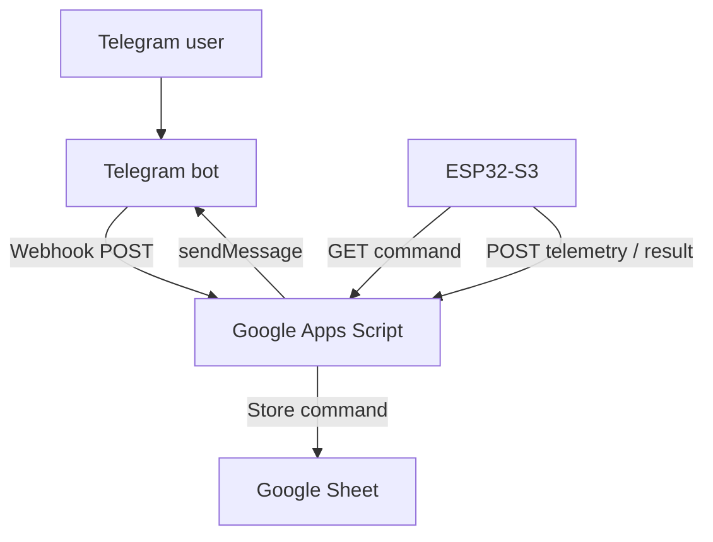

## 1. Create the Telegram Bot

### Step 1 — Open BotFather

In Telegram, open the official verified BotFather:

[Open @BotFather](https://t.me/BotFather)

Check that:

- The username is exactly `@BotFather`.
- The account is verified.
- You are not using a similarly named unofficial account.

### Step 2 — Create a Bot

Send:

```text
/newbot
```

BotFather asks for two names.

First, enter a display name, for example:

```text
ESP32 Learning Lab
```

Then enter a unique username ending in `bot`, for example:

```text
OoiKK_ESP32_bot
```

If accepted, BotFather returns something similar to:

```text
Done! Congratulations on your new bot.

Use this token to access the HTTP API:

1234567890:AAExampleSecretToken123456789
```

The official Telegram procedure is `/newbot`, followed by the bot name and username.

See the [Telegram Bot tutorial](https://core.telegram.org/bots/tutorial#obtain-your-bot-token).

## 2. Identify the Telegram Values

These values are easily confused:

| Item | Example | Purpose | Secret? |
|---|---|---|---|
| Bot display name | `ESP32 Learning Lab` | Human-readable name. | No |
| Bot username | `OoiKK_ESP32_bot` | Telegram address. | No |
| Bot ID | `1234567890` | Numeric bot identity. | No |
| Bot token | `1234567890:AAExample...` | Authenticates API requests. | Yes |
| User or chat ID | `987654321` | Identifies who receives messages. | Usually no, but protect it. |
| GAS URL | `https://script.google.com/.../exec` | Your cloud endpoint. | No |
| Webhook URL | GAS URL plus secret path | Receives Telegram updates. | Treat as sensitive. |

The numeric value before the colon in the bot token is normally the bot ID:

```text
Bot token:
1234567890:AAExampleSecretToken
└────────┘
   Bot ID
```

However, the recommended way to confirm the bot ID is with `getMe`.

## 3. Save the Bot Token Securely

Do not put the real bot token in:

- Public GitHub code.
- Teaching slides.
- Screenshots.
- Google Sheet cells.
- Serial Monitor output.
- URLs shared with other people.

For this Google Apps Script-based design, store the bot token in Apps Script Properties, not in the ESP32 firmware.

If the token is exposed, open BotFather and use:

```text
/revoke
```

or:

```text
/token
```

to replace it.

## 4. Open and Activate the Bot

Your bot's Telegram URL is:

```text
https://t.me/<BOT_USERNAME>
```

Example:

[Open the ESP32 bot](https://t.me/OoiKK_ESP32_bot)

Open the link and press:

```text
START
```

Alternatively, send:

```text
/start
```

This step is important because a bot generally cannot initiate a private conversation until the user has contacted it first.

See the [Telegram bot tutorial](https://core.telegram.org/bots/tutorial#sending-messages).

## 5. Verify the Token and Obtain the Bot ID

Construct this URL:

```text
https://api.telegram.org/bot<BOT_TOKEN>/getMe
```

Example format:

```text
https://api.telegram.org/bot1234567890:AAExampleSecretToken/getMe
```

For initial testing, paste it into a browser. Telegram should return:

```json
{
  "ok": true,
  "result": {
    "id": 1234567890,
    "is_bot": true,
    "first_name": "ESP32 Learning Lab",
    "username": "OoiKK_ESP32_bot"
  }
}
```

The important values are:

```text
Bot ID       = result.id
Bot username = result.username
```

The `getMe` method tests the bot token and returns the bot's basic information.

See the [Telegram getMe API documentation](https://core.telegram.org/bots/api#getme).

> **Security note:** Because the token appears in browser history, use this browser test only during initial setup. For the finished system, let Google Apps Script make the API requests.

## 6. Obtain the Private Chat ID

Your `chat_id` is required when Google Apps Script sends a Telegram message to you.

### Step 1 — Send a New Message to the Bot

Open your bot and send:

```text
Hello ESP32
```

or:

```text
/start
```

### Step 2 — Call `getUpdates`

Before setting a webhook, open:

```text
[https://api.telegram.org/bot](https://api.telegram.org/bot)<BOT_TOKEN>/getUpdates
```

A typical result is:

```json
{
  "ok": true,
  "result": [
    {
      "update_id": 825614000,
      "message": {
        "message_id": 1,
        "from": {
          "id": 987654321,
          "is_bot": false,
          "first_name": "Ding Dong"
        },
        "chat": {
          "id": 987654321,
          "first_name": "Ding Dong",
          "type": "private"
        },
        "date": 1789880000,
        "text": "Hello ESP32"
      }
    }
  ]
}
```

Your private chat ID is:

```text
result.message.chat.id
```

Therefore:

```text
CHAT_ID = 987654321
```

For a private conversation, these values are often the same:

```text
message.from.id
message.chat.id
```

Use `message.chat.id` because Telegram's `sendMessage` method expects a chat ID.

### If the Result Is Empty

If you receive:

```json
{
  "ok": true,
  "result": []
}
```

Then:

1. Return to Telegram.
2. Send another new message to the bot.
3. Reload the `getUpdates` URL.
4. Confirm that you have not already enabled a webhook.

Telegram's `getUpdates` method cannot operate while a webhook is active.

See the [Telegram getUpdates documentation](https://core.telegram.org/bots/api#getupdates).

## 7. Test Sending a Telegram Message

Use this URL:

```text
[https://api.telegram.org/bot](https://api.telegram.org/bot)<BOT_TOKEN>/sendMessage?chat_id=<CHAT_ID>&text=ESP32%20test%20successful
```

Example format:

```text
[https://api.telegram.org/bot1234567890:AAExampleSecretToken/sendMessage?chat_id=987654321&text=ESP32%20test%20successful](https://api.telegram.org/bot1234567890:AAExampleSecretToken/sendMessage?chat_id=987654321&text=ESP32%20test%20successful)
```

You should receive:

```json
{
  "ok": true,
  "result": {
    "message_id": 2,
    "chat": {
      "id": 987654321,
      "type": "private"
    },
    "text": "ESP32 test successful"
  }
}
```

A message should also appear in your Telegram conversation with the bot.

## 8. Configure Bot Commands

Open BotFather and send:

```text
/mybots
```

Then select:

```text
Your bot
→ Edit Bot
→ Edit Commands
```

Alternatively, send:

```text
/setcommands
```

Select your bot and submit:

```text
start - Show available commands
status - Show ESP32 status
led_on - Turn the LED on
led_off - Turn the LED off
temperature - Read the temperature
restart - Restart the ESP32
help - Show help information
```

Do not include `/` in the command definitions submitted to BotFather.

Users will later see:

```text
/start
/status
/led_on
/led_off
/temperature
/restart
/help
```

For safety, do not implement `/restart` until the basic communication is stable.

## 9. Create the Google Apps Script Project

### Step 1 — Create the Script

Open [Google Apps Script](https://script.google.com/).

Select:

```text
New project
```

Name the project:

```text
ESP32 Telegram Bridge
```

### Step 2 — Store Configuration Securely

Open:

```text
Project Settings
→ Script Properties
→ Add script property
```

Add these properties:

| Property | Value |
|---|---|
| `BOT_TOKEN` | Your complete Telegram bot token. |
| `AUTHORIZED_CHAT_ID` | Your private chat ID. |
| `DEVICE_ID` | `ESP32_01`. |
| `DEVICE_KEY` | A long random device password. |
| `WEBHOOK_PATH_SECRET` | A different long random string. |
| `WEB_APP_URL` | Web App Deployment ID. |

Example structure:

```text
BOT_TOKEN = 1234567890:AAExampleSecretToken
AUTHORIZED_CHAT_ID = 987654321
DEVICE_ID = ESP32_01
DEVICE_KEY = a-long-random-esp32-device-key
WEBHOOK_PATH_SECRET = another-long-random-webhook-secret
WEB_APP_URL = https://script.google.com/macros/s/DEPLOYMENT_ID/exec
```

Do not use the same value for `DEVICE_KEY` and `WEBHOOK_PATH_SECRET`.

[Accessing Script Properties](https://github.com/ooikk/Arduino-Documentation/blob/main/02_MISC/02_WiFi/Telegram.md#accessing-script-properties)


## 10. Add a Basic Apps Script Program

```javascript
function jsonResponse(data) {
  return ContentService
    .createTextOutput(
      JSON.stringify(data)
    )
    .setMimeType(
      ContentService.MimeType.JSON
    );
}

function doGet(e) {
  const action =
    e.parameter.action || "";

  if (action === "getCommand") {
    return getPendingCommand(e);
  }

  return jsonResponse({
    status: "success",
    service: "ESP32 Telegram Bridge"
  });
}

function doPost(e) {
  try {
    const data =
      JSON.parse(
        e.postData.contents || "{}"
      );

    // Telegram webhook update
    if (data.update_id !== undefined) {
      return handleTelegramUpdate(
        data,
        e
      );
    }

    // ESP32 telemetry or acknowledgement
    if (data.source === "esp32") {
      return handleEsp32Request(data);
    }

    return jsonResponse({
      status: "error",
      message: "Unknown request source"
    });

  } catch (error) {
    console.error(error);

    return jsonResponse({
      status: "error",
      message: error.message
    });
  }
}
```

Google Apps Script web applications must contain `doGet(e)` or `doPost(e)`. `POST` data is available through `e.postData.contents`.

See the [Google Apps Script web-app documentation](https://developers.google.com/apps-script/guides/web).

## 11. Deploy Apps Script as a Web Application

In Apps Script:

1. Select **Deploy**.
2. Select **New deployment**.
3. Click **Select type**.
4. Choose **Web app**.
5. Enter a description, such as:

   ```text
   ESP32 Telegram Bridge v1
   ```

6. For **Execute as**, select:

   ```text
   Me
   ```

7. For **Who has access**, select the option that permits public access, normally:

   ```text
   Anyone
   ```

8. Click **Deploy**.
9. Authorise the requested Google permissions.
10. Copy the web application URL.

The URL looks like:

```text
https://script.google.com/macros/s/DEPLOYMENT_ID/exec
```

Use the URL ending in:

```text
/exec
```

Do not use the testing URL ending in:

```text
/dev
```

The `/dev` URL is only available to script editors and is unsuitable for Telegram webhooks.

See the [Google Apps Script deployment guide](https://developers.google.com/apps-script/guides/web#deploy_a_script_as_a_web_app).

## 12. Test the Apps Script Web Application

Open your `/exec` URL:

```text
https://script.google.com/macros/s/DEPLOYMENT_ID/exec
```

The expected result is:

```json
{
  "status": "success",
  "service": "ESP32 Telegram Bridge"
}
```

Google may redirect the browser to a `script.googleusercontent.com` address when serving `ContentService` output. That is normal behaviour.

Your original permanent application URL remains the `/exec` URL.

## 13. Construct the Telegram Webhook URL

You can use the basic Apps Script URL directly:

```text
https://script.google.com/macros/s/DEPLOYMENT_ID/exec
```

However, adding a private path is recommended:

```text[https://script.google.com/macros/s/DEPLOYMENT_ID/exec/telegram/<WEBHOOK_PATH_SECRET>
```

Example structure:

```text
https://script.google.com/macros/s/ABC123XYZ/exec/telegram/my-long-random-secret
```

Apps Script provides everything after `/exec/` through:

```javascript
e.pathInfo
```

Therefore, Apps Script can validate that Telegram is calling the expected private path.

Add this near the beginning of the Telegram handler:

```javascript
function handleTelegramUpdate(update, e) {
  const properties =
    PropertiesService.getScriptProperties();

  const expectedPath =
    "telegram/" +
    properties.getProperty(
      "WEBHOOK_PATH_SECRET"
    );

  if (e.pathInfo !== expectedPath) {
    return jsonResponse({
      ok: false,
      error: "Invalid webhook path"
    });
  }

  const message =
    update.message;

  if (!message || !message.text) {
    return jsonResponse({
      ok: true
    });
  }

  const authorisedChatId =
    properties.getProperty(
      "AUTHORIZED_CHAT_ID"
    );

  const chatId =
    String(message.chat.id);

  if (chatId !== authorisedChatId) {
    return jsonResponse({
      ok: true
    });
  }

  // Process commands here.

  return jsonResponse({
    ok: true
  });
}
```

## 14. Register the Apps Script URL as the Telegram Webhook

The Telegram API endpoint is:

```text
https://api.telegram.org/bot<BOT_TOKEN>/setWebhook
```

The webhook URL is passed as the `url` parameter.

### Recommended Apps Script Registration Function

Add this temporary function to Apps Script:

```javascript
function registerTelegramWebhook() {
  const properties =
    PropertiesService.getScriptProperties();

  const token =
    properties.getProperty(
      "BOT_TOKEN"
    );

  const pathSecret =
    properties.getProperty(
      "WEBHOOK_PATH_SECRET"
    );

  const gasExecUrl =
    "https://script.google.com/macros/s/" +
    "DEPLOYMENT_ID/exec";

  const webhookUrl =
    gasExecUrl +
    "/telegram/" +
    pathSecret;

  const telegramUrl =
    "https://api.telegram.org/bot" +
    token +
    "/setWebhook";

  const response =
    UrlFetchApp.fetch(
      telegramUrl,
      {
        method: "post",
        payload: {
          url: webhookUrl,
          allowed_updates: JSON.stringify([
            "message",
            "callback_query"
          ]),
          drop_pending_updates: "true"
        },
        muteHttpExceptions: true
      }
    );

  console.log(
    response.getContentText()
  );
}
```

Replace only:

```text
DEPLOYMENT_ID
```

Then:

1. Select `registerTelegramWebhook` from the function list.
2. Click **Run**.
3. Authorise it if requested.
4. Open the execution log.

Expected response:

```json
{
  "ok": true,
  "result": true,
  "description": "Webhook was set"
}
```

`drop_pending_updates: true` removes older messages waiting in Telegram. Remove that parameter if you want to retain pending messages.

## 15. Verify the Webhook

Use:

```text
https://api.telegram.org/bot<BOT_TOKEN>/getWebhookInfo
```

Expected result:

```json
{
  "ok": true,
  "result": {
    "url": "https://script.google.com/macros/s/DEPLOYMENT_ID/exec/telegram/SECRET",
    "has_custom_certificate": false,
    "pending_update_count": 0,
    "max_connections": 40
  }
}
```

Check these fields:

| Field | Expected Value |
|---|---|
| `url` | Your Google Apps Script webhook URL. |
| `pending_update_count` | Normally `0`. |
| `last_error_message` | Should be absent. |
| `last_error_date` | Should be absent. |

If `last_error_message` appears, Telegram cannot obtain a successful response from Google Apps Script.

## 16. Send a Webhook Test

After the webhook is configured:

1. Open your Telegram bot.
2. Send:

   ```text
   /status
   ```

3. In Apps Script, open **Executions**.

You should see a `doPost` execution.

During initial testing, temporarily add:

```javascript
console.log(
  JSON.stringify(update)
);
```

inside `handleTelegramUpdate()`.

The logged JSON should contain:

```json
{
  "update_id": 825614001,
  "message": {
    "chat": {
      "id": 987654321
    },
    "text": "/status"
  }
}
```

Remove or reduce detailed logging after testing because it can expose user information.

## 17. Send Telegram Messages from Apps Script

```javascript
function sendTelegramTo(chatId, text) {
  const token =
    PropertiesService
      .getScriptProperties()
      .getProperty("BOT_TOKEN");

  const url =
    "https://api.telegram.org/bot" +
    token +
    "/sendMessage";

  const response =
    UrlFetchApp.fetch(
      url,
      {
        method: "post",
        contentType: "application/json",
        payload: JSON.stringify({
          chat_id: String(chatId),
          text: text
        }),
        muteHttpExceptions: true
      }
    );

  const result =
    JSON.parse(
      response.getContentText()
    );

  if (!result.ok) {
    throw new Error(
      "Telegram sendMessage failed: " +
      response.getContentText()
    );
  }

  return result;
}
```

### Convenience Function for the Authorised User

```javascript
function sendTelegram(text) {
  const chatId =
    PropertiesService
      .getScriptProperties()
      .getProperty(
        "AUTHORIZED_CHAT_ID"
      );

  return sendTelegramTo(
    chatId,
    text
  );
}
```

### Test Function

```javascript
function testTelegramMessage() {
  sendTelegram(
    "Telegram and Google Apps Script " +
    "connection successful."
  );
}
```

Run `testTelegramMessage()` manually. The message should arrive in Telegram.

## 18. URLs Needed for the Complete Project

| Purpose | URL Format |
|---|---|
| Open your bot | `https://t.me/<BOT_USERNAME>` |
| Telegram API base | `https://api.telegram.org/bot<BOT_TOKEN>/` |
| Verify token or get bot ID | `https://api.telegram.org/bot<BOT_TOKEN>/getMe` |
| Get messages before webhook | `https://api.telegram.org/bot<BOT_TOKEN>/getUpdates` |
| Send a message | `https://api.telegram.org/bot<BOT_TOKEN>/sendMessage` |
| Register webhook | `https://api.telegram.org/bot<BOT_TOKEN>/setWebhook` |
| Check webhook | `https://api.telegram.org/bot<BOT_TOKEN>/getWebhookInfo` |
| Remove webhook | `https://api.telegram.org/bot<BOT_TOKEN>/deleteWebhook` |
| GAS base URL | `https://script.google.com/macros/s/<DEPLOYMENT_ID>/exec` |
| Telegram-to-GAS webhook | `<GAS_URL>/telegram/<SECRET>` |
| ESP32 command request | `<GAS_URL>?action=getCommand&deviceId=ESP32_01&key=<DEVICE_KEY>` |

## 19. Switch Between Webhook and `getUpdates`

After the webhook is registered, this will no longer work:

```text
https://api.telegram.org/bot<BOT_TOKEN>/getUpdates
```

To temporarily return to `getUpdates`, remove the webhook:

```text
https://api.telegram.org/bot<BOT_TOKEN>/deleteWebhook
```

To also discard queued messages:

```text
https://api.telegram.org/bot<BOT_TOKEN>/deleteWebhook?drop_pending_updates=true
```

Then:

1. Send a new Telegram message.
2. Call `getUpdates`.
3. Complete testing.
4. Register the Google Apps Script webhook again.

## Final Values You Need

Record these values privately:

```text
BOT_USERNAME =
BOT_ID =
BOT_TOKEN =
AUTHORIZED_CHAT_ID =
GAS_EXEC_URL =
WEBHOOK_PATH_SECRET =
TELEGRAM_WEBHOOK_URL =
DEVICE_ID = ESP32_01
DEVICE_KEY =
```

For the current ESP32 Google Sheets project:

- Google Apps Script needs `BOT_TOKEN` and `AUTHORIZED_CHAT_ID`.
- The ESP32 needs only the Google Apps Script `/exec` URL, its `DEVICE_ID`, and its separate `DEVICE_KEY`.

This keeps the Telegram bot token out of the ESP32 firmware.

--- 

# Accessing Script Properties

Use `PropertiesService.getScriptProperties()` to access values defined under:

```text
Project Settings → Script Properties
```

## Read One Property

```javascript
const properties =
  PropertiesService.getScriptProperties();

const botToken =
  properties.getProperty("BOT_TOKEN");

const chatId =
  properties.getProperty(
    "AUTHORIZED_CHAT_ID"
  );
```

### Example

```javascript
function sendTelegram(message) {
  const properties =
    PropertiesService.getScriptProperties();

  const botToken =
    properties.getProperty("BOT_TOKEN");

  const chatId =
    properties.getProperty(
      "AUTHORIZED_CHAT_ID"
    );

  if (!botToken) {
    throw new Error(
      "BOT_TOKEN is missing from Script Properties"
    );
  }

  if (!chatId) {
    throw new Error(
      "AUTHORIZED_CHAT_ID is missing from Script Properties"
    );
  }

  const url =
    "https://api.telegram.org/bot" +
    botToken +
    "/sendMessage";

  const response =
    UrlFetchApp.fetch(
      url,
      {
        method: "post",
        contentType: "application/json",
        payload: JSON.stringify({
          chat_id: chatId,
          text: message
        }),
        muteHttpExceptions: true
      }
    );

  console.log(
    response.getContentText()
  );
}
```

## Script Property Names for This Project

Under:

```text
Project Settings → Script Properties
```

define the following properties:

| Property | Example Value |
|---|---|
| `BOT_TOKEN` | Your replacement bot token. |
| `AUTHORIZED_CHAT_ID` | `58138745`. |
| `DEVICE_ID` | `ESP32_01`. |
| `DEVICE_KEY` | A long random device key. |
| `WEBHOOK_PATH_SECRET` | A different random secret. |

Property names are case-sensitive.

Therefore:

```javascript
getProperty("BOT_TOKEN")
```

is not the same as:

```javascript
getProperty("bot_token")
```

## Read All Script Properties

```javascript
function readAllProperties() {
  const allProperties =
    PropertiesService
      .getScriptProperties()
      .getProperties();

  console.log(allProperties);
}
```

The result will be an object similar to:

```javascript
{
  BOT_TOKEN: "123456789:ExampleToken",
  AUTHORIZED_CHAT_ID: "58138745",
  DEVICE_ID: "ESP32_01",
  DEVICE_KEY: "ExampleDeviceKey",
  WEBHOOK_PATH_SECRET: "ExampleWebhookSecret"
}
```

> **Security warning:** Do not run or retain this logging function in the finished project because it prints the bot token and other secrets into the execution log.

## Recommended Configuration Function

Instead of repeatedly reading each property, create one configuration function:

```javascript
function getConfig() {
  const properties =
    PropertiesService
      .getScriptProperties();

  const config = {
    botToken:
      properties.getProperty(
        "BOT_TOKEN"
      ),

    authorisedChatId:
      properties.getProperty(
        "AUTHORIZED_CHAT_ID"
      ),

    deviceId:
      properties.getProperty(
        "DEVICE_ID"
      ),

    deviceKey:
      properties.getProperty(
        "DEVICE_KEY"
      ),

    webhookPathSecret:
      properties.getProperty(
        "WEBHOOK_PATH_SECRET"
      )
  };

  const missingProperties = [];

  if (!config.botToken) {
    missingProperties.push(
      "BOT_TOKEN"
    );
  }

  if (!config.authorisedChatId) {
    missingProperties.push(
      "AUTHORIZED_CHAT_ID"
    );
  }

  if (!config.deviceId) {
    missingProperties.push(
      "DEVICE_ID"
    );
  }

  if (!config.deviceKey) {
    missingProperties.push(
      "DEVICE_KEY"
    );
  }

  if (!config.webhookPathSecret) {
    missingProperties.push(
      "WEBHOOK_PATH_SECRET"
    );
  }

  if (missingProperties.length > 0) {
    throw new Error(
      "Missing Script Properties: " +
      missingProperties.join(", ")
    );
  }

  return config;
}
```

## Use the Configuration Function

```javascript
function testConfig() {
  const config =
    getConfig();

  // Safe values to print
  console.log(
    "Device ID: " +
    config.deviceId
  );

  console.log(
    "Authorised chat ID: " +
    config.authorisedChatId
  );

  // Do not print config.botToken
  // or secret keys.
}
```

## Use Properties in the Telegram Handler

```javascript
function handleTelegramUpdate(update, e) {
  const config =
    getConfig();

  const message =
    update.message;

  if (!message || !message.text) {
    return jsonResponse({
      ok: true
    });
  }

  const incomingChatId =
    String(message.chat.id);

  if (
    incomingChatId !==
    String(config.authorisedChatId)
  ) {
    console.warn(
      "Rejected unauthorised chat ID: " +
      incomingChatId
    );

    return jsonResponse({
      ok: true
    });
  }

  const command =
    message.text
      .trim()
      .toLowerCase()
      .split("@")[0];

  // Process the command here.

  return jsonResponse({
    ok: true
  });
}
```

## Programmatically Set Properties

Properties can also be defined through code:

```javascript
function setInitialProperties() {
  PropertiesService
    .getScriptProperties()
    .setProperties({
      AUTHORIZED_CHAT_ID: "58138745",
      DEVICE_ID: "ESP32_01"
    });
}
```

For secret tokens, manually entering them through:

```text
Project Settings → Script Properties
```

is preferable because it avoids placing the token in the source code.

## Update One Property

```javascript
function updateDeviceId() {
  PropertiesService
    .getScriptProperties()
    .setProperty(
      "DEVICE_ID",
      "ESP32_01"
    );
}
```

## Delete a Property

```javascript
function deleteDeviceKey() {
  PropertiesService
    .getScriptProperties()
    .deleteProperty(
      "DEVICE_KEY"
    );
}
```

## Important: Property Values Are Strings

All Script Property values are strings.

Even when you enter a number:

```text
58138745
```

Apps Script returns:

```javascript
"58138745"
```

Therefore, compare Telegram IDs as strings:

```javascript
if (
  String(message.chat.id) ===
  String(config.authorisedChatId)
) {
  // Authorised
}
```

### Numeric Settings

Convert numeric settings explicitly:

```javascript
const pollingInterval =
  Number(
    properties.getProperty(
      "POLLING_INTERVAL_MS"
    )
  );
```

### Boolean Settings

Convert Boolean settings explicitly:

```javascript
const alertsEnabled =
  properties.getProperty(
    "ALERTS_ENABLED"
  ) === "true";
```

## Recommended Usage Pattern

Call `getConfig()` once at the beginning of each `doGet()` or `doPost()` execution, then pass the configuration object to the relevant handler functions:

```javascript
function doPost(e) {
  const config =
    getConfig();

  const data =
    JSON.parse(
      e.postData.contents || "{}"
    );

  return handleRequest(
    data,
    config
  );
}

function handleRequest(data, config) {
  // Use config.botToken,
  // config.deviceId, and other values here.

  return jsonResponse({
    status: "success"
  });
}
```
---

# Merged `doGet(e)` Design: (HTTP Dashboard)

To ensure the script in Googlesheet **"[HTTP Dashboard](https://docs.google.com/spreadsheets/d/1KqmrGOs5891O9Zn7v5kLdqfmxuhTQq7aQj4k6dneWUI/edit?gid=0#gid=0)"** backward compatibility with existing ESP32 code `fetchCommands()` or `sendTelemetryAndFetchCommands()`.     

Use only one `doGet(e)` function. Route requests by the optional `action` parameter while keeping the default behaviour compatible with the existing ESP32 code.

## Request Design

```text
/exec                       → Return the LED value from Dashboard!H2
/exec?action=getCommand    → Also return the LED value from Dashboard!H2
/exec?action=health        → Return service status
Unknown action             → Return an error
```

## Merged Google Apps Script Code

```javascript
const DASHBOARD_SHEET_NAME = "Dashboard";
const LED_CONTROL_CELL = "H2";

function doGet(e) {
  try {
    // Prevent an error if doGet() is manually executed
    // from the Apps Script editor.
    const action =
      e && e.parameter
        ? String(
          e.parameter.action || ""
        ).trim()
        : "";

    switch (action) {
      // Existing ESP32 URL without query parameters.
      case "":
        return getPendingCommand(e);

      // New Telegram bridge command request.
      case "getCommand":
        return getPendingCommand(e);

      // Optional test or health endpoint.
      case "health":
        return jsonResponse({
          status: "success",
          service: "ESP32 Telegram Bridge"
        });

      default:
        return jsonResponse({
          status: "error",
          message: "Unknown action: " + action
        });
    }

  } catch (err) {
    console.error(err);

    return jsonResponse({
      status: "error",
      message: err.toString()
    });
  }
}

/**
 * Reads the requested LED state from Dashboard!H2.
 *
 * The function name getPendingCommand() is retained
 * for compatibility with the Telegram bridge design.
 */
function getPendingCommand(e) {
  const sheet =
    SpreadsheetApp
      .getActiveSpreadsheet()
      .getSheetByName(
        DASHBOARD_SHEET_NAME
      );

  if (!sheet) {
    throw new Error(
      'Sheet "' +
      DASHBOARD_SHEET_NAME +
      '" not found'
    );
  }

  const rawValue =
    sheet
      .getRange(LED_CONTROL_CELL)
      .getValue();

  const ledControlValue =
    normalizeLedControl(rawValue);

  return jsonResponse({
    status: "success",
    "led-control": ledControlValue
  });
}

/**
 * Converts cell values such as:
 * 1, 0, TRUE, FALSE, "ON", and "OFF"
 * into the integer values 1 or 0.
 */
function normalizeLedControl(value) {
  if (value === true || value === 1) {
    return 1;
  }

  if (value === false || value === 0) {
    return 0;
  }

  const text =
    String(value)
      .trim()
      .toLowerCase();

  if (
    text === "1" ||
    text === "true" ||
    text === "on" ||
    text === "high"
  ) {
    return 1;
  }

  if (
    text === "0" ||
    text === "false" ||
    text === "off" ||
    text === "low"
  ) {
    return 0;
  }

  throw new Error(
    "Invalid LED control value in " +
    DASHBOARD_SHEET_NAME +
    "!" +
    LED_CONTROL_CELL +
    ": " +
    value
  );
}

/**
 * Common JSON-response function used by doGet()
 * and doPost().
 */
function jsonResponse(data) {
  return ContentService
    .createTextOutput(
      JSON.stringify(data)
    )
    .setMimeType(
      ContentService.MimeType.JSON
    );
}

/**
 * Add a direct Telegram response
 */
function telegramOkResponse() {
  // HtmlService returns a direct HTTP 200 response.
  return HtmlService.createHtmlOutput("OK");
}
```

## Why This Merge Works

The original `doGet()` always reads `H2`. The new `doGet()` acts as a request router.

The merged version directs both of these requests to the same function:

```text
No action parameter
action=getCommand
```

Both requests produce one of the following responses:

```json
{
  "status": "success",
  "led-control": 1
}
```

or:

```json
{
  "status": "success",
  "led-control": 0
}
```

The response is always numeric, avoiding the previous problem:

```json
{
  "led-control": "t"
}
```

## URLs for Testing

### Existing ESP32 URL

The current ESP32 code can continue using:

```text
https://script.google.com/macros/s/DEPLOYMENT_ID/exec
```

This reads the value from `Dashboard!H2`.

### Explicit Command URL

The new format is:

```text
https://script.google.com/macros/s/DEPLOYMENT_ID/exec?action=getCommand
```

It returns the same `H2` value.

### Health Check

```text
https://script.google.com/macros/s/DEPLOYMENT_ID/exec?action=health
```

Expected response:

```json
{
  "status": "success",
  "service": "ESP32 Telegram Bridge"
}
```

### Invalid Action Test

```text
https://script.google.com/macros/s/DEPLOYMENT_ID/exec?action=unknown
```

Expected response:

```json
{
  "status": "error",
  "message": "Unknown action: unknown"
}
```

## Connect Telegram Commands to `H2`

The Telegram webhook can write `1` or `0` directly into `Dashboard!H2`.

### Set the LED Control Value

```javascript
function setLedControl(value) {
  if (value !== 0 && value !== 1) {
    throw new Error(
      "LED control must be numeric 0 or 1"
    );
  }

  const sheet =
    SpreadsheetApp
      .getActiveSpreadsheet()
      .getSheetByName(
        DASHBOARD_SHEET_NAME
      );

  if (!sheet) {
    throw new Error(
      'Sheet "' +
      DASHBOARD_SHEET_NAME +
      '" not found'
    );
  }

  sheet
    .getRange(LED_CONTROL_CELL)
    .setValue(value);

  SpreadsheetApp.flush();
}
```

### Add the `/status` Helper

```javascript
function getLedControlValue() {
  const sheet =
    SpreadsheetApp
      .getActiveSpreadsheet()
      .getSheetByName(
        DASHBOARD_SHEET_NAME
      );

  if (!sheet) {
    throw new Error(
      'Sheet "' +
      DASHBOARD_SHEET_NAME +
      '" not found'
    );
  }

  const rawValue =
    sheet
      .getRange(LED_CONTROL_CELL)
      .getValue();

  return normalizeLedControl(rawValue);
}
```

## Resulting Command Path

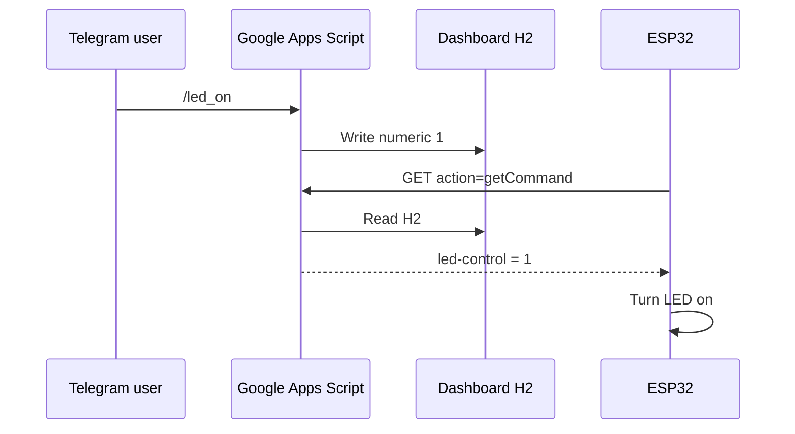

## Redeploy After Changes

After changing the Apps Script code:

1. Save the project.
2. Open **Deploy**.
3. Select **Manage deployments**.
4. Click **Edit**.
5. Select **New version**.
6. Click **Deploy**.

Otherwise, the `/exec` URL may continue running the old code.

---

# Merged `doPost(e)` Design: (HTTP Dashboard)

Replace the existing `doPost(e)` with one dispatcher that identifies whether the incoming `POST` request came from:

- **Telegram:** Contains `update_id`.
- **ESP32 telemetry:** Contains `"type": "telemetry"`.
- **ESP32 acknowledgement:** Contains `"type": "command-ack"`.

Your existing `doGet(e)` remains separate and continues returning the LED command from `H2`.

## Complete Integrated `doPost(e)`

```javascript
const DASHBOARD_SHEET_NAME = "Dashboard";
const LED_CONTROL_CELL = "H2";
const MAX_ROWS = 100;

/**
 * Receives POST requests from:
 *
 * 1. Telegram webhook
 * 2. ESP32 telemetry
 * 3. ESP32 command acknowledgement
 */
function doPost(e) {
  let isTelegramRequest = false;

  try {
    if (
      !e ||
      !e.postData ||
      !e.postData.contents
    ) {
      return jsonResponse({
        status: "error",
        message: "Empty POST request"
      });
    }

    const data =
      JSON.parse(e.postData.contents);

    // Telegram webhook updates contain update_id.
    isTelegramRequest =
      data.update_id !== undefined;

    if (isTelegramRequest) {
      return handleTelegramUpdate(data, e);
    }

    if (data.type === "telemetry") {
      return handleEsp32Telemetry(data);
    }

    if (data.type === "command-ack") {
      return handleCommandAcknowledgement(data);
    }

    return jsonResponse({
      status: "error",
      message: "Unknown POST request type"
    });

  } catch (err) {
    console.error(
      err.stack || err.toString()
    );

    // Stop Telegram from retrying a command that
    // produced an internal processing error.
    if (isTelegramRequest) {
      return telegramOkResponse();
    }

    // ESP32 still receives an informative JSON error.
    return jsonResponse({
      status: "error",
      message: err.toString()
    });
  }
}
```

## ESP32 Telemetry Handler

This contains the existing telemetry-processing code:

```javascript
function handleEsp32Telemetry(data) {
  const lock =
    LockService.getScriptLock();

  if (!lock.tryLock(10000)) {
    throw new Error(
      "Unable to obtain spreadsheet lock"
    );
  }

  try {
    const sheet =
      getDashboardSheet();

    // Validate important ESP32 fields.
    if (data.status === undefined) {
      throw new Error(
        "Telemetry field 'status' is missing"
      );
    }

    if (data.temperature === undefined) {
      throw new Error(
        "Telemetry field 'temperature' is missing"
      );
    }

    // Insert cells at A3:G3 and shift previous
    // telemetry records downward.
    const targetRange =
      sheet.getRange("A3:G3");

    targetRange.insertCells(
      SpreadsheetApp.Dimension.ROWS
    );

    // Copy formatting and formulas from A2:G2
    // into the newly inserted A3:G3.
    const topRowRange =
      sheet.getRange("A2:G2");

    topRowRange.copyTo(
      targetRange
    );

    // Write the newest telemetry to row 2.
    sheet.getRange("A2:G2").setValues([[
      new Date(),
      data.status,
      data.temperature,
      data.rssi,
      data.uptime,
      data["led-state"],
      data.button
    ]]);

    // Save actual hardware states.
    sheet.getRange("I2").setValue(
      data["led-state"]
    );

    sheet.getRange("J2").setValue(
      data.button
    );

    // Remove telemetry records beyond
    // the maximum row count.
    const lastRow =
      sheet.getLastRow();

    if (lastRow > MAX_ROWS) {
      sheet
        .getRange(
          MAX_ROWS + 1,
          1,
          lastRow - MAX_ROWS,
          7
        )
        .clearContent();
    }

    // Read the desired LED state from H2.
    const rawLedControl =
      sheet
        .getRange(LED_CONTROL_CELL)
        .getValue();

    const ledControlValue =
      normalizeLedControl(
        rawLedControl
      );

    SpreadsheetApp.flush();

    // Return the command to the ESP32.
    return jsonResponse({
      status: "success",
      "led-control": ledControlValue
    });

  } finally {
    lock.releaseLock();
  }
}
```

## Telegram Webhook Handler

This processes:

- `/led_on`
- `/led_off`
- `/status`
- `/temperature`
- `/telemetry`
- `/start`
- `/help`

```javascript
function handleTelegramUpdate(update, e) {
  // Optional webhook-path verification.
  validateTelegramWebhookPath(e);

  if (!claimTelegramUpdate(update.update_id)) {
    console.log(
      "Duplicate Telegram update ignored: " +
      update.update_id
    );

    return telegramOkResponse();
  }

  const message =
    update.message;

  // Some Telegram updates may not contain
  // a normal text message.
  if (!message || !message.text) {
    return jsonResponse({
      ok: true
    });
  }

  const properties =
    PropertiesService
      .getScriptProperties();

  const authorisedChatId =
    properties.getProperty(
      "AUTHORIZED_CHAT_ID"
    );

  if (!authorisedChatId) {
    throw new Error(
      "AUTHORIZED_CHAT_ID is missing"
    );
  }

  const incomingChatId =
    String(message.chat.id);

  // Ignore commands from unauthorised users.
  if (
    incomingChatId !==
    String(authorisedChatId)
  ) {
    console.warn(
      "Rejected unauthorised chat ID: " +
      incomingChatId
    );

    return jsonResponse({
      ok: true
    });
  }

  /*
   * Remove the bot username from group commands.
   *
   * Example:
   * /led_on@OoiKK_ESP32_bot
   *
   * becomes:
   * /led_on
   */


  const command =
    message.text
      .trim()
      .toLowerCase()
      .split("@")[0];

  const sheet = getDashboardSheet();

  switch (command) {
    case "/start":
    case "/help":
      sendTelegramTo(
        incomingChatId,
        "ESP32 Telegram Control\n\n" +
        "/led_on - Request LED ON\n" +
        "/led_off - Request LED OFF\n" +
        "/status - Show ESP32 status\n" +
        "/temperature - Read temperature\n" +
        "/telemetry - Send all telemetries data\n" +
        "/help - Show commands"
      );
      break;

    case "/led_on":
      setLedControl(1);

      sendTelegramTo(
        incomingChatId,
        "LED ON command stored in " +
        "Dashboard!H2.\n" +
        "Waiting for the next ESP32 communication."
      );
      break;

    case "/led_off":
      setLedControl(0);

      sendTelegramTo(
        incomingChatId,
        "LED OFF command stored in " +
        "Dashboard!H2.\n" +
        "Waiting for the next ESP32 communication."
      );
      break;

    case "/status":
      //const sheet = getDashboardSheet();
      const deviceStatus = sheet.getRange("B2").getValues();
      sendTelegramTo(
        incomingChatId,
        "Device: " + deviceStatus
      );
      break;
    case "/temperature":
      //const sheet = getDashboardSheet();
      const temperature = sheet.getRange("C2").getValues();
      sendTelegramTo(
        incomingChatId,
        "Temperature: " + temperature + " °C\n"
      );
      break;
    case "/telemetry":
      sendEsp32Status(
        incomingChatId
      );
      break;

    default:
      sendTelegramTo(
        incomingChatId,
        "Unknown command: " +
        command +
        "\n\n" +
        "Available commands:\n" +
        "/led_on\n" +
        "/led_off\n" +
        "/status\n" +
        "/temperature\n" +
        "//telemetry\n"+
        "/help"
      );
  }

  // Telegram only needs a successful response.
  return telegramOkResponse();
  //return jsonResponse({ok: true});

}
```

## Webhook-Path Validation

Use this if the registered webhook URL follows this format:

```text
GAS_EXEC_URL/telegram/WEBHOOK_PATH_SECRET
```

```javascript
function validateTelegramWebhookPath(e) {
  const properties = PropertiesService.getScriptProperties();
  const secret = properties.getProperty("WEBHOOK_PATH_SECRET");

  if (!secret) return;

  const receivedSecret = e && e.parameter ? String(e.parameter.secret || "") : "";

  if (receivedSecret !== secret) {
    throw new Error("Invalid Telegram webhook secret parameter");
  }
}
```

If the webhook currently points directly to:

```text
https://script.google.com/macros/s/DEPLOYMENT_ID/exec
```

either:

- Do not define `WEBHOOK_PATH_SECRET`; or
- Update the webhook URL to include the secret path.

## Write the Telegram Command to `H2`

```javascript
function setLedControl(value) {
  if (value !== 0 && value !== 1) {
    throw new Error(
      "LED control value must be 0 or 1"
    );
  }

  const lock =
    LockService.getScriptLock();

  if (!lock.tryLock(10000)) {
    throw new Error(
      "Unable to obtain spreadsheet lock"
    );
  }

  try {
    const sheet =
      getDashboardSheet();

    sheet
      .getRange(LED_CONTROL_CELL)
      .setValue(value);

    SpreadsheetApp.flush();

  } finally {
    lock.releaseLock();
  }
}
```

## Send ESP32 Status to Telegram

Based on the current sheet layout:

| Cell | Information |
|---|---|
| `A2` | Timestamp |
| `B2` | Status |
| `C2` | Temperature |
| `D2` | RSSI |
| `E2` | Uptime |
| `F2` | Reported LED state |
| `G2` | Reported button state |
| `H2` | Desired LED control |
| `I2` | Actual LED state |
| `J2` | Actual button state |

```javascript
function sendEsp32Status(chatId) {
  const sheet = getDashboardSheet();

  const values =
    sheet.getRange("A2:J2").getValues()[0];

  const timestamp = values[0];
  const deviceStatus = values[1];
  const temperature = values[2];
  const rssi = values[3];
  const uptime = values[4];

  const requestedLedState =
    normalizeLedControl(values[7]);

  const actualLedState =
    normalizeLedControl(values[8]);

  const buttonState = values[9];

  const message =
    "ESP32 Status\n\n" +
    "Device: " + deviceStatus + "\n" +
    "Temperature: " + temperature + " °C\n" +
    "RSSI: " + rssi + " dBm\n" +
    "Uptime: " + uptime + " seconds\n" +
    "Requested LED: " +
      formatOnOff(requestedLedState) + "\n" +
    "Actual LED: " +
      formatOnOff(actualLedState) + "\n" +
    "Button: " + buttonState + "\n" +
    "Last update: " + timestamp;

  sendTelegramTo(chatId, message);
}

function formatOnOff(value) {
  return value === 1
    ? "ON"
    : "OFF";
}
```

## Send a Message Through Telegram

```javascript
function sendTelegramTo(chatId, text) {
  const properties =
    PropertiesService
      .getScriptProperties();

  const botToken =
    properties.getProperty(
      "BOT_TOKEN"
    );

  if (!botToken) {
    throw new Error(
      "BOT_TOKEN is missing from Script Properties"
    );
  }

  const url =
    "https://api.telegram.org/bot" +
    botToken +
    "/sendMessage";

  const response =
    UrlFetchApp.fetch(
      url,
      {
        method: "post",
        contentType: "application/json",
        payload: JSON.stringify({
          chat_id: String(chatId),
          text: text
        }),
        muteHttpExceptions: true
      }
    );

  const responseText =
    response.getContentText();

  const result =
    JSON.parse(responseText);

  if (!result.ok) {
    throw new Error(
      "Telegram sendMessage failed: " +
      responseText
    );
  }

  return result;
}
```

## Optional ESP32 Acknowledgement Handler

This supports a future ESP32 payload such as:

```json
{
  "type": "command-ack",
  "deviceId": "ESP32_01",
  "success": true,
  "led-state": 1
}
```

```javascript
function handleCommandAcknowledgement(data) {
  const properties =
    PropertiesService
      .getScriptProperties();

  const chatId =
    properties.getProperty(
      "AUTHORIZED_CHAT_ID"
    );

  const success =
    data.success === true;

  const actualLedState =
    normalizeLedControl(
      data["led-state"]
    );

  const message =
    success
      ? "ESP32 confirmed LED is " +
        formatOnOff(actualLedState) +
        "."
      : "ESP32 failed to execute the command.";

  sendTelegramTo(
    chatId,
    message
  );

  return jsonResponse({
    status: "success",
    message: "Acknowledgement recorded"
  });
}
```

## Shared Helper Functions

```javascript
function getDashboardSheet() {
  const sheet =
    SpreadsheetApp
      .getActiveSpreadsheet()
      .getSheetByName(
        DASHBOARD_SHEET_NAME
      );

  if (!sheet) {
    throw new Error(
      'Sheet "' +
      DASHBOARD_SHEET_NAME +
      '" not found'
    );
  }

  return sheet;
}
```

```javascript
function normalizeLedControl(value) {
  if (value === true || value === 1) {
    return 1;
  }

  if (value === false || value === 0) {
    return 0;
  }

  const text =
    String(value)
      .trim()
      .toLowerCase();

  if (
    text === "1" ||
    text === "true" ||
    text === "on" ||
    text === "high"
  ) {
    return 1;
  }

  if (
    text === "0" ||
    text === "false" ||
    text === "off" ||
    text === "low"
  ) {
    return 0;
  }

  throw new Error(
    "Invalid LED value: " +
    value
  );
}
```

```javascript
function jsonResponse(data) {
  return ContentService
    .createTextOutput(
      JSON.stringify(data)
    )
    .setMimeType(
      ContentService.MimeType.JSON
    );
}
```

## Required Script Properties

Verify these properties under:

```text
Project Settings → Script Properties
```

| Property | Value |
|---|---|
| `BOT_TOKEN` | Your replacement Telegram bot token. |
| `AUTHORIZED_CHAT_ID` | `58138745`. |
| `WEBHOOK_PATH_SECRET` | Optional random string. |

## Resulting Behaviour

When the ESP32 sends telemetry:

```json
{
  "type": "telemetry",
  "status": "ONLINE",
  "temperature": 45.5,
  "rssi": -73,
  "uptime": 100,
  "led-state": 0,
  "button": 0
}
```

Google Apps Script updates the sheet and returns:

```json
{
  "status": "success",
  "led-control": 1
}
```

When Telegram sends a `/led_on` webhook update, Google Apps Script writes:

```text
Dashboard!H2 = 1
```

At the next ESP32 `POST` or `GET` request, the ESP32 receives:

```json
{
  "status": "success",
  "led-control": 1
}
```

## Redeploy After Replacing the Code

After replacing the Apps Script code:

1. Save the project.
2. Open **Deploy**.
3. Select **Manage deployments**.
4. Click **Edit**.
5. Select **New version**.
6. Click **Deploy**.

If you update the existing deployment, its `/exec` URL remains unchanged.

---

# Final Telegram Webhook Setup


Two items must be addressed before Telegram will work:

1. Add and run `registerTelegramWebhook()` once.
2. Deploy the updated script as a Web App.

## 1. Add a Telegram Test Function

Add this function:

```javascript
function testTelegramSend() {
  const properties =
    PropertiesService
      .getScriptProperties();

  const chatId =
    properties.getProperty(
      "AUTHORIZED_CHAT_ID"
    );

  if (!chatId) {
    throw new Error(
      "AUTHORIZED_CHAT_ID is missing"
    );
  }

  sendTelegramTo(
    chatId,
    "Google Apps Script Telegram test successful."
  );
}
```

1. Select `testTelegramSend()` in Apps Script.
2. Click **Run**.
3. Approve permissions if requested.
4. Check whether the test message arrives in Telegram.

This verifies that:

- `BOT_TOKEN` is correct.
- `AUTHORIZED_CHAT_ID` is correct.
- `sendTelegramTo()` works.
- Apps Script has permission to call Telegram.

## 2. Add the Webhook Registration Function

Add the following `registerTelegramWebhook()` function:

```javascript
function registerTelegramWebhook() {
  const properties =
    PropertiesService.getScriptProperties();

  const botToken =
    properties.getProperty("BOT_TOKEN");

  const webAppUrl =
    properties.getProperty("WEB_APP_URL");

  const webhookSecret =
    properties.getProperty(
      "WEBHOOK_PATH_SECRET"
    );

  if (!botToken) {
    throw new Error(
      "BOT_TOKEN is missing"
    );
  }

  if (!webAppUrl) {
    throw new Error(
      "WEB_APP_URL is missing"
    );
  }

  if (!webAppUrl.endsWith("/exec")) {
    throw new Error(
      "WEB_APP_URL must end with /exec. " +
      "Current value: " + webAppUrl
    );
  }

  if (!webhookSecret) {
    throw new Error(
      "WEBHOOK_PATH_SECRET is missing"
    );
  }

  if (
    !/^[A-Za-z0-9_-]+$/.test(webhookSecret)
  ) {
    throw new Error(
      "WEBHOOK_PATH_SECRET contains " +
      "invalid characters"
    );
  }

  // Use query parameters instead:
  const webhookUrl = webAppUrl + "?secret=" + webhookSecret;

  const telegramApiUrl =
    "https://api.telegram.org/bot" +
    botToken +
    "/setWebhook";

  const response =
    UrlFetchApp.fetch(
      telegramApiUrl,
      {
        method: "post",
        contentType: "application/json",
        payload: JSON.stringify({
          url: webhookUrl,
          allowed_updates: [
            "message"
          ],

          /*
           * Discard the four messages that failed
           * while the /dev URL was registered.
           */
          drop_pending_updates: true
        }),
        muteHttpExceptions: true
      }
    );

  const responseText =
    response.getContentText();

  console.log(
    "Registered webhook: " +
    webhookUrl
  );

  console.log(
    "Telegram response: " +
    responseText
  );

  const result =
    JSON.parse(responseText);

  if (!result.ok) {
    throw new Error(
      "Webhook registration failed: " +
      responseText
    );
  }

  return result;
}
```

Or using Direct Browser URL:     

```text
https://api.telegram.org/bot<YOUR_BOT_TOKEN>/setWebhook?url=<YOUR_WEBAPP_URL>&drop_pending_updates=true
```

`ScriptApp.getService().getUrl()` When run in development context, it can return the /dev URL. Google documents that getUrl() returns the development-mode URL when running in development mode. 

Use the explicitly stored /exec URL `WEB_APP_URL` instead:   
```javascript
  const webAppUrl =
    properties.getProperty("WEB_APP_URL");
```   

See the [Google Apps Script Service documentation](https://developers.google.com/apps-script/reference/script/service#geturl).

The resulting webhook URL will be:

```text
https://script.google.com/macros/s/DEPLOYMENT_ID/exec/telegram/YOUR_SECRET
```

Below is the console log response of `registerTelegramWebhook()`     

```
Registered webhook: https://script.google.com/macros/s/DEPLOYMENT_ID/exec/telegram/your-webhook-secret
Telegram response: {"ok":true,"result":true,"description":"Webhook was set"}
```

Telegram will subsequently send every bot message to this URL as an HTTPS `POST`.

See the [Telegram setWebhook documentation](https://core.telegram.org/bots/api#setwebhook).

## 3. Add a Webhook-Information Function

This function lets you verify the webhook registration:

```javascript
function getTelegramWebhookInfo() {
  const botToken =
    PropertiesService
      .getScriptProperties()
      .getProperty("BOT_TOKEN");

  if (!botToken) {
    throw new Error(
      "BOT_TOKEN is missing"
    );
  }

  const url =
    "https://api.telegram.org/bot" +
    botToken +
    "/getWebhookInfo";

  const response =
    UrlFetchApp.fetch(
      url,
      {
        method: "get",
        muteHttpExceptions: true
      }
    );

  const responseText =
    response.getContentText();

  console.log(responseText);

  return JSON.parse(responseText);
}
```

Or using Direct Browser URL:     

```text
https://api.telegram.org/bot<YOUR_BOT_TOKEN>/getWebhookInfo
```

Expected log:

```json
{
  "ok": true,
  "result": {
    "url": "https://script.google.com/macros/s/.../exec/telegram/...",
    "has_custom_certificate": false,
    "pending_update_count": 0
  }
}
```

Actual log:   

```json
{
 "ok":true,
 "result":{
 "url":"https://script.google.com/macros/s/DEPLOYMENT_ID/exec/telegram/your-webhook-secret",
 "has_custom_certificate":false,
 "pending_update_count":0,
 "max_connections":40,
 "ip_address":"172.217.17.46",
 "allowed_updates":["message"]
 }
}
```

Confirm that:

- `url` contains your GAS `/exec/telegram/...` URL.
- `pending_update_count` is normally `0`.
- `last_error_message` is absent.

## 4. Optional Webhook Removal Function

Use this if you need to return to `getUpdates` testing:

```javascript
/**
 * Deletes the active Telegram Webhook and purges all queued retry messages.
 */
function deleteTelegramWebhook() {
  const botToken = PropertiesService.getScriptProperties().getProperty("BOT_TOKEN");

  if (!botToken) {
    throw new Error("BOT_TOKEN is missing from Script Properties.");
  }

  const url = "https://api.telegram.org/bot" + botToken + "/deleteWebhook";

  const response = UrlFetchApp.fetch(url, {
    method: "post",
    contentType: "application/json",
    payload: JSON.stringify({
      drop_pending_updates: true // Purges all retrying messages immediately
    }),
    muteHttpExceptions: true
  });

  const responseText = response.getContentText();
  console.log("Delete Webhook Response: " + responseText);

  return JSON.parse(responseText);
}
```

Or using Direct Browser URL:      
```text
https://api.telegram.org/bot<YOUR_BOT_TOKEN>/deleteWebhook?drop_pending_updates=true
```


> Do not run this function during normal webhook operation.

## 5. Check Script Properties

Under:

```text
Project Settings → Script Properties
```

confirm the following:

| Property | Required Value |
|---|---|
| `BOT_TOKEN` | Your new replacement token. |
| `AUTHORIZED_CHAT_ID` | `58138745`. |
| `WEBHOOK_PATH_SECRET` | A long random value. |

Example webhook secret:

```text
ESP32_TG_a8F3kP91mZ7
```

Do not include the following in `WEBHOOK_PATH_SECRET`:

- Spaces.
- Slashes.
- Colons.
- The bot token.

Make sure `BOT_TOKEN` contains the replacement token created after the original token was exposed.

## 6. Initialise Dashboard Cells

Before testing `/status`, enter valid values:

| Cell | Initial Value |
|---|---:|
| `H2` | `0` |
| `I2` | `0` |
| `J2` | `0` |

Otherwise, this code may reject a blank value:

```javascript
normalizeLedControl(
  values[1]
);
```

The `/led_on` and `/led_off` commands update `H2`.

## 7. Deploy the New Version

After correcting the code:

1. Save the Apps Script project.
2. Select **Deploy → Manage deployments**.
3. Edit the existing Web App deployment.
4. Select **New version**.
5. Confirm:

   ```text
   Execute as: Me
   Who has access: Anyone
   ```

6. Click **Deploy**.

Update the existing deployment instead of creating an unrelated deployment. This keeps the same `/exec` URL used by the ESP32.

## 8. Run the Functions in This Order

### Step 1 — Test Telegram Sending

Run:

```text
testTelegramSend()
```

Expected result:

```text
Telegram receives the test message.
```

### Step 2 — Register the Webhook

Run:

```text
registerTelegramWebhook()
```

Expected log:

```json
{
  "ok": true,
  "result": true,
  "description": "Webhook was set"
}
```

### Step 3 — Verify the Webhook

Run:

```text
getTelegramWebhookInfo()
```

Confirm the webhook URL and the absence of errors.

### Step 4 — Test `/start`

Send to the bot:

```text
/start
```

Expected Telegram response:

```text
ESP32 Telegram Control

/led_on - Request LED ON
/led_off - Request LED OFF
/status - Show ESP32 status
/help - Show commands
```

### Step 5 — Test `/led_on`

Send:

```text
/led_on
```

Expected results:

```text
Dashboard!H2 becomes numeric 1.
```

Telegram replies that the command is stored.

On the next ESP32 `GET` request or telemetry `POST`, the ESP32 receives:

```json
{
  "status": "success",
  "led-control": 1
}
```

### Step 6 — Test `/led_off`

Send:

```text
/led_off
```

Expected results:

```text
Dashboard!H2 becomes numeric 0.
```

The ESP32 receives:

```json
{
  "status": "success",
  "led-control": 0
}
```

## What You Do Not Need

You do not need:

- A timed Apps Script trigger.
- Telegram `getUpdates`.
- A Telegram library on the ESP32.
- The bot token inside ESP32 firmware.
- Another `doPost()`.
- Another `handleTelegramUpdate()`.

Once the webhook is registered, Telegram automatically calls your existing `doPost()`. The dispatcher identifies `update_id` and routes the request to `handleTelegramUpdate()`.

---
# Drop Pending Telegram Updates

## Method 1: Direct Browser URL

This is the fastest method. Set `drop_pending_updates=true` by pasting one of the following URLs into a web browser.

Replace `<YOUR_BOT_TOKEN>` with your actual bot token.

### Delete the Webhook and Drop Queued Updates

```text
https://api.telegram.org/bot<YOUR_BOT_TOKEN>/deleteWebhook?drop_pending_updates=true
```

### Register a New Webhook and Drop Queued Updates

Replace `<YOUR_WEBAPP_URL>` with the deployed Google Apps Script Web App URL.

```text
https://api.telegram.org/bot<YOUR_BOT_TOKEN>/setWebhook?url=<YOUR_WEBAPP_URL>&drop_pending_updates=true
```

## Method 2: Google Apps Script with `UrlFetchApp`

Pass `"drop_pending_updates": true` inside the JSON payload when sending a `POST` request to Telegram.

### Delete a Webhook

```javascript
function deleteTelegramWebhook() {
  const botToken =
    PropertiesService
      .getScriptProperties()
      .getProperty("BOT_TOKEN");

  const url =
    "https://api.telegram.org/bot" +
    botToken +
    "/deleteWebhook";

  UrlFetchApp.fetch(
    url,
    {
      method: "post",
      contentType: "application/json",
      payload: JSON.stringify({
        // Drops all queued and retrying messages
        drop_pending_updates: true
      }),
      muteHttpExceptions: true
    }
  );
}
```

### Register a Webhook

```javascript
function registerTelegramWebhook() {
  const botToken =
    PropertiesService
      .getScriptProperties()
      .getProperty("BOT_TOKEN");

  const webAppUrl =
    PropertiesService
      .getScriptProperties()
      .getProperty("WEB_APP_URL");

  const url =
    "https://api.telegram.org/bot" +
    botToken +
    "/setWebhook";

  UrlFetchApp.fetch(
    url,
    {
      method: "post",
      contentType: "application/json",
      payload: JSON.stringify({
        url: webAppUrl,

        // Clears the backlog before sending new updates
        drop_pending_updates: true
      }),
      muteHttpExceptions: true
    }
  );
}
```

## Method 3: cURL Command

Run the following command in a terminal or Command Prompt:

```bash
curl -X POST \
  "https://api.telegram.org/bot<YOUR_BOT_TOKEN>/deleteWebhook" \
  -H "Content-Type: application/json" \
  -d '{"drop_pending_updates": true}'
```
## Method 4: Flush the Stuck Telegram Queue and Re-Register

Run this combined script in your Apps Script editor. It will completely delete the broken webhook, flush the retrying message queue, and re-register the clean endpoint:

```javascript
function resetAndRegisterTelegramWebhook() {
  const properties = PropertiesService.getScriptProperties();
  const botToken = properties.getProperty("BOT_TOKEN");
  const webAppUrl = properties.getProperty("WEB_APP_URL");
  const webhookSecret = properties.getProperty("WEBHOOK_PATH_SECRET");

  if (!botToken || !webAppUrl || !webhookSecret) {
    throw new Error("Missing BOT_TOKEN, WEB_APP_URL, or WEBHOOK_PATH_SECRET in Script Properties.");
  }

  // Step 1: Delete existing webhook and drop stuck retry updates
  const deleteUrl = "https://api.telegram.org/bot" + botToken + "/deleteWebhook";
  UrlFetchApp.fetch(deleteUrl, {
    method: "post",
    contentType: "application/json",
    payload: JSON.stringify({ drop_pending_updates: true }),
    muteHttpExceptions: true
  });

  Utilities.sleep(1000); // Pause 1 second

  // Step 2: Register new webhook with secret query parameter
  const webhookUrl = webAppUrl + "?secret=" + webhookSecret;
  const setUrl = "https://api.telegram.org/bot" + botToken + "/setWebhook";

  const response = UrlFetchApp.fetch(setUrl, {
    method: "post",
    contentType: "application/json",
    payload: JSON.stringify({
      url: webhookUrl,
      allowed_updates: ["message"],
      drop_pending_updates: true
    }),
    muteHttpExceptions: true
  });

  console.log("Registration Response: " + response.getContentText());
}

```
---
# Telegram Commands and `doGet(e)`

None of the Telegram bot commands currently call `doGet(e)`.

Because a Telegram webhook is registered, Telegram sends commands such as `/status`, `/led_on`, and `/led_off` as HTTPS `POST` requests:

```text
Telegram command
      ↓
doPost(e)
      ↓
handleTelegramUpdate(data, e)
```

## When `doGet(e)` Is Called

`doGet(e)` is called only when something performs an HTTP `GET` request to the Apps Script URL.

For example:

```text
[https://script.google.com/macros/s/DEPLOYMENT_ID/exec?action=getCommand](https://script.google.com/macros/s/DEPLOYMENT_ID/exec?action=getCommand)
```

## Request Routing in This Project

| Request Source | HTTP Method | Apps Script Function |
|---|---|---|
| Telegram webhook | `POST` | `doPost(e)` |
| ESP32 telemetry upload | `POST` | `doPost(e)` |
| ESP32 command polling | `GET` | `doGet(e)` |
| Browser opening the Web App URL | `GET` | `doGet(e)` |

## The `/status` Command

The `/status` Telegram command does not call `doGet(e)`.

It directly calls:

```javascript
case "/status":
  sendEsp32Status(
    incomingChatId
  );
  break;
```

The request path is:

```text
Telegram /status command
      ↓
doPost(e)
      ↓
handleTelegramUpdate(data, e)
      ↓
sendEsp32Status(chatId)
```

## Reusing `doGet(e)` Logic

If you deliberately want a Telegram command to reuse logic currently inside `doGet(e)`, extract that logic into a normal helper function and call the helper from both places.

Do not call `doGet(e)` directly from `handleTelegramUpdate()` because the Telegram event object differs from a browser or ESP32 `GET` event.

### Recommended Structure

```javascript
function doGet(e) {
  const action =
    e && e.parameter
      ? e.parameter.action || ""
      : "";

  if (action === "getCommand") {
    return jsonResponse(
      getLedCommand()
    );
  }

  return jsonResponse({
    status: "success",
    service: "ESP32 Telegram Bridge"
  });
}

function getLedCommand() {
  const sheet =
    SpreadsheetApp
      .getActiveSpreadsheet()
      .getSheetByName("Dashboard");

  const value =
    sheet
      .getRange("H2")
      .getValue();

  return {
    status: "success",
    "led-control":
      normalizeLedControl(value)
  };
}

function handleTelegramUpdate(update, e) {
  const message =
    update.message;

  if (!message || !message.text) {
    return jsonResponse({
      ok: true
    });
  }

  const command =
    message.text
      .trim()
      .toLowerCase()
      .split("@");

  switch (command) {
    case "/status": {
      const commandState =
        getLedCommand();

      sendTelegramTo(
        message.chat.id,
        "Current LED control: " +
        commandState["led-control"]
      );
      break;
    }

    default:
      break;
  }

  return jsonResponse({
    ok: true
  });
}
```

The helper function contains the reusable business logic, while `doGet(e)` and `handleTelegramUpdate()` remain separate request handlers.

---


# Multiple Telegram Bots with One Apps Script

Yes. Multiple Telegram bots can use the same Apps Script deployment and Google Sheet.

Each bot requires:

- Its own bot token.
- Its own webhook secret.
- Its own authorised chat ID.
- A webhook URL containing a bot identifier.

Telegram sends each update as an HTTPS `POST` request, while Apps Script exposes URL query parameters through `e.parameter`.

See the [Telegram Bot API](https://core.telegram.org/bots/api?utm_source=chatgpt.com "Telegram Bot API").

The sample below assumes that both bots control the same `Dashboard!H2`. Therefore, the most recent command wins.

## 1. Add Script Properties

In:

```text
Project Settings → Script Properties
```

add the following properties:

| Property | Example |
|---|---|
| `WEB_APP_URL` | https://script.google.com/macros/s/.../exec |
| `BOT1_TOKEN` | First bot token. |
| `BOT1_SECRET` | Strong random secret. |
| `BOT1_CHAT_IDS` | First authorised chat ID. |
| `BOT2_TOKEN` | Second bot token. |
| `BOT2_SECRET` | Different random secret. |
| `BOT2_CHAT_IDS` | Second authorised chat ID. |

Multiple chat IDs can be comma-separated:

```text
58138745,123456789
```

Script Properties are suitable because they persist between separate webhook and ESP32 executions.

See the [Apps Script PropertiesService documentation](https://developers.google.com/apps-script/reference/properties/properties-service?utm_source=chatgpt.com "Class PropertiesService").

## 2. Bot Configuration

```javascript
const TELEGRAM_BOT_KEYS = [
  "bot1",
  "bot2"
];

function getTelegramBotConfig(botKey) {
  if (
    !TELEGRAM_BOT_KEYS.includes(
      botKey
    )
  ) {
    throw new Error(
      "Unknown Telegram bot: " +
      botKey
    );
  }

  const properties =
    PropertiesService
      .getScriptProperties();

  const prefix =
    botKey.toUpperCase();

  const token =
    properties.getProperty(
      prefix + "_TOKEN"
    );

  const secret =
    properties.getProperty(
      prefix + "_SECRET"
    );

  const chatIdsText =
    properties.getProperty(
      prefix + "_CHAT_IDS"
    ) || "";

  const authorizedChatIds =
    chatIdsText
      .split(",")
      .map(function(value) {
        return value.trim();
      })
      .filter(function(value) {
        return value !== "";
      });

  if (!token || !secret) {
    throw new Error(
      "Missing token or secret for " +
      botKey
    );
  }

  return {
    botKey: botKey,
    token: token,
    secret: secret,
    authorizedChatIds: authorizedChatIds
  };
}
```

## 3. Register Both Webhooks

Each bot receives a different URL:

```text
/exec?source=telegram&bot=bot1&secret=BOT1_SECRET
/exec?source=telegram&bot=bot2&secret=BOT2_SECRET
```

### Registration Function

```javascript
function registerAllTelegramWebhooks() {
  const properties =
    PropertiesService
      .getScriptProperties();

  const webAppUrl =
    properties.getProperty(
      "WEB_APP_URL"
    );

  if (
    !webAppUrl ||
    !webAppUrl.endsWith("/exec")
  ) {
    throw new Error(
      "WEB_APP_URL must contain the deployed /exec URL"
    );
  }

  TELEGRAM_BOT_KEYS.forEach(
    function(botKey) {
      const config =
        getTelegramBotConfig(
          botKey
        );

      const webhookUrl =
        webAppUrl +
        "?source=telegram" +
        "&bot=" +
        encodeURIComponent(botKey) +
        "&secret=" +
        encodeURIComponent(
          config.secret
        );

      const telegramUrl =
        "https://api.telegram.org/bot" +
        config.token +
        "/setWebhook";

      const response =
        UrlFetchApp.fetch(
          telegramUrl,
          {
            method: "post",
            contentType:
              "application/json",
            payload: JSON.stringify({
              url: webhookUrl,
              allowed_updates: [
                "message"
              ],
              drop_pending_updates: true
            }),
            muteHttpExceptions: true
          }
        );

      console.log(
        botKey +
        " registration: " +
        response.getContentText()
      );
    }
  );
}
```

Run `registerAllTelegramWebhooks()` once after deploying a new Apps Script version.

## 4. Route Telegram Requests in `doPost()`

```javascript
function telegramOkResponse() {
  return HtmlService
    .createHtmlOutput("OK");
}

function doPost(e) {
  const isTelegramRequest =
    e &&
    e.parameter &&
    e.parameter.source ===
      "telegram";

  try {
    if (
      !e ||
      !e.postData ||
      !e.postData.contents
    ) {
      throw new Error(
        "Empty POST request"
      );
    }

    const data =
      JSON.parse(
        e.postData.contents
      );

    if (isTelegramRequest) {
      const botKey =
        String(
          e.parameter.bot || ""
        );

      return handleTelegramUpdate(
        botKey,
        data,
        e
      );
    }

    if (data.type === "telemetry") {
      return handleEsp32Telemetry(
        data
      );
    }

    if (data.type === "command-ack") {
      return handleCommandAcknowledgement(
        data
      );
    }

    return jsonResponse({
      status: "error",
      message: "Unknown POST request"
    });

  } catch (err) {
    console.error(
      err.stack ||
      err.toString()
    );

    if (isTelegramRequest) {
      // Prevent Telegram retry loops.
      return telegramOkResponse();
    }

    return jsonResponse({
      status: "error",
      message: err.toString()
    });
  }
}
```

## 5. Send Using the Correct Bot

Replace the single-token `sendTelegramTo()` function with:

```javascript
function sendTelegramFromBot(
  botKey,
  chatId,
  message
) {
  const config =
    getTelegramBotConfig(
      botKey
    );

  const url =
    "https://api.telegram.org/bot" +
    config.token +
    "/sendMessage";

  const response =
    UrlFetchApp.fetch(
      url,
      {
        method: "post",
        contentType:
          "application/json",
        payload: JSON.stringify({
          chat_id: String(chatId),
          text: message
        }),
        muteHttpExceptions: true
      }
    );

  const result =
    JSON.parse(
      response.getContentText()
    );

  if (!result.ok) {
    throw new Error(
      "Telegram sendMessage failed for " +
      botKey +
      ": " +
      response.getContentText()
    );
  }

  return result;
}
```

## 6. Store Which Bot Issued the LED Command

Because both bots share `H2`, save the originating bot and chat ID together with the target state:

```javascript
function storeTelegramLedCommand(
  botKey,
  chatId,
  targetLedState,
  updateId
) {
  const target =
    normalizeLedControl(
      targetLedState
    );

  const lock =
    LockService.getScriptLock();

  if (!lock.tryLock(10000)) {
    throw new Error(
      "Unable to obtain LED command lock"
    );
  }

  try {
    const sheet =
      getDashboardSheet();

    sheet
      .getRange(LED_CONTROL_CELL)
      .setValue(target);

    const pendingCommand = {
      botKey: botKey,
      chatId: String(chatId),
      targetLedState: target,
      updateId: updateId,
      createdAt:
        new Date().toISOString()
    };

    PropertiesService
      .getScriptProperties()
      .setProperty(
        "PENDING_LED_COMMAND",
        JSON.stringify(
          pendingCommand
        )
      );

    SpreadsheetApp.flush();

  } finally {
    lock.releaseLock();
  }
}
```

## 7. Multi-Bot Telegram Handler

```javascript
function handleTelegramUpdate(
  botKey,
  update,
  e
) {
  const config =
    getTelegramBotConfig(
      botKey
    );

  const receivedSecret =
    String(
      e.parameter.secret || ""
    );

  if (
    receivedSecret !==
    config.secret
  ) {
    throw new Error(
      "Invalid webhook secret for " +
      botKey
    );
  }

  const message =
    update.message;

  if (
    !message ||
    !message.text
  ) {
    return telegramOkResponse();
  }

  const chatId =
    String(message.chat.id);

  if (
    !config.authorizedChatIds
      .includes(chatId)
  ) {
    console.warn(
      "Unauthorized chat for " +
      botKey +
      ": " +
      chatId
    );

    return telegramOkResponse();
  }

  const command =
    message.text
      .trim()
      .toLowerCase()
      .split("@");

  switch (command) {
    case "/start":
    case "/help":
      sendTelegramFromBot(
        botKey,
        chatId,
        "ESP32 Telegram Control\n\n" +
        "/led_on - Request LED ON\n" +
        "/led_off - Request LED OFF\n" +
        "/status - Show LED status"
      );
      break;

    case "/led_on":
      storeTelegramLedCommand(
        botKey,
        chatId,
        1,
        update.update_id
      );

      sendTelegramFromBot(
        botKey,
        chatId,
        "LED ON stored in Dashboard!H2.\n" +
        "Waiting for ESP32 confirmation."
      );
      break;

    case "/led_off":
      storeTelegramLedCommand(
        botKey,
        chatId,
        0,
        update.update_id
      );

      sendTelegramFromBot(
        botKey,
        chatId,
        "LED OFF stored in Dashboard!H2.\n" +
        "Waiting for ESP32 confirmation."
      );
      break;

    case "/status":
      sendLedStatus(
        botKey,
        chatId
      );
      break;

    default:
      sendTelegramFromBot(
        botKey,
        chatId,
        "Unknown command: " +
        command
      );
  }

  return telegramOkResponse();
}
```

### Status Function

```javascript
function sendLedStatus(
  botKey,
  chatId
) {
  const sheet =
    getDashboardSheet();

  const requestedState =
    normalizeLedControl(
      sheet
        .getRange(LED_CONTROL_CELL)
        .getValue()
    );

  const actualState =
    normalizeLedControl(
      sheet
        .getRange("I2")
        .getValue()
    );

  sendTelegramFromBot(
    botKey,
    chatId,
    "Requested LED: " +
    formatOnOff(
      requestedState
    ) +
    "\nActual ESP32 LED: " +
    formatOnOff(
      actualState
    )
  );
}
```

## 8. Acknowledge Through the Originating Bot

Inside `handleEsp32Telemetry()`, declare these variables before the `try` block:

```javascript
let ledControlValue;
let acknowledgementData = null;
```

While still inside the locked `try` block, add:

```javascript
const actualLedState =
  normalizeLedControl(
    data["led-state"]
  );

const properties =
  PropertiesService
    .getScriptProperties();

const pendingText =
  properties.getProperty(
    "PENDING_LED_COMMAND"
  );

if (pendingText) {
  const pendingCommand =
    JSON.parse(
      pendingText
    );

  const expectedState =
    normalizeLedControl(
      pendingCommand.targetLedState
    );

  if (
    actualLedState ===
    expectedState
  ) {
    acknowledgementData = {
      type: "command-ack",
      success: true,
      botKey:
        pendingCommand.botKey,
      chatId:
        pendingCommand.chatId,
      "led-state":
        actualLedState,
      "target-led-state":
        expectedState
    };

    properties.deleteProperty(
      "PENDING_LED_COMMAND"
    );
  }
}
```

After the `finally` block releases the lock, add:

```javascript
if (
  acknowledgementData !== null
) {
  handleCommandAcknowledgement(
    acknowledgementData
  );
}

return jsonResponse({
  status: "success",
  "led-control":
    ledControlValue
});
```

### Updated Acknowledgement Handler

```javascript
function handleCommandAcknowledgement(
  data
) {
  const actualLedState =
    normalizeLedControl(
      data["led-state"]
    );

  const message =
    data.success === true
      ? "ESP32 confirmed LED is " +
        formatOnOff(
          actualLedState
        ) +
        "."
      : "ESP32 failed to execute " +
        "the LED command.";

  sendTelegramFromBot(
    data.botKey,
    data.chatId,
    message
  );

  return jsonResponse({
    status: "success",
    message:
      "Acknowledgement sent"
  });
}
```

## Important Behaviour

Because both bots control the same `H2`:

```text
Bot 1 requests ON
Bot 2 requests OFF before the ESP32 checks
Result: Bot 2 OFF replaces Bot 1 ON
```

Only the latest command is stored in:

```text
PENDING_LED_COMMAND
```

### Separate LED Controls per Bot

If each bot should control a different ESP32, assign separate cells:

| Bot | Command Cell | Actual-State Cell |
|---|---|---|
| Bot 1 | `H2` | `I2` |
| Bot 2 | `H3` | `I3` |

Each user must also open each bot and send `/start` before that bot can send messages to the user's private chat.

Keep all tokens in Script Properties, and regenerate any token previously exposed in URLs or messages.

---

# Option C: Telegram Inline Controller (Inline-Button Control)

The completed Arduino sketch uses direct Telegram polling:

```text
Telegram inline button
        ↓
Telegram callback_query
        ↓
ESP32 getUpdates()
        ↓
GPIO/PWM updated
        ↓
Telegram dashboard refreshed
```

This implementation does not use Google Sheets or Google Apps Script.

## Important: Existing GAS Webhook

Telegram does not allow `getUpdates()` polling while a webhook is active.

Therefore, either:

1. Create a new bot specifically for direct ESP32 control. This is recommended.
2. Remove the existing Google Apps Script webhook from the current bot.

Do not use a previously exposed bot token. Regenerate it through BotFather or create a new bot.

## 1. Create the Telegram Bot

Open [@BotFather](https://t.me/BotFather) in Telegram.

Send:

```text
/newbot
```

Follow the prompts.

Enter a display name, such as:

```text
ESP32 Device Controller
```

Enter a username ending in `bot`, such as:

```text
OOIKK_ESP32_Controller_bot
```

Copy the new bot token and keep it private.

See Telegram's official [bot tutorial](https://core.telegram.org/bots/tutorial?utm_source=chatgpt.com "From BotFather to 'Hello World'") for the BotFather registration process.

## 2. Configure Bot Commands

In BotFather, send:

```text
/setcommands
```

Select your bot, then enter:

```text
start - Open the device control panel
panel - Show inline control buttons
status - Show current device status
help - Show available commands
```

You do not need BotFather's `/setinline` option.

This project uses an inline keyboard attached to a normal bot message, not Telegram inline-query mode.

## 3. Remove the Old Webhook

If reusing the same bot, remove its existing webhook.

In PowerShell:

```powershell
$token = Read-Host "Enter bot token"

Invoke-RestMethod `
  -Method Post `
  -Uri "https://api.telegram.org/bot$token/deleteWebhook" `
  -Body @{
    drop_pending_updates = "true"
  }
```

Expected response:

```text
ok     result
--     ------
True   True
```

If you use a newly created bot, it normally has no webhook, so this step is optional.

## 4. Obtain the Authorised Chat ID

Use `getUpdates`, not `getMe`.

`getMe` returns information about the bot itself:

```text
https://api.telegram.org/bot<TOKEN>/getMe
```

The returned `result.id` is the bot ID, not your personal chat ID.

See the [Telegram Bot API](https://core.telegram.org/bots/api?utm_source=chatgpt.com "Telegram Bot API").

### Get Your Chat ID with `getUpdates`

1. Temporarily stop or reset the ESP32 so it does not consume the Telegram update.
2. Open your bot in Telegram.
3. Send:

   ```text
   /start
   ```

4. Open:

   ```text
   https://api.telegram.org/bot<TOKEN>/getUpdates
   ```

5. Look for:

   ```json
   {
     "message": {
       "chat": {
         "id": 58138745,
         "type": "private"
       }
     }
   }
   ```

The required value is:

```text
result[].message.chat.id
```

Set it in your code:

```cpp
const char AUTHORIZED_CHAT_ID[] =
  "58138745";
```

### Chat ID in an Inline-Button Update

For an inline-button press, the update structure is:

```json
{
  "callback_query": {
    "from": {
      "id": 58138745
    },
    "message": {
      "chat": {
        "id": 58138745
      }
    }
  }
}
```

The relevant fields are:

```text
result[].callback_query.from.id
result[].callback_query.message.chat.id
```

In a private conversation, these values are normally the same.

### PowerShell Method

This method avoids typing the token directly into browser history:

```powershell
$token = Read-Host "Enter bot token"

Invoke-RestMethod `
  -Uri "https://api.telegram.org/bot$token/getUpdates"
```

#### Display Only the Updates

```powershell
$result = Invoke-RestMethod `
  -Uri "https://api.telegram.org/bot$token/getUpdates"

$result.result |
  ConvertTo-Json -Depth 10
```

### If the Result Is Empty

If the response is:

```json
{
  "ok": true,
  "result": []
}
```

Then:

1. Stop ESP32 polling first.
2. Send a new message, such as `/start`.
3. Immediately run `getUpdates` again.

The ESP32's `bot.getUpdates()` call may otherwise collect the message before the browser or PowerShell does.


## If a Webhook Is Still Registered

`getUpdates` cannot operate while a webhook is active. Telegram treats polling and webhooks as mutually exclusive.

See the [Telegram Bot API documentation](https://core.telegram.org/bots/api?utm_source=chatgpt.com "Telegram Bot API").

Check the webhook status:

```text
[https://api.telegram.org/bot](https://api.telegram.org/bot)<TOKEN>/getWebhookInfo
```

### Remove the Webhook with PowerShell

```powershell
Invoke-RestMethod `
  -Method Post `
  -Uri "[https://api.telegram.org/bot$token/deleteWebhook](https://api.telegram.org/bot$token/deleteWebhook)" `
  -Body @{
    drop_pending_updates = "true"
  }
```

Then:

1. Send `/start` again.
2. Call `getUpdates`.
3. Read the value from:

   ```text
   result[].message.chat.id
   ```

## Security Reminder

Revoke any bot token previously posted publicly and use the replacement token for these tests.


## 5. Install Arduino Libraries

In the Arduino IDE, open:

```text
Tools → Manage Libraries
```

Install:

- `UniversalTelegramBot` by Brian Lough.
- `ArduinoJson` by Benoit Blanchon.

The `UniversalTelegramBot` library supports:

- `sendMessageWithInlineKeyboard()`.
- Callback data.
- `answerCallbackQuery()`.

See the [UniversalTelegramBot GitHub repository.](https://github.com/witnessmenow/Universal-Arduino-Telegram-Bot)

The sketch targets Arduino-ESP32 3.x and uses the current PWM APIs:

```cpp
ledcAttach(pin, frequency, resolution);
ledcWrite(pin, duty);
```

See the [Arduino-ESP32 LEDC documentation](https://docs.espressif.com/projects/arduino-esp32/en/latest/api/ledc.html?utm_source=chatgpt.com "LED Control (LEDC)").

## 6. Hardware Connections

The sample uses these default GPIO assignments:

| Device Signal | ESP32 GPIO | Required Interface |
|---|---:|---|
| External LED | `GPIO 4` | LED with series resistor. |
| Fan PWM | `GPIO 6` | Logic-level MOSFET or driver. |
| Motor PWM/Enable | `GPIO 7` | H-bridge PWM or enable input. |
| Motor `IN1` | `GPIO 8` | H-bridge direction input. |
| Motor `IN2` | `GPIO 9` | H-bridge direction input. |

Change these pins if they conflict with your ESP32-S3 board:

```cpp
constexpr uint8_t LED_PIN =
  4;

constexpr uint8_t FAN_PWM_PIN =
  6;

constexpr uint8_t MOTOR_PWM_PIN =
  7;

constexpr uint8_t MOTOR_IN1_PIN =
  8;

constexpr uint8_t MOTOR_IN2_PIN =
  9;
```

### Safety Requirements

- Do not connect a fan or motor directly to an ESP32 GPIO.
- Use an external power supply suitable for the load.
- Connect the external supply ground and ESP32 ground together.
- Use a logic-level MOSFET and flyback protection for a two-wire DC fan.
- Use a motor driver such as the TB6612FNG or DRV8833 for the motor.
- This sample is not intended for an AC mains fan or AC light.
- A four-wire PC fan requires a different open-collector PWM interface.

## 7. Enter Your Credentials

Edit these four lines:

```cpp
const char WIFI_SSID[] =
  "YOUR_WIFI_SSID";

const char WIFI_PASSWORD[] =
  "YOUR_WIFI_PASSWORD";

const char BOT_TOKEN[] =
  "YOUR_NEW_TELEGRAM_BOT_TOKEN";

const char AUTHORIZED_CHAT_ID[] =
  "YOUR_TELEGRAM_CHAT_ID";
```

For example:

```cpp
const char AUTHORIZED_CHAT_ID[] =
  "58138745";
```

Do not include `<` or `>` around the values.

## 8. Upload and Test

1. Select your ESP32-S3 board in the Arduino IDE.
2. Select the correct COM port.
3. Compile and upload the sketch.
4. Open the Serial Monitor.
5. Set the baud rate to:

   ```text
   115200
   ```

Expected startup messages:

```text
Connecting to Wi-Fi....
Wi-Fi connected. IP: 192.168.x.x
Synchronizing time....
```

The bot should then send:

```text
ESP32 inline controller is online. Send /panel.
```

Send:

```text
/panel
```

## Available Inline Controls

The dashboard provides:

| Device | Controls |
|---|---|
| LED | `ON`, `OFF` |
| Fan | `ON`, `OFF`, `25%`, `50%`, `75%`, `100%` |
| Motor | `ON`, `OFF`, `0%`, `25%`, `50%`, `75%`, `100%` |
| Status | `Refresh Status` |

The dashboard displays:

```text
ESP32 DEVICE CONTROL

LED: ON
Fan: ON | Speed setting: 50%
Motor: OFF | Speed setting: 50%
Wi-Fi RSSI: -55 dBm
```

After every button press, the sketch:

1. Executes the selected action.
2. Answers the callback query to stop Telegram's loading animation.
3. Edits the original dashboard message.
4. Shows the updated device state.

The library supports supplying a message ID when sending an inline keyboard, allowing the dashboard message to be edited instead of creating a new message after every button click.

See the [UniversalTelegramBot implementation](https://github.com/witnessmenow/Universal-Arduino-Telegram-Bot/blob/master/src/UniversalTelegramBot.cpp)

## Speed-Control Behaviour

### Fan

- `FAN OFF` stops PWM but retains the selected speed.
- `FAN ON` resumes the previous speed.
- Pressing a percentage button sets the speed and turns the fan on.

### Motor

- `MOTOR OFF` stops the motor but retains its speed setting.
- `MOTOR ON` resumes the previous speed.
- `MOTOR 0%` stops the motor.
- Pressing `25%`–`100%` sets the speed and starts the motor.

## PWM Duty-Cycle Conversion

The PWM percentage is converted to an 8-bit duty cycle:

| Speed | Approximate Duty Cycle |
|---:|---:|
| `0%` | `0` |
| `25%` | `64` |
| `50%` | `128` |
| `75%` | `191` |
| `100%` | `255` |

Some fans and motors may not start reliably at `25%`.

If this occurs:

- Increase the minimum button setting.
- Implement a brief `100%` startup pulse.
- Apply the requested lower speed after the startup pulse.

## Final code

[02_WiFi_Telegram.ino](https://github.com/ooikk/Arduino-Documentation/blob/main/02_MISC/02_WiFi/02_WiFi_Telegram.ino)

---

# ESP32 Telegram Communication Guide and Explained

## 1. Why Must the ESP32 Synchronize Its Clock?

The ESP32 communicates with Telegram over secure HTTPS:

```cpp
WiFiClientSecure telegramClient;

telegramClient.setCACert(
  TELEGRAM_CERTIFICATE_ROOT
);
```
Defined in this file: [TelegramCertificate.h](https://github.com/witnessmenow/Universal-Arduino-Telegram-Bot/blob/master/src/TelegramCertificate.h)


The TLS certificate presented by `api.telegram.org` contains validity dates:

```text
Not valid before
Not valid after
```

After startup, an ESP32 may not know the real date and time. Its clock may initially show a date close to:

```text
1 January 1970
```

Certificate verification can then fail because the certificate appears to be from the future or has expired.

This is why the sketch runs code similar to:

```cpp
configTime(
  0,
  0,
  "pool.ntp.org",
  "time.nist.gov"
);
```

SNTP obtains the current UTC time and updates the ESP32 system clock. ESP-IDF recommends obtaining the time before performing certificate validation; otherwise, validation can report future or expired certificate errors.

See the [ESP-IDF System Time documentation](https://docs.espressif.com/projects/esp-idf/en/stable/esp32/api-reference/system/system_time.html)

Clock synchronization is needed for TLS security.

It is not needed for:

- GPIO or PWM control.
- Telegram `update_id` ordering.
- `message_id`.
- Reading Telegram message timestamps.
- Calculating fan or motor speed.

The date in:

```cpp
bot.messages[i].date
```

comes from Telegram, not from the ESP32 clock.

### Avoid This Workaround

```cpp
telegramClient.setInsecure();
```

This disables certificate verification and exposes the connection to impersonation or man-in-the-middle attacks.

## 2. What Happens When `sendMessage()` Runs in `setup()`?

```cpp
bot.sendMessage(
  AUTHORIZED_CHAT_ID,
  "ESP32 inline controller is online. Send /panel.",
  ""
);
```

This performs one outgoing Telegram operation every time the ESP32 boots.

Internally:

1. The bot creates a Telegram Bot API request.
2. It uses the bot token configured here:

   ```cpp
   UniversalTelegramBot bot(
     BOT_TOKEN,
     telegramClient
   );
   ```

3. It sends an HTTPS request approximately equivalent to:

   ```http
   POST https://api.telegram.org/bot<TOKEN>/sendMessage
   ```

4. The JSON request contains approximately:

   ```json
   {
     "chat_id": "1070514044",
     "text": "ESP32 inline controller is online. Send /panel."
   }
   ```

5. Telegram delivers the message to that chat.
6. `sendMessage()` returns `true` on success or `false` on failure.

The third argument is the formatting mode:

```cpp
""
```

An empty value means ordinary text.

Other common values are:

```cpp
"Markdown"
"HTML"
```

### Check the Result

```cpp
bool sent =
  bot.sendMessage(
    AUTHORIZED_CHAT_ID,
    "ESP32 inline controller is online. Send /panel.",
    ""
  );

Serial.printf(
  "Startup Telegram message: %s\n",
  sent ? "sent" : "failed"
);

if (!sent) {
  Serial.printf(
    "Telegram library error: %d\n",
    bot._lastError
  );
}
```

### Important Behaviour

- The message is sent every time the ESP32 restarts.
- It does not invoke `handleTelegramUpdates()`.
- It does not generate an incoming update for the bot.
- It does not automatically display the inline panel.
- The user usually must first open the bot and press **Start**.
- The bot cannot initiate a new private conversation with a user who has never started it.

After a successful send, the returned Telegram message ID is normally stored in:

```cpp
bot.last_sent_message_id
```

The library implements `sendMessage()` as a synchronous HTTPS operation and checks Telegram's `ok` result.

See the [UniversalTelegramBot implementation](https://github.com/witnessmenow/Universal-Arduino-Telegram-Bot/blob/master/src/UniversalTelegramBot.cpp)

## 3. ESP32-to-Telegram Communication Flow

There is no direct inbound connection from Telegram to the ESP32 in this design.

The ESP32 repeatedly initiates outbound HTTPS connections to Telegram. This works behind a home router, firewall, or NAT without opening an ESP32 port.

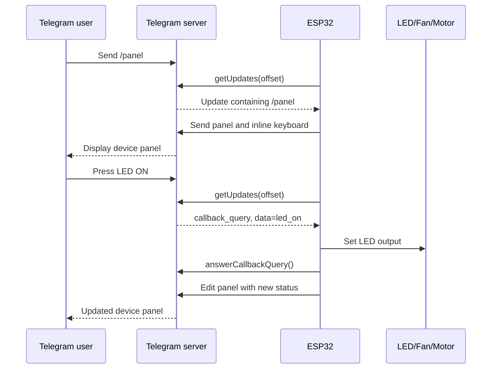

### When the User Sends `/panel`

1. The Telegram application sends `/panel` to Telegram's servers.
2. Telegram creates an update containing the message.
3. The update waits on Telegram's server.
4. The ESP32 calls:

   ```cpp
   bot.getUpdates(
     bot.last_message_received + 1
   );
   ```

5. Telegram returns the update as JSON.
6. The library parses it into:

   ```cpp
   bot.messages[0]
   ```

7. The handler reads:

   ```cpp
   bot.messages[0].text
   ```

8. When the text is `/panel`, the ESP32 sends the status panel and inline keyboard.

### When the User Presses an Inline Button

Suppose a button contains:

```json
{
  "text": "LED ON",
  "callback_data": "led_on"
}
```

Telegram creates a `callback_query` update.

The library exposes it approximately as:

```cpp
bot.messages[index].type
// "callback_query"

bot.messages[index].text
// "led_on"

bot.messages[index].query_id
// Unique callback-query ID

bot.messages[index].message_id
// Panel message ID

bot.messages[index].chat_id

bot.messages[index].from_id
```

Your code:

1. Checks the user or chat authorisation.
2. Reads `"led_on"` from `.text`.
3. Changes the LED GPIO.
4. Calls `answerCallbackQuery()` to stop Telegram's loading animation.
5. Edits the existing panel message so it shows the new state.

### If the ESP32 Is Offline

Telegram normally retains pending updates for up to 24 hours. When the ESP32 reconnects, polling may retrieve those updates if they have not already been confirmed.

See the [Telegram Bot API documentation](https://core.telegram.org/bots/api)

A bot cannot use `getUpdates` polling and a webhook simultaneously.

If a Google Apps Script webhook is still registered, remove it before using direct ESP32 polling:

```text
https://api.telegram.org/bot<TOKEN>/deleteWebhook?drop_pending_updates=true
```

## 4. What Is the `bot.xxx` Structure?

This declaration creates an object named `bot`:

```cpp
UniversalTelegramBot bot(
  BOT_TOKEN,
  telegramClient
);
```

`UniversalTelegramBot` is the class.

`bot` is an instance of that class.

The constructor receives:

| Argument | Purpose |
|---|---|
| `BOT_TOKEN` | Identifies and authenticates the Telegram bot. |
| `telegramClient` | Provides the secure TCP/TLS connection. |

The library stores a pointer to `telegramClient`, so both objects should remain global and exist for the entire program:

```cpp
WiFiClientSecure telegramClient;

UniversalTelegramBot bot(
  BOT_TOKEN,
  telegramClient
);
```

A `bot.xxx` expression can refer to:

- A method, such as `bot.sendMessage(...)`.
- A runtime setting, such as `bot.longPoll`.
- A state value, such as `bot.last_message_received`.
- A parsed message, such as `bot.messages[i].text`.

The public interface and message fields below come from the UniversalTelegramBot source.

See the [UniversalTelegramBot header](https://github.com/witnessmenow/Universal-Arduino-Telegram-Bot/blob/master/src/UniversalTelegramBot.h)

### Important Bot Methods and Properties

| Member | Purpose |
|---|---|
| `getUpdates(offset)` | Downloads pending Telegram updates. |
| `sendMessage(...)` | Sends a text message. |
| `sendMessageWithInlineKeyboard(...)` | Sends or edits a message containing inline buttons. |
| `answerCallbackQuery(...)` | Acknowledges an inline-button press. |
| `getMe()` | Retrieves basic bot-account information. |
| `setMyCommands(...)` | Defines commands displayed in Telegram's command menu. |
| `messages[]` | Parsed updates returned by `getUpdates()`. |
| `last_message_received` | Most recent processed Telegram `update_id`. |
| `longPoll` | Telegram long-poll timeout in seconds. |
| `last_sent_message_id` | ID of the last successfully sent message. |
| `waitForResponse` | Local socket-response waiting time. |
| `maxMessageLength` | JSON document capacity used while parsing. |
| `_lastError` | Last internal library or network error. |
| `name` | Bot display name, populated by `getMe()`. |
| `userName` | Bot username, populated by `getMe()`. |

`name` and `userName` may remain empty until this succeeds:

```cpp
if (bot.getMe()) {
  Serial.println(bot.name);
  Serial.println(bot.userName);
}
```

### `bot.messages[index]`

Each entry is a `telegramMessage` structure.

Common fields include:

| Field | Meaning |
|---|---|
| `.type` | `"message"`, `"callback_query"`, or another supported type. |
| `.update_id` | ID of the complete Telegram update. |
| `.message_id` | ID of the message inside its chat. |
| `.text` | Message text or inline-button `callback_data`. |
| `.chat_id` | Chat in which the interaction occurred. |
| `.chat_title` | Group or channel title, when available. |
| `.from_id` | Telegram user ID of the sender. |
| `.from_name` | Sender's name. |
| `.date` | Telegram-provided Unix timestamp. |
| `.query_id` | Callback-query ID used by `answerCallbackQuery()`. |
| `.reply_to_message_id` | ID of a replied-to message. |
| `.reply_to_text` | Text of a replied-to message. |
| `.latitude` | Shared location latitude. |
| `.longitude` | Shared location longitude. |
| `.hasDocument` | Whether the update contains a document. |
| `.file_name` | Telegram document name. |
| `.file_path` | Telegram document path. |
| `.file_caption` | Document caption. |
| `.file_size` | Document size. |

Not every field is populated for every update.

For example, a normal message usually has:

```cpp
message.type
message.text
message.chat_id
message.from_id
message.message_id
```

A callback query additionally needs:

```cpp
message.query_id
message.text
// callback_data

message.message_id
// Original panel message
```

The library's parser maps Telegram JSON to `bot.messages[index]`.

See the [UniversalTelegramBot parser implementation](https://github.com/witnessmenow/Universal-Arduino-Telegram-Bot/blob/master/src/UniversalTelegramBot.cpp)

Use:

```cpp
bot.messages[index].text
```

There is no literal:

```cpp
messages.xx
```

`xx` represents whichever field you want.

## 5. Behaviour of Important Operations

### `getUpdates()`

Typical code:

```cpp
int updateCount =
  bot.getUpdates(
    bot.last_message_received + 1
  );
```

The library generates a request similar to:

```text
getUpdates?offset=12346&limit=1&timeout=10
```

It then:

1. Sends the HTTPS request.
2. Waits for Telegram's response.
3. Parses the returned JSON.
4. Places each parsed result in `bot.messages[]`.
5. Updates `bot.last_message_received`.
6. Returns the number of parsed updates.

### Recommended Polling Pattern

```cpp
int updateCount =
  bot.getUpdates(
    bot.last_message_received + 1
  );

while (updateCount > 0) {
  handleTelegramUpdates(
    updateCount
  );

  updateCount =
    bot.getUpdates(
      bot.last_message_received + 1
    );
}
```

This drains all pending updates.

The library documentation recommends using:

```cpp
bot.last_message_received + 1
```

as the offset.

See the [UniversalTelegramBot GitHub repository](https://github.com/witnessmenow/Universal-Arduino-Telegram-Bot)

### `last_message_received`

This contains the most recently processed Telegram `update_id`.

It is not:

- A chat ID.
- A user ID.
- A message ID.
- A callback-query ID.

For example:

```cpp
bot.last_message_received == 57290
```

The next request uses:

```cpp
57290 + 1
```

This tells Telegram:

```text
Return only updates numbered 57291 and later.
```

Telegram treats an update as confirmed when a later offset is supplied.

See the [Telegram Bot API documentation](https://core.telegram.org/bots/api)

### `longPoll`

Configured with:

```cpp
bot.longPoll = 10;
```

This does not mean:

```text
Poll every 10 seconds.
```

It tells Telegram that it may hold an empty `getUpdates` request open for up to 10 seconds while waiting for a new update.

Behaviour:

- If an update arrives immediately, Telegram returns immediately.
- If no update arrives, the request may return after approximately 10 seconds.
- This reduces repeated empty requests.

Because the library call is synchronous, the ESP32 `loop()` can be blocked inside `getUpdates()` for close to the long-poll duration.

This is an inference from Telegram's timeout behaviour and the library's synchronous request implementation.

See the [Telegram Bot API documentation](https://core.telegram.org/bots/api)

This matters if the loop also performs:

- Fast sensor sampling.
- Watchdog-sensitive operations.
- OTA handling.
- Precise motor timing.
- Other network services.

Hardware PWM continues running in the ESP32 peripheral, but loop-based control logic waits.

### `sendMessage()`

Example:

```cpp
bool success =
  bot.sendMessage(
    chatId,
    "LED is now ON",
    ""
  );
```

Parameters are generally:

```cpp
sendMessage(
  chat_id,
  text,
  parse_mode
);
```

It sends a new message and returns a Boolean success result.

In this library version, a nonzero fourth `message_id` causes the library to edit an existing message instead of sending a new one:

```cpp
bot.sendMessage(
  chatId,
  newText,
  "",
  existingMessageId
);
```

Internally, this selects Telegram's `editMessageText` operation.

See the [UniversalTelegramBot implementation](https://github.com/witnessmenow/Universal-Arduino-Telegram-Bot/blob/master/src/UniversalTelegramBot.cpp)

### `sendMessageWithInlineKeyboard()`

Example:

```cpp
bot.sendMessageWithInlineKeyboard(
  chatId,
  panelText,
  "",
  CONTROL_KEYBOARD
);
```

It sends:

- Message text.
- An inline keyboard.
- Button captions.
- Button `callback_data`.

To edit an existing panel:

```cpp
bot.sendMessageWithInlineKeyboard(
  chatId,
  panelText,
  "",
  CONTROL_KEYBOARD,
  panelMessageId
);
```

The last argument identifies the message to update.

This prevents the bot from generating a new dashboard message after every button press.

### `messages[index]`

After:

```cpp
int count =
  bot.getUpdates(...);
```

valid entries are:

```cpp
bot.messages
```

through:

```cpp
bot.messages[count - 1]
```

Example:

```cpp
for (
  int index = 0;
  index < count;
  index++
) {
  String type =
    bot.messages[index].type;

  String chatId =
    bot.messages[index].chat_id;

  String userId =
    bot.messages[index].from_id;

  String value =
    bot.messages[index].text;
}
```

Many UniversalTelegramBot installations define:

```cpp
#define HANDLE_MESSAGES 1
```

Therefore, only one update is held in `messages[]` per request. The surrounding `while` loop retrieves remaining updates sequentially.

### `answerCallbackQuery()`

When a user presses an inline button, Telegram displays a loading indicator on that button.

Your code should answer the callback:

```cpp
bot.answerCallbackQuery(
  bot.messages[index].query_id,
  "LED turned ON"
);
```

This tells Telegram that the button press has been handled.

It does not normally create a regular chat message. Instead, it:

- Stops the button's loading indicator.
- Optionally displays a short popup notification.
- Can optionally display an alert.
- Can optionally open a URL.

The important identifier is:

```cpp
query_id
```

Do not pass `message_id` to `answerCallbackQuery()`.

The library sends the callback ID, optional text, alert setting, cache time, and optional URL to Telegram's `answerCallbackQuery` method.

See the [UniversalTelegramBot implementation](https://github.com/witnessmenow/Universal-Arduino-Telegram-Bot/blob/master/src/UniversalTelegramBot.cpp)

## Telegram Identifiers

Do not confuse these identifiers:

| Identifier | Identifies | Used For |
|---|---|---|
| `chat_id` | Conversation. | Sending or editing a message. |
| `from_id` | Telegram user. | User authorisation. |
| `update_id` | Incoming update envelope. | Polling offset. |
| `message_id` | Message within one chat. | Editing the control panel. |
| `query_id` | One inline-button press. | `answerCallbackQuery()`. |

For private chats, `chat_id` and `from_id` are often equal, but you should not assume they are always equal.

In a group:

- `chat_id` identifies the group and may be negative.
- `from_id` identifies the individual who pressed the button.

For authorisation, this pattern is safer:

```cpp
bool isAuthorizedUser(
  const String& fromId
) {
  return fromId ==
    AUTHORIZED_USER_ID;
}
```

## Other Relevant Members

### `getMe()`

`getMe()` validates the token and loads basic bot information:

```cpp
if (bot.getMe()) {
  Serial.println(
    bot.name
  );

  Serial.println(
    bot.userName
  );
}
```

### `setMyCommands()`

`setMyCommands()` registers the commands Telegram shows in its `/` menu.

It does not implement those commands. Your update handler must still process them.

### `last_sent_message_id`

Stores the message ID returned by Telegram after a successful send.

### `waitForResponse`

Controls how long the library waits for local HTTP response data.

It is different from `longPoll`.

### `maxMessageLength`

Controls the ArduinoJson document capacity.

If responses grow beyond this capacity, JSON parsing may fail.

### `telegramClient`

The secure network transport.

### `TELEGRAM_CERTIFICATE_ROOT`

The trusted CA certificate used to authenticate Telegram's HTTPS server.

### `BOT_POLL_INTERVAL_MS`

If present in your sketch, this is your own delay between completed polling cycles.

It is separate from:

```cpp
bot.longPoll
```

### `bot.maxMessageLength`

`bot.maxMessageLength` sets the maximum Telegram HTTP response size, in characters, that `UniversalTelegramBot` stores and processes.

#### Default Value

```cpp
bot.maxMessageLength = 1500;
```

If a Telegram response is larger than this—especially when it contains a large inline keyboard—the response may be truncated.

The JSON can then fail to parse, causing symptoms such as:

- Button presses not responding.
- `getUpdates()` returning `0`.
- The same update being received repeatedly.
- The bot appearing to hang.

#### Increase the Limit

For a larger control keyboard, increase the value during `setup()`:

```cpp
bot.maxMessageLength = 4096;
```

If necessary:

```cpp
bot.maxMessageLength = 6144;
```

#### Memory Consideration

A larger value consumes more ESP32 RAM because the library uses it when creating temporary JSON buffers.

Choose a value large enough for your Telegram messages and inline keyboards, but avoid making it unnecessarily large.


---
# Print Parsed Telegram Fields

You can print every parsed field stored in `bot.messages[index]` by adding a dedicated debug function.

The library stores Telegram updates in its `telegramMessage` structure.

See the [Universal-Arduino-Telegram-Bot telegramMessage structure](https://github.com/witnessmenow/Universal-Arduino-Telegram-Bot/blob/master/src/UniversalTelegramBot.h)

## Print a Telegram Message

```cpp
void printTelegramMessage(int index) {
  const telegramMessage& msg =
    bot.messages[index];

  Serial.println();
  Serial.println(
    "========== TELEGRAM UPDATE =========="
  );

  Serial.print("Array index: ");
  Serial.println(index);

  Serial.print("update_id: ");
  Serial.println(msg.update_id);

  Serial.print("type: ");
  Serial.println(msg.type);

  Serial.print("text/callback_data: ");
  Serial.println(msg.text);

  Serial.print("chat_id: ");
  Serial.println(msg.chat_id);

  Serial.print("chat_title: ");
  Serial.println(msg.chat_title);

  Serial.print("from_id: ");
  Serial.println(msg.from_id);

  Serial.print("from_name: ");
  Serial.println(msg.from_name);

  Serial.print("date: ");
  Serial.println(msg.date);

  Serial.print("message_id: ");
  Serial.println(msg.message_id);

  Serial.print("query_id: ");
  Serial.println(msg.query_id);

  Serial.print("reply_to_message_id: ");
  Serial.println(
    msg.reply_to_message_id
  );

  Serial.print("reply_to_text: ");
  Serial.println(msg.reply_to_text);

  Serial.print("hasDocument: ");
  Serial.println(
    msg.hasDocument
      ? "true"
      : "false"
  );

  Serial.print("file_name: ");
  Serial.println(msg.file_name);

  Serial.print("file_caption: ");
  Serial.println(msg.file_caption);

  Serial.print("file_path: ");
  Serial.println(msg.file_path);

  Serial.print("file_size: ");
  Serial.println(msg.file_size);

  Serial.print("latitude: ");
  Serial.println(
    msg.latitude,
    6
  );

  Serial.print("longitude: ");
  Serial.println(
    msg.longitude,
    6
  );

  Serial.println(
    "====================================="
  );
}
```

## Call It from the Update Handler

```cpp
void handleTelegramUpdates(
  int updateCount
) {
  Serial.print(
    "Number of updates received: "
  );

  Serial.println(updateCount);

  for (
    int index = 0;
    index < updateCount;
    index++
  ) {
    printTelegramMessage(index);

    if (
      bot.messages[index].type ==
      "callback_query"
    ) {
      handleCallbackQuery(index);
    } else {
      handleTextMessage(index);
    }
  }
}
```

## Print Bot Runtime Information

You can also print public runtime information maintained by the bot object:

```cpp
void printBotRuntimeInformation() {
  Serial.println();
  Serial.println(
    "========== BOT RUNTIME =========="
  );

  Serial.print("Bot name: ");
  Serial.println(bot.name);

  Serial.print("Bot username: ");
  Serial.println(bot.userName);

  Serial.print("Last update received: ");
  Serial.println(
    bot.last_message_received
  );

  Serial.print("Last sent message ID: ");
  Serial.println(
    bot.last_sent_message_id
  );

  Serial.print("Long-poll timeout: ");
  Serial.println(bot.longPoll);

  Serial.print("Response wait time: ");
  Serial.println(
    bot.waitForResponse
  );

  Serial.print("Maximum message length: ");
  Serial.println(
    bot.maxMessageLength
  );

  Serial.print("Last library error: ");
  Serial.println(
    bot._lastError
  );

  Serial.println(
    "================================="
  );
}
```

Call it before processing the messages:

```cpp
void handleTelegramUpdates(
  int updateCount
) {
  printBotRuntimeInformation();

  for (
    int index = 0;
    index < updateCount;
    index++
  ) {
    printTelegramMessage(index);

    if (
      bot.messages[index].type ==
      "callback_query"
    ) {
      handleCallbackQuery(index);
    } else {
      handleTextMessage(index);
    }
  }
}
```

## Protect the Bot Token

Do not print the bot token:

```cpp
Serial.println(
  bot.getToken()
);
```

Printing it would expose the bot token in the Serial Monitor logs.

## Expected `/start` Message

For a normal `/start` message, expect output similar to:

```text
type: message
text/callback_data: /start
chat_id: 58138745
from_id: 58138745
message_id: 123
query_id:
```

## Expected Inline-Button Press

For an inline-button press, expect output similar to:

```text
type: callback_query
text/callback_data: LED_ON
chat_id: 58138745
from_id: 58138745
message_id: 124
query_id: 1234567890123456789
```

## Callback Query Field Mapping

For a `callback_query`, the library maps the fields as follows:

| Library Field | Meaning |
|---|---|
| `msg.text` | Button `callback_data`. |
| `msg.query_id` | Callback-query ID. |
| `msg.message_id` | ID of the dashboard message. |
| `msg.chat_id` | Chat containing the dashboard. |
| `msg.from_id` | User who pressed the button. |

Some fields will be empty because their values depend on the update type.

For example, document fields are normally empty for text messages and button presses.

## Debugging Limitation

This function prints every field retained by `UniversalTelegramBot`, but it does not print the complete raw JSON returned by Telegram.

The library discards Telegram fields that are not included in its `telegramMessage` structure.

---

# Receiving Telegram Photos on the ESP32

## Overview

When you send a photo from Telegram to the ESP32, Telegram does not place the JPEG data directly inside `getUpdates()`.

The transfer happens in three stages:

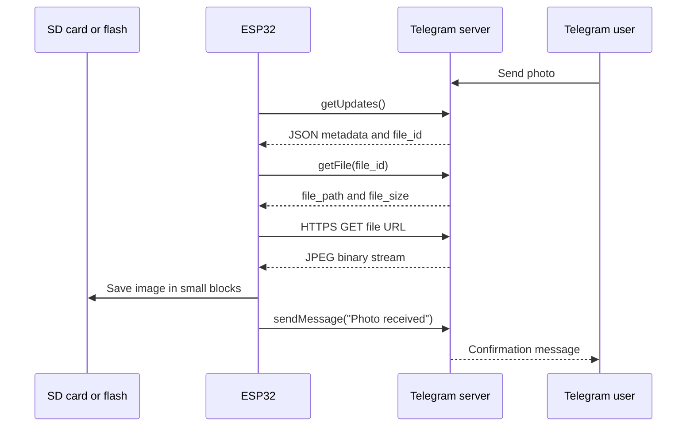

The important distinction is:

```text
getUpdates() receives information about the photo.
getFile() obtains the temporary download path.
A separate HTTPS GET downloads the actual JPEG bytes.
```

Telegram keeps pending updates for up to 24 hours. Polling with `getUpdates()` and webhooks are mutually exclusive.

See the [Telegram Bot API](https://core.telegram.org/bots/api?utm_source=chatgpt.com).

## 1. Communication Protocols

Several protocol layers work together:

| Layer | Protocol | Purpose |
|---|---|---|
| Application | Telegram Bot API | `getUpdates`, `getFile`, and `sendMessage`. |
| Data format | JSON | Photo metadata, IDs, and file path. |
| Security | TLS/HTTPS | Encrypts and authenticates Telegram communication. |
| Transport | TCP | Reliable delivery of JSON and JPEG bytes. |
| Network | Wi-Fi/IP | Connects the ESP32 to the Internet. |
| Image data | JPEG or PNG | Binary image stored or processed by the ESP32. |

All Telegram Bot API requests use port `443`:

```text
ESP32 → HTTPS/TCP → api.telegram.org:443
```

The ESP32 initiates every connection. Telegram does not open a connection directly to the ESP32.

## 2. Limitation of the Current Library

Your installed `UniversalTelegramBot` version supports incoming documents, but its current message parser does not extract Telegram's normal `message.photo[]` field.

Its parser handles:

```text
message["text"]
message["location"]
message["document"]
```

For a document, the library automatically:

1. Reads the document's `file_id`.
2. Calls `getFile()`.
3. Places the download URL in:

   ```cpp
   bot.messages[index].file_path
   ```

4. Places the file size in:

   ```cpp
   bot.messages[index].file_size
   ```

5. Sets:

   ```cpp
   bot.messages[index].hasDocument = true;
   ```

This behaviour is visible in the [UniversalTelegramBot implementation](https://github.com/witnessmenow/Universal-Arduino-Bot/blob/master/src/UniversalTelegramBot.cpp?utm_source=chatgpt.com).

There are two implementation choices:

### Method A — Recommended Initially

Send the image from Telegram as a file or document instead of a compressed photo.

This works with the existing library without modification.

### Method B — Normal Telegram Photo

Modify the library or manually parse the raw `getUpdates()` JSON to extract:

```text
message.photo[]
```

This provides the normal Telegram photo-sharing experience but requires additional code.

Prove the complete download and storage process using Method A first.

## 3. Prepare ESP32 Storage

A Telegram photograph can easily be hundreds of kilobytes or several megabytes.

Do not place the complete image in a normal RAM array.

Choose one storage destination:

| Storage | Use Case |
|---|---|
| SD card | Recommended for large or multiple images. |
| LittleFS | Suitable for smaller images. |
| PSRAM | Useful for temporary processing, but data disappears after restart. |
| Direct streaming | Useful when forwarding or processing without permanent storage. |

### SD Card Setup

Include the required libraries:

```cpp
#include <SD.h>
#include <SPI.h>
```

Initialise the SD card in `setup()`:

```cpp
if (!SD.begin(SD_CS_PIN)) {
  Serial.println(
    "[SD] Initialization failed"
  );
} else {
  Serial.println(
    "[SD] Ready"
  );
}
```

The ESP32 should verify that it has somewhere to place the photo before starting a potentially large network transfer.

## 4. Configure Secure Telegram Communication

The existing structure should look approximately like this:

```cpp
#include <WiFi.h>
#include <WiFiClientSecure.h>
#include <UniversalTelegramBot.h>

WiFiClientSecure telegramClient;

UniversalTelegramBot bot(
  BOT_TOKEN,
  telegramClient
);
```

After Wi-Fi connects, synchronise the system clock and install Telegram's root certificate:

```cpp
configTime(
  0,
  0,
  "pool.ntp.org",
  "time.nist.gov"
);

telegramClient.setCACert(
  TELEGRAM_CERTIFICATE_ROOT
);
```

### Why This Is Required

- The root certificate authenticates `api.telegram.org`.
- The system clock is needed to check whether Telegram's TLS certificate is currently valid.
- Without a valid clock, certificate verification may fail.
- Do not use `setInsecure()` in the final application because it disables server authentication.

## 5. Increase JSON Capacity

A document update contains more information than a simple text message. A large inline keyboard may also increase the response size.

Set:

```cpp
bot.maxMessageLength = 4096;
bot.longPoll = 10;
```

If parsing still fails:

```cpp
bot.maxMessageLength = 6144;
```

`maxMessageLength` is used for the Telegram JSON response, not for storing the actual JPEG.

The image itself must be streamed separately.

## 6. Send the Photo as a Document

In Telegram:

1. Open your bot conversation.
2. Press the attachment button.
3. Select **File** or **Document**.
4. Select the JPEG file.
5. Send it to the bot.

Do not initially select the normal **Gallery/Photo** option.

Telegram will create an update similar to:

```json
{
  "message": {
    "message_id": 152,
    "from": {
      "id": 123456789
    },
    "chat": {
      "id": 123456789
    },
    "document": {
      "file_name": "test.jpg",
      "mime_type": "image/jpeg",
      "file_id": "BQACAg..."
    },
    "caption": "Test image"
  }
}
```

The image bytes are not present in this JSON. The `file_id` is a reference to the file stored on Telegram's server.

## 7. Poll for the Incoming Update

Continue using the existing polling loop:

```cpp
int updateCount =
  bot.getUpdates(
    bot.last_message_received + 1
  );

while (updateCount > 0) {
  handleTelegramUpdates(
    updateCount
  );

  updateCount =
    bot.getUpdates(
      bot.last_message_received + 1
    );
}
```

Telegram assigns every update an `update_id`.

```text
last_message_received + 1
```

requests only newer updates.

The `while` loop drains multiple waiting messages.

After processing the document, the library provides:

```cpp
bot.messages[index].hasDocument
bot.messages[index].file_name
bot.messages[index].file_caption
bot.messages[index].file_size
bot.messages[index].file_path
bot.messages[index].chat_id
bot.messages[index].from_id
```

## 8. Detect and Validate the Image

Add document handling to `handleTelegramUpdates()`:

```cpp
void handleTelegramUpdates(
  int updateCount
) {
  for (
    int index = 0;
    index < updateCount;
    index++
  ) {
    const String chatId =
      bot.messages[index].chat_id;

    const String fromId =
      bot.messages[index].from_id;

    if (
      !fromId.equals(
        AUTHORIZED_CHAT_ID
      )
    ) {
      bot.sendMessage(
        chatId,
        "Unauthorized user.",
        ""
      );

      continue;
    }

    if (
      bot.messages[index].hasDocument
    ) {
      handleIncomingDocument(
        index
      );

      continue;
    }

    handleTextMessage(
      index
    );
  }
}
```

Then inspect the document:

```cpp
void handleIncomingDocument(
  int index
) {
  const String chatId =
    bot.messages[index].chat_id;

  const String fileName =
    bot.messages[index].file_name;

  const String fileUrl =
    bot.messages[index].file_path;

  const long fileSize =
    bot.messages[index].file_size;

  Serial.println(
    "[PHOTO] Document received"
  );

  Serial.println(
    "[PHOTO] Name: " +
    fileName
  );

  Serial.println(
    "[PHOTO] URL obtained"
  );

  Serial.printf(
    "[PHOTO] Size: %ld bytes\n",
    fileSize
  );

  // Download function will be called here.
}
```

Authorisation must happen before downloading. Otherwise, any Telegram user who can reach the bot could consume ESP32 storage and network bandwidth.

## 9. Check the File Extension and Size

Before downloading:

```cpp
bool isAcceptedImage(
  const String& name
) {
  String lowerName =
    name;

  lowerName.toLowerCase();

  return lowerName.endsWith(
           ".jpg"
         ) ||
         lowerName.endsWith(
           ".jpeg"
         ) ||
         lowerName.endsWith(
           ".png"
         );
}
```

Use a practical size limit:

```cpp
constexpr size_t MAX_PHOTO_SIZE =
  2 * 1024 * 1024;
```

Validate the file:

```cpp
if (
  !isAcceptedImage(
    fileName
  )
) {
  bot.sendMessage(
    chatId,
    "Please send a JPG or PNG image.",
    ""
  );

  return;
}

if (
  fileSize <= 0 ||
  fileSize > MAX_PHOTO_SIZE
) {
  bot.sendMessage(
    chatId,
    "The image is too large.",
    ""
  );

  return;
}
```

Telegram's hosted Bot API currently permits bots to download files up to 20 MB. The `getFile()` download link is guaranteed to remain valid for at least one hour.

See the [Telegram Bot API](https://core.telegram.org/bots/api?utm_source=chatgpt.com).

The ESP32 limit should normally be much lower than Telegram's limit because of:

- Storage space.
- Download duration.
- Watchdog timing.
- Image-decoder requirements.
- Display resolution.
- Heap fragmentation.

## 10. Understand the Generated File URL

The library's `getFile()` function constructs a URL in this form:

```text
[https://api.telegram.org/file/bot](https://api.telegram.org/file/bot)<TOKEN>/<file_path>
```

For example:

```text
[https://api.telegram.org/file/bot123456:ABC/photos/file_7.jpg](https://api.telegram.org/file/bot123456:ABC/photos/file_7.jpg)
```

The library stores that complete URL in:

```cpp
bot.messages[index].file_path
```

The URL includes your bot token.

Therefore:

- Never print it in publicly shared logs.
- Do not publish screenshots containing it.
- Do not send it to another user.
- Do not store it permanently.

Telegram documents this download-URL format and temporary validity.

See the [Telegram Bot API](https://core.telegram.org/bots/api?utm_source=chatgpt.com).

For safer diagnostics:

```cpp
Serial.println(
  "[PHOTO] Download URL obtained"
);
```

Do not print the actual URL.

## 11. Download the Binary Image

Use a separate HTTPS client for the download:

```cpp
#include <HTTPClient.h>
```

```cpp
bool downloadPhotoToSD(
  const String& fileUrl,
  const String& destination
) {
  WiFiClientSecure downloadClient;

  downloadClient.setCACert(
    TELEGRAM_CERTIFICATE_ROOT
  );

  HTTPClient https;

  if (
    !https.begin(
      downloadClient,
      fileUrl
    )
  ) {
    Serial.println(
      "[PHOTO] HTTPS begin failed"
    );

    return false;
  }

  https.setConnectTimeout(
    15000
  );

  https.setTimeout(
    30000
  );

  int httpCode =
    https.GET();

  if (
    httpCode != HTTP_CODE_OK
  ) {
    Serial.printf(
      "[PHOTO] HTTP GET failed: %d\n",
      httpCode
    );

    https.end();

    return false;
  }

  File outputFile =
    SD.open(
      destination,
      FILE_WRITE
    );

  if (!outputFile) {
    Serial.println(
      "[PHOTO] Cannot create output file"
    );

    https.end();

    return false;
  }

  WiFiClient* stream =
    https.getStreamPtr();

  uint8_t buffer[1024];

  int remaining =
    https.getSize();

  while (
    https.connected() &&
    (
      remaining > 0 ||
      remaining == -1
    )
  ) {
    size_t available =
      stream->available();

    if (available > 0) {
      size_t bytesToRead =
        min(
          available,
          sizeof(buffer)
        );

      int bytesRead =
        stream->readBytes(
          buffer,
          bytesToRead
        );

      if (bytesRead <= 0) {
        break;
      }

      outputFile.write(
        buffer,
        bytesRead
      );

      if (remaining > 0) {
        remaining -= bytesRead;
      }
    }

    delay(1);
  }

  outputFile.close();
  https.end();

  return (
    remaining == 0 ||
    remaining == -1
  );
}
```

Call it using a controlled filename:

```cpp
bool success =
  downloadPhotoToSD(
    fileUrl,
    "/telegram_photo.jpg"
  );
```

### Why Use a 1 KB Buffer?

The ESP32 never holds the full image in internal RAM.

Data is read from Wi-Fi and immediately written to storage. Memory usage remains nearly constant regardless of image size.

## 12. Acknowledge the Result

After downloading:

```cpp
if (success) {
  bot.sendMessage(
    chatId,
    "Photo received and saved.",
    ""
  );
} else {
  bot.sendMessage(
    chatId,
    "Photo download failed.",
    ""
  );
}
```

This acknowledgement is a new outgoing Telegram API request:

```text
ESP32 → sendMessage → Telegram → User
```

It does not affect the downloaded file or the original update.

## 13. Display the Image on a TFT

Receiving the image and displaying it are separate operations.

The ESP32 must:

1. Download the compressed JPEG.
2. Store it or stream it.
3. Decode the JPEG into pixel data.
4. Resize or crop it to the display resolution.
5. Send RGB pixels to the TFT.

For example:

```text
Telegram JPEG: 1920 × 1080
TFT display:    160 × 128
```

A TFT cannot normally display the JPEG file directly.

Use a decoder such as:

- `TJpg_Decoder`.
- `JPEGDEC`.
- `PNGdec` for PNG files.

For a small ST7735 display, request or prepare a smaller image when possible. Decoding a full phone photograph only to reduce it to `160 × 128` wastes time and memory.

## 14. Receive a Normal Telegram Photo

When the user sends an image through Telegram's **Gallery/Photo** interface, the update contains an array:

```json
{
  "photo": [
    {
      "file_id": "small-id",
      "width": 90,
      "height": 67,
      "file_size": 1468
    },
    {
      "file_id": "medium-id",
      "width": 320,
      "height": 240,
      "file_size": 18542
    },
    {
      "file_id": "large-id",
      "width": 1280,
      "height": 960,
      "file_size": 173421
    }
  ]
}
```

Telegram generates several `PhotoSize` versions.

Normally, select the last entry:

```text
photo[photo.size() - 1]
```

because it is usually the largest available version.

The sequence is then:

```text
photo[last].file_id
        ↓
getFile(file_id)
        ↓
file_path
        ↓
HTTPS GET binary JPEG
```

However, the current `UniversalTelegramBot` parser does not copy `message.photo[]` into `bot.messages[]`.

Supporting this properly requires either:

- Extending `telegramMessage` with photo fields and modifying `processResult()`.
- Replacing `bot.getUpdates()` for media reception with a custom HTTP and ArduinoJson parser.

Do not run a custom `getUpdates()` implementation alongside `bot.getUpdates()`. One poller may consume updates before the other sees them.

## Recommended Development Sequence

1. Send a small JPG as a Telegram document.
2. Confirm `hasDocument`, `file_name`, and `file_size`.
3. Download it to the SD card.
4. Verify the JPEG on a computer.
5. Add TFT decoding.
6. Add filename, extension, and size protection.
7. Only then extend the parser to accept normal Telegram photos.

This separates Telegram communication, storage, and image decoding into testable stages and makes fault isolation much easier.
